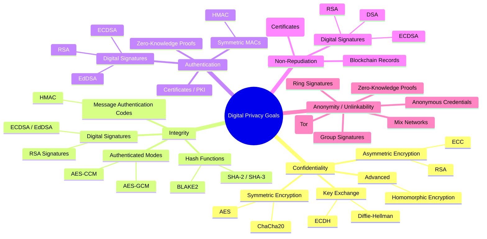

# 🔐 Digital Privacy Goals & Cryptographic Techniques

# 🌳 Mermaid Mindmap

Here’s the **combined map: Privacy Goals → Cryptographic Techniques**.

---

### 1. **Confidentiality**

👉 Prevent unauthorized access to data (only intended parties can read it).
**Techniques:**

* Symmetric Encryption (AES, ChaCha20)
* Asymmetric Encryption (RSA, ECC)
* Key Exchange (Diffie-Hellman, ECDH)
* Advanced: Homomorphic Encryption (compute on encrypted data)

---

### 2. **Integrity**

👉 Ensure data has not been altered in transit or storage.
**Techniques:**

* Hash Functions (SHA-2, SHA-3, BLAKE2)
* Message Authentication Codes (HMAC)
* Digital Signatures (RSA, ECDSA, EdDSA)
* Block Cipher Modes with Integrity (AES-GCM, AES-CCM)

---

### 3. **Authentication**

👉 Verify the identity of communicating parties or systems.
**Techniques:**

* Digital Signatures (RSA, ECDSA, EdDSA)
* Public Key Infrastructure (certificates, PKI)
* Symmetric MACs (HMAC for entity authentication)
* Zero-Knowledge Proofs (identity without revealing secrets)

---

### 4. **Non-Repudiation**

👉 Prevent a sender from denying that they performed an action or sent a message.
**Techniques:**

* Digital Signatures (RSA, ECDSA, EdDSA, DSA)
* PKI (certificate authorities binding keys to identities)
* Blockchain consensus logs (signatures embedded in immutable records)

---

### 5. **Anonymity / Unlinkability**

👉 Protect user identity and prevent correlation of actions.
**Techniques:**

* Anonymous Credentials / Group Signatures
* Zero-Knowledge Proofs (proving membership without revealing identity)
* Ring Signatures (used in Monero)
* Onion Routing (Tor → layered encryption with symmetric + asymmetric keys)
* Mix Networks (shuffle encrypted traffic for unlinkability)

---
