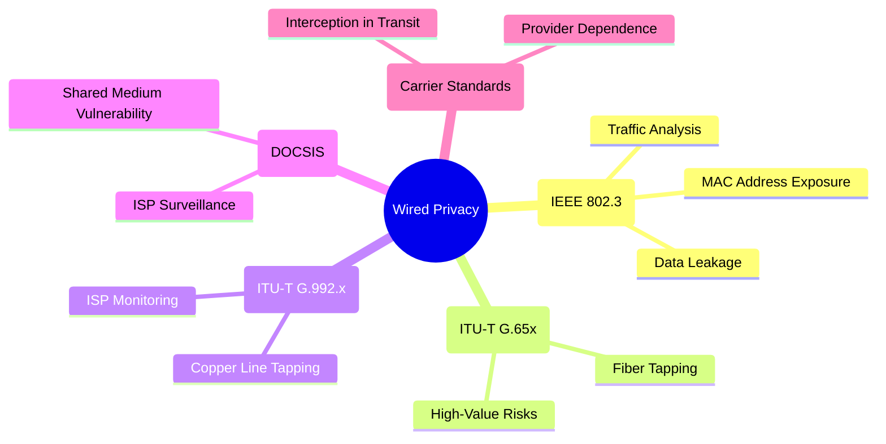

# **Wired Privacy**

Wired communication uses **physical media** (copper or fiber). Compared to wireless, it’s harder to intercept since attackers need **direct access to the medium**. However, **privacy risks exist at every layer**, especially due to how each technology and standard handles data transmission.

# Diagram Wired Privacy Only

---

## **1. Ethernet (LAN) → IEEE 802.3**

**Reason for Division:** Ethernet is the most common **LAN technology** standardized under **IEEE 802.3**.

### Privacy Concerns:

* **Data Leakage**

  * In hub-based networks (legacy), all traffic is broadcast — anyone can sniff.
  * In switch-based LANs, attackers may use techniques like ARP spoofing to redirect/capture traffic.

* **MAC Address Exposure**

  * Each Ethernet device has a **unique MAC address**.
  * This identifier can be logged and tracked across enterprise networks.

* **Traffic Analysis**

  * Even if the payload is encrypted, **timing, volume, and endpoints** can reveal sensitive information (e.g., business patterns).

---

## **2. Fiber Optics → ITU-T G.65x Series**

**Reason for Division:** High-speed backbone networks and ISPs rely on **fiber optic standards** (e.g., ITU-T G.652, G.655).

### Privacy Concerns:

* **Fiber Tapping**

  * Attackers bend fiber (using “bending couplers”) to leak light signals.
  * Done covertly without breaking the connection.

* **High-Value Target Risks**

  * Fiber lines often carry **government, banking, military, and enterprise data**.
  * Attacks here have **huge impact** (bulk interception).

---

## **3. DSL Broadband → ITU-T G.992.x**

**Reason for Division:** DSL uses **telephone copper lines** to deliver internet, standardized under ITU-T G.992.x.

### Privacy Concerns:

* **Copper Line Tapping**

  * Copper is easier to tap than fiber.
  * Attackers near a junction box or distribution point can eavesdrop.

* **ISP Monitoring**

  * DSL depends fully on the provider’s infrastructure.
  * ISPs can **log browsing**, **inspect data**, or comply with **government requests** for surveillance.

---

## **4. Cable Internet → DOCSIS (Data Over Cable Service Interface Specification)**

**Reason for Division:** Cable internet runs on **coaxial TV cables**, defined by **DOCSIS** standards.

### Privacy Concerns:

* **Shared Medium Vulnerability**

  * In **early DOCSIS versions**, all subscribers in a local loop shared bandwidth.
  * A malicious user could capture neighbors’ unencrypted traffic.
  * Later DOCSIS versions added **encryption (BPI+)** to reduce this risk.

* **ISP Surveillance**

  * Cable providers can monitor, filter, or log user activity.
  * Some ISPs use **deep packet inspection (DPI)** for ads or traffic shaping.

---

## **5. Leased Lines / MPLS → Carrier Standards (ITU-T, Provider-Specific)**

**Reason for Division:** Enterprises use **leased lines** or **MPLS VPNs** for private, high-reliability connections.

### Privacy Concerns:

* **Provider Dependence**

  * Although “private,” data flows through carrier switches.
  * Trust in provider security and integrity is critical.

* **Interception in Transit**

  * Without **end-to-end encryption**, carriers (or insiders) could intercept traffic.
  * MPLS only **separates traffic logically**, not by encryption, so content is visible inside the carrier.

---

# **Summary of Wired Privacy**

* **Ethernet (IEEE 802.3):** Local eavesdropping, MAC tracking.
* **Fiber Optics (ITU-T G.65x):** Tapping backbone links, large-scale risks.
* **DSL (G.992.x):** Copper tapping, ISP monitoring.
* **Cable Internet (DOCSIS):** Shared medium exposure, ISP surveillance.
* **Leased Lines/MPLS:** Carrier trust issues, transit interception.

---
