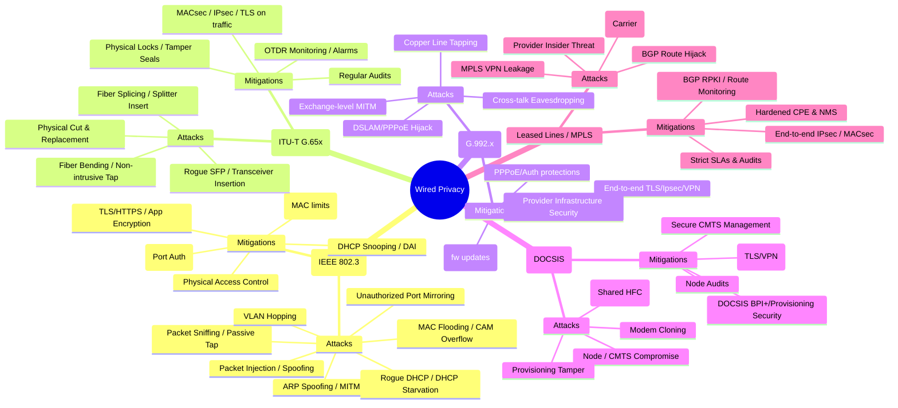

# 1) Wired Privacy — Technologies & Attack Techniques (detailed)

# Diagram Wired Privacy → Attacks → Mitigations

## Ethernet (IEEE 802.3)

**Primary attack techniques**

* **Packet sniffing / passive tap** — connect a device to the same physical network (or mirror port) and capture frames (unauthorized visibility of traffic unless payload is encrypted).
* **ARP spoofing / ARP poisoning (MITM)** — attacker sends forged ARP replies to associate their MAC with another IP, intercepting/forwarding traffic.
* **MAC flooding / CAM table overflow** — overload switch forwarding table so switch behaves like a hub (broadcasts frames to all ports), enabling sniffing.
* **VLAN hopping** — exploit misconfigurations (native VLAN tricks, double-tagging) to access other VLANs.
* **Rogue DHCP / DHCP starvation** — run fake DHCP server to give malicious gateway/DNS or consume IPs to force denial and/or user misconfiguration.
* **Port mirroring misuse / unauthorized SPAN** — if switch admin interfaces are compromised, attacker can mirror traffic to their port.
* **Packet injection / spoofing** — craft and send frames to impersonate machines, send malicious packets, or disrupt sessions.
* **Cable/physical tap** — cut or tap the copper cable; place inline hardware that duplicates traffic.

**What this enables:** credential theft, session hijack, data exfiltration, lateral movement, reconnaissance, and privacy invasion.

---

## Fiber Optics (ITU-T G.65x)

**Primary attack techniques**

* **Fiber bending / non-intrusive tapping** — bend fiber to leak a tiny portion of light to a receiver without breaking the fiber.
* **Fiber splicing / intrusive tapping** — splice in a splitter to divert a copy of the optical signal.
* **Rogue optical transceiver insertion (SFP/GBIC)** — replace or insert modules that allow interception or modification.
* **Physical cuts & replacement** — cutting fiber and replacing with device that records/transmits traffic.
* **Compromise of optical amplifiers / repeaters** — intercepting at amplification or OADM points in backbone.

**What this enables:** large-scale bulk interception of backbone traffic, long-term covert monitoring.

---

## DSL (ITU-T G.992.x) — copper telephone lines

**Primary attack techniques**

* **Copper line tapping** — attach probes at distribution points or junction boxes to capture DSL signal or POTS voice.
* **Cross-talk / near-end eavesdropping** — exploit electromagnetic coupling to read signals.
* **Modem/DSLAM compromise** — compromise provider equipment (DSLAM) to monitor or alter customer sessions.
* **PPPoE session hijack / replay** — hijack authentication/session tokens if not protected.
* **In-path MITM at local exchange** — attacker with access to exchange can intercept/redirect customer traffic.

**What this enables:** eavesdropping, ISP-level surveillance, targeted interception.

---

## Cable Internet (DOCSIS)

**Primary attack techniques**

* **Node compromise / CMTS manipulation** — compromise cable modem termination systems to read or redirect traffic.
* **Downstream sniffing on shared HFC** — in older/poorly configured nodes, subscribers’ downstream data could be captured.
* **Cable modem cloning** — clone legitimate modem identifiers to impersonate a subscriber or intercept traffic.
* **DOCSIS provisioning tamper** — manipulating provisioning files to change encryption or QoS/policies.
* **Deep Packet Inspection (DPI) abuse** — provider uses DPI to log or alter traffic for surveillance or ads.

**What this enables:** neighbor eavesdropping (historically), ISP-level monitoring, subscriber impersonation.

---

## Leased Lines / MPLS (Carrier networks)

**Primary attack techniques**

* **Transit interception via carrier access** — intercept at carrier PoPs or intermediate routers; logical separation (MPLS) is not encryption.
* **MPLS VPN leakage (mis-routing / misconfiguration)** — route leaking can expose private routes to other tenants.
* **BGP route hijack / route injection** — operational attacks that redirect traffic to attacker-controlled networks (affects any wired backbone).
* **Provider insider threats** — malicious or coerced insiders accessing traffic flows.
* **Compromise of CPE / provider NMS** — breach of Customer Premises Equipment or network management system to view or alter traffic.

**What this enables:** interception of enterprise traffic, exfiltration, cross-tenant exposure, supply-chain level surveillance.

---

# 2) Mitigations & Detection (per technology + cross-cutting)

## Per-technology mitigations

### Ethernet

* **802.1X (port-based network access control):** require device/authentication before granting LAN access.
* **Port security:** limit MAC addresses per port; shut down ports on violation.
* **DHCP snooping / IP source guard:** prevent rogue DHCP and IP spoofing.
* **Dynamic ARP Inspection (DAI):** prevent ARP spoofing.
* **BPDU guard / root guard:** protect against malicious STP manipulations.
* **Encrypt application traffic (TLS/HTTPS, SSH, S/MIME)** — assume LAN may be visible.
* **MAC address randomization (where applicable)** for endpoint privacy (but consider enterprise policies).
* **Physical security of network closets / cabling.**

**Detection:** Monitor switch CAM utilization, unexpected MAC moves, ARP anomalies, new mirrored ports, odd DHCP offers, SIEM alerts for ARP spikes.

---

### Fiber Optics

* **Physical protection & access control** at fiber huts, ducts, splice points.
* **Fiber-monitoring (OTDR)** to detect bends, loss, or unauthorized splices; alarms for attenuation changes.
* **Encrypt sensitive traffic** (MACsec, IPsec, TLS) so tap yields little useful plaintext.
* **Use encrypted DWDM channels / private encryption appliances** on backbone segments where required.
* **Regular audits & tamper-evident seals** on splice closures.

**Detection:** OTDR anomaly detection, unexpected optical power loss/gain, unusual latency/jitter, inventory checks of SFPs.

---

### DSL

* **Encrypt end-to-end:** TLS/IPsec/VPN between customer and remote site to protect beyond last mile.
* **Harden CPE (customer gateway):** secure firmware, strong passwords, disable remote admin.
* **Provider security controls:** secure DSLAM/aggregation, strict physical access, logging.
* **Use PPPoE protections and strong authentication** where applicable.

**Detection:** Monitor for new DSLAM sessions, abnormal PPP session reauths, line attenuation changes, unusual login patterns.

---

### Cable (DOCSIS)

* **Use DOCSIS security features (BPI+, secure provisioning).**
* **Encrypt at application layer:** TLS/HTTPS, VPNs, IPsec.
* **Lockdown CMTS management & provisioning systems; sign provisioning configs.**
* **Regular node audits and splitters/inventory control.**

**Detection:** Monitor for duplicate modem MACs, odd provisioning pushes, increases in downstream promiscuous traffic.

---

### Leased Lines / MPLS

* **Apply end-to-end encryption (IPsec, TLS, MACsec)** even over “private” circuits.
* **Use BGP security (RPKI/ROA)** to reduce route hijacks.
* **Strict service provider SLAs & audits**, contractual controls around access and logging.
* **Segment & firewall intra-tenant traffic** and monitor for route leaks.
* **Harden and monitor CPE & network management systems.**

**Detection:** RPKI/route monitoring for suspicious prefixes, BGP route anomalies, unexpected path changes, and SIEM use for provider access events.

---

## Cross-cutting best practices (apply everywhere)

* **Assume the medium can be compromised** — encrypt sensitive data end-to-end (E2EE) and apply least privilege.
* **Layered security (defense in depth):** combine physical, link-layer, network-layer, and application-layer protections.
* **Strong key and certificate management** — prevent MITM via forged certs.
* **Logging, monitoring, and incident response:** SIEM, NIDS, flow analysis (NetFlow/sFlow), OTDR where fiber is used.
* **Regular penetration testing & red-team exercises** to validate controls.
* **Asset management & tamper-evident seals** for physical infrastructure.

---
