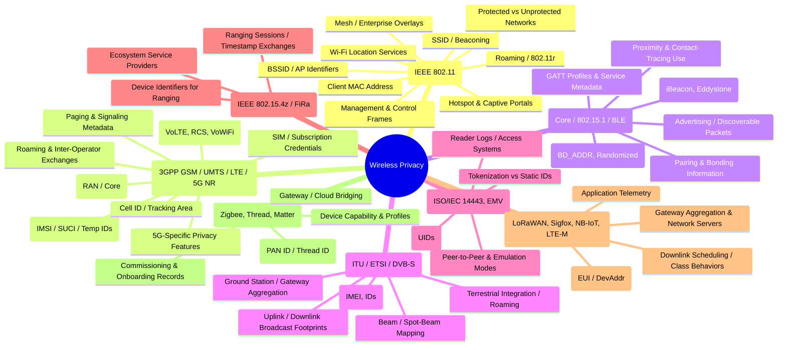

# Wireless Privacy — Technology-first (with standards)

**Why divide by technology?**
Different wireless technologies use different frequency bands, link-layer protocols, identity schemes, and mobility/roaming models. Those differences cause *different kinds of privacy exposure* (e.g., persistent hardware IDs, broadcast discovery, long-range propagation, or reliance on a provider). So organizing by technology gives a practical, user- and system-centric view.

---

## 1. Wi-Fi — **IEEE 802.11 family (a/b/g/n/ac/ax/be/… )**

**Why separated:** Wi-Fi is the dominant local-area wireless networking technology for consumer and enterprise data. Its ubiquity, AP/client roles, and management/control primitives create privacy-specific nodes.

**Key nodes (and what they are / why they matter):**

* **SSID / Beaconing:**

  * Access Points advertise network names (SSIDs) in beacons. Beacons let devices discover networks; repeated or probe-derived SSID information can reveal user preferences and movement patterns (e.g., which home or workplace networks a device has seen).
* **BSSID / AP identifiers:**

  * Each AP has an identifier (often tied to MAC). BSSIDs let observers correlate a device to a physical place (shop, office) when the BSSID is consistently present.
* **Client MAC address (and probe requests):**

  * Clients transmit (and used to transmit) their hardware MAC in traffic and in active scans. Persistent MACs provide a stable identifier that links a device across time and locations, enabling tracking.
* **Management & control frames (beacons, probes, auth/assoc):**

  * Management frames are visible to listeners and carry metadata (supported rates, capabilities, RSN information) that can fingerprint device models or client capabilities.
* **Protected vs unprotected networks (encryption status as metadata):**

  * Whether a network is open, uses enterprise authentication, or uses stronger protections appears in the network’s advertised capabilities — this influences how an observer interprets traffic but also is privacy-relevant as a signal (e.g., “this device prefers public hotspots”).
* **Roaming / 802.11r / Fast BSS Transition:**

  * Roaming events and the identifiers used during handoff (AP lists, roaming-related frames) reveal movement between APs and sites.
* **Hotspot / captive portals / third-party authentication:**

  * When Wi-Fi offloads authentication to external services, that can create privacy linkages between device identity and third-party identity providers or ad platforms.
* **Wi-Fi location services / fingerprinting datasets:**

  * Wi-Fi infrastructure and signal fingerprints are commonly used for geolocation; the presence of the device in a fingerprinting database or logs ties it to places over time.
* **Mesh or enterprise overlays:**

  * Enterprise Wi-Fi fabrics can centralize control and logging; the topological mapping and centralized logs create nodes where privacy-sensitive metadata (who connected where and when) is aggregated.

---

## 2. Mobile / Cellular Networks — **3GPP family (GSM / UMTS / LTE / 5G NR etc.)**

**Why separated:** Mobile networks operate over licensed cellular spectrum with hierarchical network elements (UE, RAN, core), subscriber identities and authentication schemes; they provide wide-area connectivity and are typically operator-controlled — all of which produce unique privacy aspects.

**Key nodes (and what they are / why they matter):**

* **Subscriber identity (IMSI / SUCI / Temporary IDs):**

  * Standards define permanent and temporary identifiers for subscribers. How identity is represented (cleartext vs concealed) and when temporary IDs change affect whether a user can be persistently linked across cells and time.
* **Mobile-network operator infrastructure (RAN, MME/AMF, HSS/UDM):**

  * Operational elements log attachments, handovers, and session metadata. These operator-side logs map a device to locations and service usage over large areas.
* **Cell ID / TAC / Tracking Area / RAN cell identifiers:**

  * Every base station/cell broadcasts identifiers that let a device be localized to a cell, and transitions between cells reveal movement patterns as a device moves.
* **Paging & signaling (control-plane metadata):**

  * Signaling messages (paging, attach/detach) are part of normal operation; they create metadata trails about presence and reachability without application-layer content.
* **SIM / credentials and subscription management:**

  * The SIM/USIM and how the subscription is provisioned/managed ties a real-world subscriber identity to network identifiers and usage records.
* **Roaming & inter-operator exchanges:**

  * When a device moves between countries or operators, inter-operator signaling and logs create cross-domain linkage points where identity and location can be correlated.
* **Application-plane offloads (VoLTE, RCS, VoWiFi):**

  * Newer services bring voice and messaging into IP/routed domains under operator control, centralizing metadata about communications similarly to data sessions.
* **5G-specific identity/feature nodes (e.g., SUCI, subscription privacy features):**

  * Later standards introduce mechanisms for concealing permanent identities and more granular privacy controls; the standard design choices determine how identity and metadata are exposed or concealed.

---

## 3. Bluetooth — **Core spec / IEEE 802.15.1** (and Bluetooth Low Energy / BLE)

**Why separated:** Bluetooth is the primary short-range personal-area technology used for device pairing, peripherals, beacons, and proximity-based interactions. Its pairing model and frequent advertising make it a distinct privacy category.

**Key nodes (and what they are / why they matter):**

* **Device address (BD\_ADDR) and random/static addressing modes:**

  * Bluetooth devices have addresses; some modes allow randomization. The addressing behavior determines whether a device is linkable across sessions and locations.
* **Advertising / discoverable packets:**

  * Devices broadcast advertisements for discovery and services; these broadcasts contain service UUIDs, manufacturer data, and can persistently signal presence.
* **Pairing and bonding information (keys, profiles):**

  * When devices pair and bond, long-lived relationships are formed (e.g., phone ↔ headset). Those relationships and stored identifiers form nodes that can be used to reconstruct networks of co-located devices.
* **Beacon technologies (iBeacon, Eddystone) over BLE:**

  * Beacons intentionally broadcast identifiers to enable location-based services, analytics, and proximity interactions, linking devices to places and actions.
* **GATT profiles and service metadata:**

  * The set of services a device exposes (health, payment, automation) signals the device type and potential sensitivity of interactions.
* **Proximity and contact-tracing deployments:**

  * Uses of Bluetooth for proximity measurements (distance estimation, encounters) create explicit correlation datasets between devices over time.

---

## 4. Satellite Communications — **ITU / ETSI / various satellite system standards (GEO/LEO constellations, DVB-S/x, etc.)**

**Why separated:** Satellite links cover long distances and wide areas; many services (broadband, IoT backhaul, positioning) use satellites. The transmission footprint and centralized ground-station interfaces create privacy-relevant nodes that differ from terrestrial wireless.

**Key nodes (and what they are / why they matter):**

* **Uplink / downlink identifiers and broadcast footprints:**

  * Signals sent to/from satellites span large geographic footprints; presence of a terminal within a footprint can be passively observed over large areas.
* **Terminal identifiers (IMEI for sat phones, terminal IDs):**

  * Terminals and user devices often have persistent identifiers that associate a device with satellite sessions and thus locations or service usage.
* **Ground station / gateway aggregation points:**

  * Satellite traffic funnels through terrestrial gateways where sessions and metadata are aggregated and logged, tying remote devices to geographic endpoints.
* **Beam / spot-beam mapping:**

  * Modern satellites use spot beams; which beam a terminal uses provides a coarse geographic trace of the terminal’s location.
* **Integration with terrestrial networks (roaming, backhaul):**

  * When satellite links interconnect with terrestrial operators, identity and metadata cross boundaries and produce aggregation nodes.

---

## 5. NFC & Short-Range Payment/Access Tech — **ISO/IEC 14443, ISO/IEC 18092, EMV, etc.**

**Why separated:** NFC is extremely short-range and used for identity, payment, and access tokens. The sensitivity of the payloads (payment credentials, access tokens) and the tokenization/identifier models justify treating it separately.

**Key nodes (and what they are / why they matter):**

* **Tag / card identifiers (UIDs) and passive reads:**

  * NFC tags and cards often present unique identifiers; repeated presence at readers builds presence logs and associations.
* **Tokenization vs static identifiers (EMV, host/card emulation):**

  * Whether a system uses ephemeral tokens or static identifiers determines how long an encounter remains linkable.
* **Reader logs / access control systems:**

  * Readers (door controllers, POS terminals) store transaction logs linking UID/token to time/location — a centralized node for privacy-sensitive records.
* **Peer-to-peer NFC and device emulation modes:**

  * Device-to-device exchanges and wallet emulation introduce new identifier mappings and service-level linkages (e.g., wallet provider metadata).

---

## 6. Ultra-Wideband (UWB) & Precision Ranging — **IEEE 802.15.4z / FiRa and related specs**

**Why separated:** UWB is emerging for high-precision ranging and secure positioning (car access, spatial awareness). Its unique capability to derive fine-grained distance and angle makes it a distinct privacy area.

**Key nodes (and what they are / why they matter):**

* **Ranging sessions and timestamp exchanges:**

  * The data used to derive distances is metadata that ties devices to precise relative positions — useful for location-sensitive services and, therefore, privacy-sensitive logs.
* **Device identifiers tied to ranging capabilities:**

  * Devices participating in UWB exchanges expose identifiers that can anchor highly accurate location traces.
* **Ecosystem service providers (FiRa, platform vendors):**

  * Vendors and platforms that collect UWB-derived location create aggregation nodes for fine-grained movement data.

---

## 7. LPWAN & IoT Wide-Area Tech (LoRaWAN, Sigfox, NB-IoT, LTE-M) — **LoRa Alliance, 3GPP, etc.**

**Why separated:** LPWANs connect low-power devices across long ranges with specific identifier/authentication models and gateway-funnel topologies; privacy concerns center around device identity and large-scale telemetry collection.

**Key nodes (and what they are / why they matter):**

* **Device EUI / DevAddr / Application keys (identifier schemes):**

  * Device identifiers and application-layer identity models map telemetry to physical devices and locations over time.
* **Gateway aggregation & network servers:**

  * LPWAN gatekeepers collect uplinks from many low-power endpoints; these servers are central nodes aggregating device activity across regions.
* **Downlink scheduling / class behaviors:**

  * How and when devices listen for downlinks reveals timing patterns that can be correlated with events or behaviors.
* **Application-layer telemetry (sensor readings):**

  * The content of telemetry (e.g., occupancy, energy usage) is privacy-relevant when it allows inference about personal behavior.

---

## 8. Mesh & Short-Range IoT (Zigbee, Thread, Matter) — **IEEE 802.15.4 / IETF / CSA / Connectivity standards**

**Why separated:** Mesh IoT protocols create dense, often always-on fabrics inside homes and buildings; node-to-node routing, device discovery, and central hubs create privacy nodes tied to domestic activities.

**Key nodes (and what they are / why they matter):**

* **Device network identifier (PAN ID / Thread network ID / Matter identifiers):**

  * Network-level IDs associate devices with a given home or building and make device sets traceable.
* **Device capability and profile metadata (light, sensor, lock):**

  * The type and behavior of devices (e.g., smart lock vs thermostat) leak activity semantics about occupants.
* **Gateway / hub analytics and cloud bridging:**

  * Gateways bridge local meshes to cloud services, funneling event streams (when doors open, lights on/off) to external providers.
* **Commissioning & device onboarding records:**

  * Commissioning logs tie device serials to user accounts and locations, forming durable identity links.

---

# Final notes (conceptual summary)

* Each wireless **technology** presents **distinct privacy nodes** because of differences in: identifier schemes (permanent vs ephemeral), signalling/management visibility, coverage footprint (local vs global), and operator/third-party aggregation points (e.g., APs, mobile operators, satellite gateways, cloud hubs).
* The nodes I described are **places where identifying or behavioral metadata is created, transmitted, or aggregated** — and therefore they are the natural focal points for privacy analysis, policy controls, or data-governance attention.
* If you’d like, I can now:

  * produce a **Mermaid mindmap** diagram of **Wireless Privacy** (technology → nodes) to visualize this, or
  * prepare a **concise one-page summary** suitable for a report or slide with these nodes and one-sentence explanations.
---
