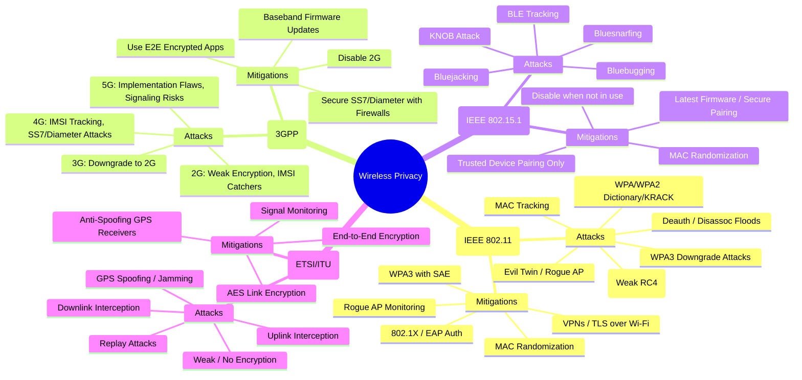

# **Wireless Privacy**

Wireless networks transmit over the **air**, which makes them inherently more exposed than wired since attackers don’t need physical access — only proximity (or in the case of satellite, the right equipment). Each wireless technology has its **own standards** and **privacy risks**.

---
# **Wireless Privacy — Mermaid Mindmap**

## **1. Wi-Fi → IEEE 802.11 (a/b/g/n/ac/ax/be)**

**Reason for Division:** Wi-Fi is the dominant wireless LAN technology, governed by the **IEEE 802.11 family** of standards.

### Privacy Concerns & Attack Techniques

* **WEP (802.11b):**

  * Weak RC4 encryption with predictable IVs → easily cracked.
* **WPA/WPA2 (802.11g/n/ac):**

  * Pre-shared key brute force (dictionary attacks if weak passwords).
  * KRACK (Key Reinstallation Attack) exploits handshake flaws.
* **WPA3 (802.11ax/be):**

  * SAE handshake much stronger, but still susceptible to downgrade attacks in mixed environments.
* **Eavesdropping:**

  * If traffic is unencrypted/open Wi-Fi, anyone can capture it.
* **Evil Twin / Rogue AP:**

  * Fake AP mimics a real one to capture credentials or inject malicious traffic.
* **Deauthentication/Disassociation Attacks:**

  * Force clients off AP to capture handshake traffic.
* **MAC Address Tracking:**

  * Wi-Fi devices broadcast probe requests with their MAC, enabling tracking.

### Mitigations

* Use **WPA3 with SAE** where possible.
* Strong, unique passphrases (avoid dictionary attacks).
* Disable legacy WEP/WPA.
* Deploy **802.1X/EAP with RADIUS** for enterprise networks.
* Use **VPNs/TLS encryption** over Wi-Fi to protect beyond link layer.
* Enable **MAC randomization** on clients.
* Monitor for **rogue APs** and deauth floods.

---

## **2. Mobile Networks → 3GPP Standards (GSM, UMTS, LTE, 5G NR)**

**Reason for Division:** Cellular networks are standardized by **3GPP** across generations (2G → 5G). Each generation improved privacy, but vulnerabilities remain.

### Privacy Concerns & Attack Techniques

* **2G GSM:**

  * Weak A5/1, A5/2 ciphers crackable.
  * No mutual authentication → fake base stations (IMSI catchers).
* **3G UMTS:**

  * Mutual authentication added.
  * Still vulnerable to rogue base stations that downgrade users to 2G.
* **4G LTE:**

  * IP-based encryption, stronger than 3G.
  * Still allows **IMSI tracking** in some cases.
  * SS7/Diameter protocol vulnerabilities → location tracking, call/SMS interception.
* **5G NR:**

  * Uses **SUCI (Subscription Concealed Identifier)** instead of sending IMSI directly → stronger identity privacy.
  * New vulnerabilities (e.g., implementation flaws, signaling storms).

### Mitigations

* **Force LTE/5G only** on devices (disable fallback to 2G where possible).
* Use **end-to-end encryption (TLS, Signal, WhatsApp)** for messaging and calls.
* Telecom operators must secure **SS7/Diameter interconnects** with firewalls and anomaly detection.
* Regular updates to device baseband firmware.

---

## **3. Bluetooth → IEEE 802.15.1**

**Reason for Division:** Bluetooth is standardized under **IEEE 802.15.1** for short-range communication (IoT, peripherals, wearables).

### Privacy Concerns & Attack Techniques

* **Bluejacking:**

  * Sending unsolicited messages to nearby devices.
* **Bluesnarfing:**

  * Exploiting vulnerabilities in pairing to steal data (contacts, files).
* **Bluebugging:**

  * Gaining remote control over a device (calls, messages).
* **Bluetooth Low Energy (BLE) Tracking:**

  * Devices broadcast UUIDs/MAC addresses → can be used to track users in malls, airports, etc.
* **Key Negotiation of Bluetooth (KNOB) Attack:**

  * Forces devices to use weak encryption during pairing.

### Mitigations

* Keep **Bluetooth off** when not in use.
* Pair only with trusted devices.
* Use latest **Bluetooth version (with patched firmware)**.
* Enable **MAC address randomization** in BLE.
* Enforce **Just Works/Numeric Comparison** authentication in BLE Secure Connections.

---

## **4. Satellite Communication → ITU/ETSI Standards**

**Reason for Division:** Satellite systems (VSAT, GPS, broadband, military SATCOM) follow **ETSI and ITU standards**. Since signals travel through open space, interception is easier with the right equipment.

### Privacy Concerns & Attack Techniques

* **Downlink Interception:**

  * Anyone with a large enough dish and demodulator can capture unencrypted satellite downlink traffic.
* **Uplink Interception:**

  * More difficult but possible with high-power equipment.
* **Replay Attacks:**

  * Capture and resend satellite communications.
* **Weak/No Encryption:**

  * Many older satellite systems send data unencrypted (TV feeds, maritime comms).
* **GPS Spoofing/Jamming:**

  * Broadcasting fake GPS signals to mislead receivers.

### Mitigations

* Use **end-to-end encryption** at the application or link layer.
* Enforce **AES-based link encryption** in modern SATCOM equipment.
* Deploy **anti-spoofing GPS receivers** that use authentication (military M-code, Galileo OSNMA).
* Signal monitoring for abnormal interference.

---

✅ **Summary:**  
- **Wi-Fi (802.11):** Main risks from weak/legacy protocols, rogue APs, and unencrypted sessions.  
- **Mobile (3GPP):** IMSI catchers, SS7 attacks, and downgrade exploits.  
- **Bluetooth (802.15.1):** Short-range attacks like bluesnarfing and tracking.  
- **Satellite (ITU/ETSI):** Open-air interception and weak encryption.  

---

