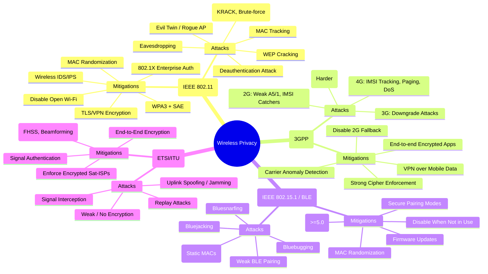

# **Wireless Privacy**
# **Diagram Wireless Privacy**

---

## **1. Wi-Fi → IEEE 802.11 (a/b/g/n/ac/ax/be)**

**Reason for Division:** Defined by IEEE 802.11 standards. Widely used for home, enterprise, and public access.

### Attack Techniques

* **Eavesdropping**

  * Capture unencrypted traffic (open Wi-Fi).
* **WEP cracking**

  * WEP (802.11b) keys can be brute-forced in minutes.
* **WPA/WPA2 attacks**

  * Dictionary/brute-force against PSK (pre-shared key).
  * KRACK attack against WPA2 handshake.
* **Evil Twin AP / Rogue Hotspot**

  * Fake AP mimics real one → trick users into connecting.
* **Deauthentication attack**

  * Force users off Wi-Fi to reconnect via attacker AP.
* **MAC address tracking**

  * Devices leak probe requests containing MACs.

### Mitigations

* Use **WPA3 with SAE authentication** (strongest).
* Enforce **enterprise Wi-Fi with 802.1X/EAP**.
* Disable open Wi-Fi / captive portals without encryption.
* Enable **MAC address randomization** on clients.
* Wireless IDS/IPS to detect rogue APs and DoS.
* Encrypt application data (TLS/HTTPS, VPN).

---

## **2. Mobile Networks → 3GPP (GSM, UMTS, LTE, 5G NR)**

**Reason for Division:** Governed by 3GPP standards (cellular). Used globally for mobile data & calls.

### Attack Techniques

* **2G (GSM)**

  * Weak A5/1 and A5/2 ciphers (easy to crack).
  * IMSI catchers (Stingrays) force downgrade to 2G → steal identity.

* **3G (UMTS)**

  * Stronger encryption (KASUMI), but still downgrade attacks possible.

* **4G (LTE)**

  * IMSI catchers still possible (via fake base stations).
  * Location tracking via paging messages.
  * DoS via signaling overload.

* **5G (NR)**

  * Better with **SUCI (Subscription Concealed Identifier)**.
  * Still vulnerable to rogue base stations (though harder).

### Mitigations

* Disable **2G fallback** on devices if possible.
* Use **end-to-end encrypted apps** (Signal, WhatsApp, etc.).
* Deploy **cellular firewalls & anomaly detection** for carriers.
* Regulators to enforce **strong cipher use only**.
* In enterprises: use **VPNs** over mobile data.

---

## **3. Bluetooth → IEEE 802.15.1 (Classic) & BLE (4.0/5.0)**

**Reason for Division:** Short-range wireless tech standardized under IEEE 802.15. Used for IoT, wearables, peripherals.

### Attack Techniques

* **Bluejacking**

  * Sending unsolicited messages.
* **Bluesnarfing**

  * Stealing contacts/files without user consent.
* **Bluebugging**

  * Remote control of device (older devices).
* **Tracking via MAC address**

  * Static MACs allow persistent tracking.
* **BLE vulnerabilities**

  * Weak pairing modes allow MITM during key exchange.

### Mitigations

* Use **latest Bluetooth versions (≥5.0)**.
* Disable Bluetooth when not in use.
* Use **randomized MAC addresses**.
* Enforce **secure pairing modes (Numeric Comparison, Passkey)**.
* Apply **firmware updates** for IoT devices.

---

## **4. Satellite Communication → ETSI / ITU Standards**

**Reason for Division:** Used for GPS, TV, military, and remote internet (e.g., VSAT, Starlink). Governed by ETSI/ITU standards.

### Attack Techniques

* **Signal interception**

  * Open broadcast channels (TV, GPS) can be intercepted.
* **Uplink spoofing / jamming**

  * Attacker injects signals or jams communication.
* **Replay attacks**

  * Captured signals replayed to manipulate receivers.
* **Weak/no encryption**

  * Legacy systems often transmit unencrypted.

### Mitigations

* Apply **end-to-end encryption** at network or app layer.
* Use **anti-jamming technologies** (frequency hopping, beamforming).
* Deploy **authentication for uplink signals**.
* Regulatory enforcement for encryption in satellite ISPs.

---

✅ **Summary of Wireless Privacy**  
- **Wi-Fi:** most common, privacy risks from weak encryption and rogue APs.  
- **Mobile:** risks from legacy 2G and IMSI catchers; 5G improves but not perfect.  
- **Bluetooth:** short range, but common in IoT; risks from device tracking & weak pairing.  
- **Satellite:** huge coverage, but legacy systems often unencrypted and easy to intercept.  

---
