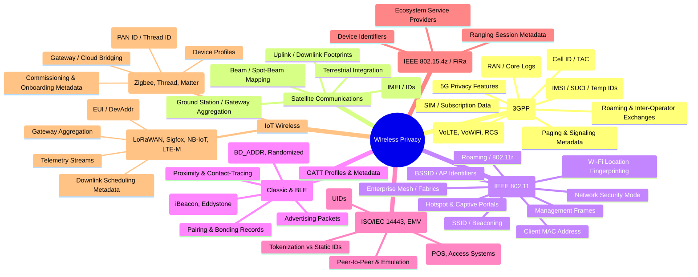

# Wireless Privacy (technology-category division)

# Mindmap (Wireless divided into categories)

### 1. **Mobile / Cellular Networks (3GPP GSM → 5G NR)**

* **Subscriber Identity (IMSI, SUCI, Temporary IDs):** Core identifiers of mobile subscribers.
* **Operator Infrastructure (RAN, Core, Logs):** Network entities that aggregate location and session metadata.
* **Cell Identifiers (Cell ID, TAC):** Reveal coarse-grained location and mobility.
* **Paging & Signaling Metadata:** Control-plane messages that log presence/activity.
* **SIM / Subscription Data:** Links device to person/account.
* **Roaming & Inter-Operator Exchanges:** Metadata exchange between networks.
* **Service Offloads (VoLTE, VoWiFi, RCS):** Centralized logging of calls and messages.
* **5G-Specific Privacy Features (SUCI, improved ID handling).**

---

### 2. **Satellite Communications (ITU / ETSI / DVB-S families)**

* **Uplink / Downlink Footprints:** Broad area transmissions.
* **Terminal Identifiers (satphone IMEIs, IDs):** Persistent identity of user devices.
* **Ground Station / Gateway Aggregation:** Where traffic funnels and is logged.
* **Beam / Spot-Beam Mapping:** Coarse-grained geolocation of terminals.
* **Terrestrial Integration:** Satellite ↔ cellular/ISP interconnects linking IDs across domains.

---

### 3. **Wi-Fi (IEEE 802.11 family)**

* **SSID / Beaconing:** Networks broadcast names.
* **BSSID / AP Identifiers:** Infrastructure identity → location mapping.
* **Client MAC Address:** Stable device ID (historically).
* **Management Frames:** Metadata like device capabilities.
* **Network Security Mode:** Open vs protected networks.
* **Roaming / 802.11r:** Movement tracking across APs.
* **Hotspot / Captive Portals:** External auth services linking identity.
* **Wi-Fi Location Fingerprinting:** Infrastructure datasets for geolocation.
* **Enterprise Mesh / Fabrics:** Centralized controllers as metadata aggregation points.

---

### 4. **Bluetooth (Classic & BLE)**

* **Device Address (BD\_ADDR, randomized/static).**
* **Advertising Packets:** Short-range broadcasts revealing presence.
* **Pairing / Bonding Records:** Persistent device relationships.
* **Beacon Protocols (iBeacon, Eddystone).**
* **GATT Profiles & Metadata:** Reveal device type and purpose.
* **Proximity / Contact Tracing Use Cases.**

---

### 5. **NFC & Contactless (ISO/IEC 14443, EMV, 18092)**

* **Card / Tag Identifiers (UIDs).**
* **Tokenization vs Static IDs:** Determines traceability.
* **Reader Logs (POS, access control).**
* **Peer-to-Peer / Device Emulation.**

---

### 6. **Ultra-Wideband (IEEE 802.15.4z / FiRa)**

* **Ranging Session Metadata (timestamps, ToF exchanges).**
* **Device Identifiers tied to ranging.**
* **Ecosystem Service Providers (platform-level aggregation).**

---

### 7. **IoT Wireless**

**a. LPWAN (LoRaWAN, Sigfox, NB-IoT, LTE-M):**

* **Device IDs (EUI, DevAddr, Keys).**
* **Gateway Aggregation Points.**
* **Downlink Scheduling Metadata.**
* **Telemetry Streams.**

**b. Mesh / Short-Range IoT (Zigbee, Thread, Matter):**

* **Network Identifiers (PAN ID, Thread ID).**
* **Device Profiles (lock, thermostat, sensor).**
* **Gateway / Cloud Bridging.**
* **Commissioning / Onboarding Metadata.**

---
