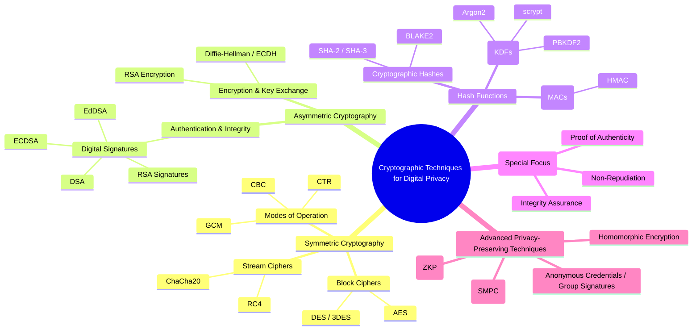

# 🌐 Cryptographic Techniques for Digital Privacy

# 🌳 Mermaid Mindmap

---
## **1. Symmetric Cryptography**

**Definition:** Same secret key is used for both encryption and decryption.
**Privacy role:** Ensures confidentiality of stored or transmitted data when the key is kept secret.

**Nodes:**

* **Block Ciphers**

  * Operate on fixed-size blocks of data (e.g., 128 bits).
  * Examples: AES (FIPS 197, modern standard), DES (legacy), 3DES (deprecated).
  * Used in VPNs, disk encryption, TLS bulk data encryption.
* **Stream Ciphers**

  * Encrypt data one bit/byte at a time, useful for continuous streams.
  * Examples: RC4 (deprecated), ChaCha20 (modern).
  * Used in secure messaging, real-time communications.
* **Modes of Operation (for block ciphers)**

  * Define how to apply block ciphers to longer data.
  * Examples: CBC (chaining), CTR (counter), GCM (provides both encryption and integrity).
  * Privacy impact: mode choice affects leakage (e.g., ECB leaks patterns).

---

## **2. Asymmetric Cryptography (Public-Key Cryptography)**

**Definition:** Uses a key pair — public key (shared) and private key (secret).
**Privacy role:** Enables secure communication without pre-shared keys, supports authentication and identity protection.

**Nodes:**

* **Encryption & Key Exchange**

  * **RSA Encryption (PKCS#1):** Public key encrypts session keys; private key decrypts.
  * **Diffie-Hellman (DH) / Elliptic Curve Diffie-Hellman (ECDH):** Establish shared keys over insecure channels without transmitting them.
  * Privacy relevance: protects confidentiality when communicating with strangers.
* **Authentication & Integrity (Digital Signatures)**

  * Private key signs, public key verifies.
  * Prevents impersonation, supports non-repudiation.
  * Examples:

    * RSA Signatures
    * DSA (Digital Signature Algorithm, FIPS 186)
    * ECDSA (Elliptic Curve DSA, efficient for mobile/IoT)
    * EdDSA (modern, Ed25519 / Ed448)

---

## **3. Hash Functions**

**Definition:** One-way mathematical functions that map data to fixed-length digests.
**Privacy role:** Protects passwords, ensures data integrity, supports digital signatures.

**Nodes:**

* **Cryptographic Hash Functions**

  * Examples: SHA-2 (SHA-256), SHA-3, BLAKE2, MD5 (broken).
  * Properties: preimage resistance, collision resistance.
  * Used for password storage, integrity verification, blockchain.
* **Message Authentication Codes (MACs)**

  * Combine a hash with a secret key (HMAC).
  * Provide both integrity and authenticity.
  * Examples: HMAC-SHA256.
* **Key Derivation Functions (KDFs)**

  * Stretch weak keys (like passwords) into strong cryptographic keys.
  * Examples: PBKDF2, Argon2, scrypt.
  * Privacy role: resists brute-force attacks on passwords.

---

## **4. Digital Signatures** *(subgroup of asymmetric, but often treated as a core technique)*

**Definition:** Cryptographic proof of authenticity and integrity.
**Privacy role:** Ensures that communication or data really comes from the claimed sender, prevents tampering, and supports accountability.

**Nodes:**

* **RSA Signatures:** Classic, widely deployed (SSL/TLS, code signing).
* **DSA:** Standardized by NIST, less common today.
* **ECDSA:** Used in Bitcoin, TLS, mobile apps — smaller key sizes.
* **EdDSA (Ed25519, Ed448):** Modern, efficient, resistant to common attacks.

---

## **5. Advanced Privacy-Preserving Techniques**

**Definition:** Cryptographic methods that go beyond traditional encryption/signatures to provide **stronger digital privacy guarantees**.

**Nodes:**

* **Zero-Knowledge Proofs (ZKP):** Prove you know something (password, identity, credential) without revealing it. Used in privacy coins (Zcash), identity systems.
* **Homomorphic Encryption:** Enables computation on encrypted data without decrypting (privacy-preserving cloud computation).
* **Secure Multi-Party Computation (SMPC):** Multiple parties jointly compute a function without revealing their private inputs.
* **Anonymous Credentials / Group Signatures:** Authenticate without revealing identity (used in anonymous e-cash, digital ID).

---

✅ **Main node:** Cryptographic Techniques for Digital Privacy  
✅ **First-level division:** Symmetric, Asymmetric, Hash Functions, Digital Signatures, Advanced Techniques  
✅ Each node explained with its role in privacy.  

---
