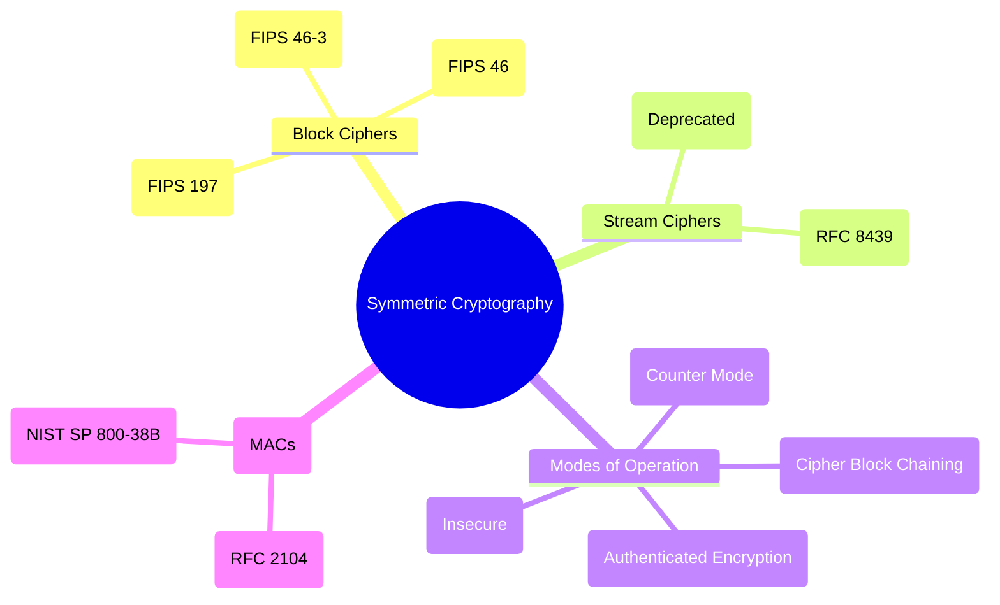

# 🔐 Symmetric Cryptography

# 🌳 Mermaid Mindmap

---

### 📌 Definition

* Uses the **same secret key** for both encryption and decryption.
* Fast and efficient → suitable for bulk data encryption (files, databases, network traffic).
* Core role in **Confidentiality**, but can also support **Integrity** when combined with MACs or authenticated encryption.

---

## 🌳 Subdivision of Symmetric Cryptography

### 1. **Block Ciphers**

* Encrypt data in **fixed-size blocks** (e.g., 64-bit, 128-bit).
* Require **modes of operation** to handle larger data streams.
* **Examples (Standards):**

  * **AES (Advanced Encryption Standard, FIPS 197):** Modern global standard, 128-bit blocks, key sizes 128/192/256 bits.
  * **DES (Data Encryption Standard, FIPS 46):** 56-bit keys, insecure today due to brute force.
  * **3DES (Triple DES, FIPS 46-3):** Legacy improvement over DES, now deprecated.
* **Privacy role:** Prevents raw data exposure during storage/transmission.

---

### 2. **Stream Ciphers**

* Encrypt data **bit by bit** or **byte by byte**, using a pseudo-random keystream.
* Ideal for **real-time or continuous data** (e.g., voice, video).
* **Examples:**

  * **RC4:** Formerly used in SSL/TLS and WEP, now broken and deprecated.
  * **ChaCha20 (RFC 8439):** Modern, secure, widely used in TLS (e.g., Google/Android).
* **Privacy role:** Lightweight and fast, especially for mobile and IoT.

---

### 3. **Modes of Operation (for Block Ciphers)**

* Since block ciphers only encrypt fixed-size blocks, **modes define how to apply them to variable-length data**.
* Some also add **integrity protection**.
* **Examples:**

  * **ECB (Electronic Codebook):** Insecure, leaks patterns.
  * **CBC (Cipher Block Chaining):** Older, but still used; requires random IVs.
  * **CTR (Counter Mode):** Converts block cipher into stream cipher; parallelizable.
  * **GCM (Galois/Counter Mode):** Provides **authenticated encryption (AEAD)** — ensures confidentiality **and** integrity.
* **Privacy role:** Proper mode choice prevents metadata leakage and ensures robustness against replay/alteration.

---

### 4. **Message Authentication Codes (MACs)**

* Provide **data integrity + authentication** using a symmetric key.
* Not pure encryption, but built on symmetric cryptography.
* **Examples:**

  * **HMAC (Hash-based MAC, RFC 2104):** Combines hash functions with a secret key.
  * **CMAC (Cipher-based MAC, NIST SP 800-38B):** Uses block ciphers like AES.
* **Privacy role:** Ensures data hasn’t been tampered with and confirms origin from a trusted party.

---

## 📌 Why Symmetric Cryptography is Essential for Digital Privacy

* **Performance:** Much faster than asymmetric cryptography → suitable for bulk data.
* **Foundation:** Used in VPNs, TLS (after key exchange), disk encryption, Wi-Fi (WPA2/WPA3), mobile networks.
* **Limitations:** Requires secure key distribution → solved by combining with **asymmetric cryptography** (hybrid systems).

---
