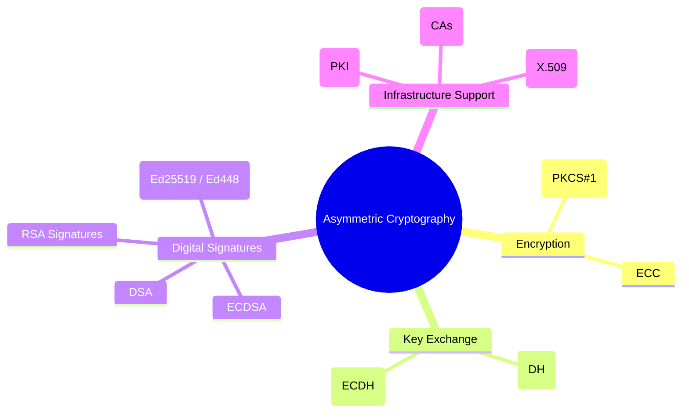

# 🔐 Asymmetric Cryptography (Public-Key Cryptography)

# 🌳 Mermaid Mindmap

### 📌 Definition

* Uses a **key pair**:

  * **Public key** → shared openly, used for encryption/verification.
  * **Private key** → kept secret, used for decryption/signing.
* Solves the **key distribution problem** of symmetric cryptography.
* Core role in **Confidentiality, Authentication, Non-Repudiation, and Secure Key Exchange**.

---

## 🌳 Subdivision of Asymmetric Cryptography

### 1. **Encryption**

* Provides **confidentiality** by encrypting data with the recipient’s public key.
* Only the holder of the private key can decrypt.
* **Examples:**

  * **RSA Encryption (PKCS#1):** Classic, widely used in TLS and secure email.
  * **Elliptic Curve Cryptography (ECC):** Efficient alternative to RSA, smaller keys.
* **Privacy role:** Allows secure exchange of information without a shared secret in advance.

---

### 2. **Key Exchange**

* Establishes a **shared secret key** over an insecure channel.
* That key is then used for **symmetric encryption** (fast bulk encryption).
* **Examples:**

  * **Diffie-Hellman (DH):** First public key exchange protocol.
  * **Elliptic Curve Diffie-Hellman (ECDH):** Modern, efficient, widely used in TLS, Signal protocol.
* **Privacy role:** Prevents eavesdroppers from learning session keys.

---

### 3. **Digital Signatures**

* Provide **authentication, integrity, and non-repudiation**.
* Private key signs, public key verifies.
* **Examples:**

  * **RSA Signatures (PKCS#1 v1.5, PSS):** Classic, used in TLS certificates, code signing.
  * **DSA (Digital Signature Algorithm, FIPS 186):** NIST standard, less common today.
  * **ECDSA (Elliptic Curve DSA):** Efficient, used in Bitcoin, TLS, and IoT.
  * **EdDSA (Ed25519, Ed448):** Modern, fast, resistant to side-channel attacks.
* **Privacy role:** Ensures messages are authentic and unaltered, and that the sender cannot later deny authorship.

---

### 4. **Infrastructure Support (PKI)**

* Asymmetric cryptography requires a **trust framework**.
* **Public Key Infrastructure (PKI):** Uses digital certificates (X.509) to bind public keys to identities.
* **Certificate Authorities (CAs):** Trusted third parties that issue certificates.
* **Privacy role:** Ensures that when you use someone’s public key, it really belongs to them.

---

## 📌 Why Asymmetric Cryptography is Essential for Digital Privacy

* **Key Distribution:** Eliminates the need for secure pre-shared keys.
* **Authentication:** Ensures entities are who they claim to be.
* **Non-Repudiation:** Provides undeniable proof of authorship/signature.
* **Hybrid Systems:** Almost always combined with symmetric cryptography (e.g., TLS: RSA/ECDH to exchange AES keys).

---
