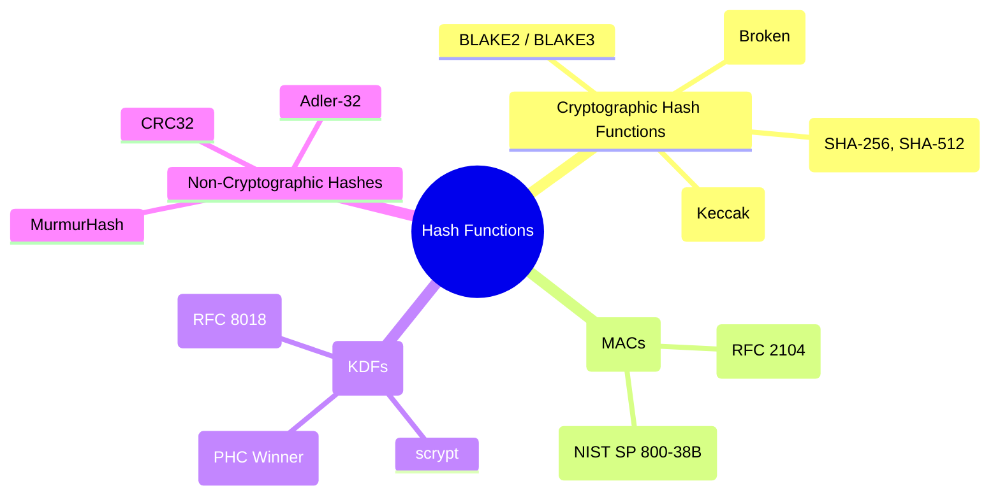

# 🔐 Hash Functions
# 🌳 Mermaid Mindmap

---
### 📌 Definition

* A **hash function** is a one-way mathematical function that maps input data of any size into a fixed-length output (digest).
* Properties required for **cryptographic hash functions**:

  * **Preimage resistance:** Hard to find a message from its hash.
  * **Second preimage resistance:** Hard to find two messages with the same hash.
  * **Collision resistance:** Hard to find two different messages with identical hashes.
* Core role in **Integrity, Authentication, Digital Signatures, and Key Protection**.

---

## 🌳 Subdivision of Hash Functions

### 1. **Cryptographic Hash Functions**

* General-purpose secure hashing for integrity verification.
* **Examples:**

  * **SHA-2 (SHA-256, SHA-512):** Widely used standard, secure.
  * **SHA-3 (Keccak):** Newer standard, sponge construction, resistant to new attack models.
  * **BLAKE2 / BLAKE3:** Fast, modern alternatives with strong security.
  * **MD5 / SHA-1:** Broken, no longer suitable for security.
* **Privacy role:**

  * Verifies that data has not been tampered with.
  * Used in file verification, blockchain, TLS handshakes.

---

### 2. **Message Authentication Codes (MACs)**

* Combine a **secret key** with a hash function or block cipher to provide **integrity + authentication**.
* **Examples:**

  * **HMAC (Hash-based MAC, RFC 2104):** Built from SHA-2, widely used in TLS, APIs, JWTs.
  * **CMAC (Cipher-based MAC, NIST SP 800-38B):** Uses AES block cipher.
* **Privacy role:**

  * Ensures only someone with the shared key could have created the message.
  * Used in API authentication, secure channels, and wireless protocols.

---

### 3. **Key Derivation Functions (KDFs)**

* Stretch **weak or human-chosen secrets (like passwords)** into strong cryptographic keys.
* Protect against brute force and rainbow table attacks.
* **Examples:**

  * **PBKDF2 (PKCS #5, RFC 8018):** Standard, uses repeated hashing.
  * **scrypt:** Memory-hard, slows down hardware attacks.
  * **Argon2 (Password Hashing Competition winner):** Strongest modern KDF.
* **Privacy role:**

  * Secures password-based authentication.
  * Protects encryption keys derived from low-entropy inputs.

---

### 4. **Checksums & Non-Cryptographic Hashes** *(not suitable for privacy)*

* Simple error-detection mechanisms (CRC32, Adler-32, MurmurHash).
* Fast but **insecure** — should **not** be used for digital privacy.
* **Privacy role:** None (informational only).

---

## 📌 Why Hash Functions are Essential for Digital Privacy

* **Data Integrity:** Ensure files, messages, or transactions haven’t been modified.
* **Authentication:** Used in HMACs for API keys, session validation, TLS.
* **Digital Signatures:** Always sign a hash of the message, not the raw message (efficiency & security).
* **Password Protection:** Store hashes, not plaintext; use KDFs for added resistance.
* **Blockchain & Digital Identity:** Core of immutability and trust in distributed ledgers.

---
