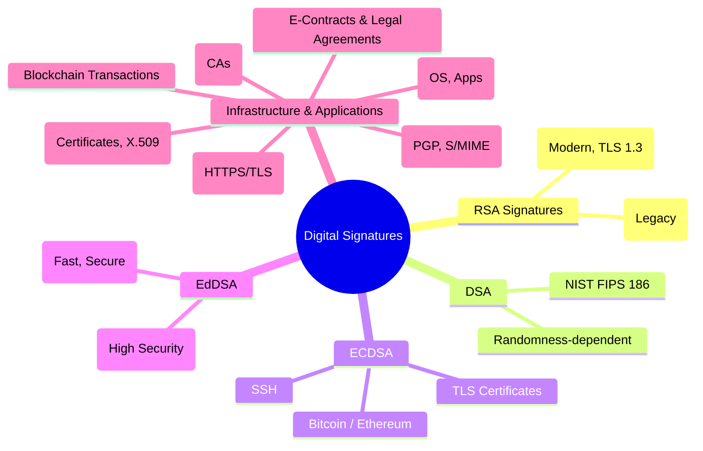

# 🔐 Digital Signatures 

# 🌳 Mermaid Mindmap 

### 📌 What They Are

A **digital signature** is the digital equivalent of a handwritten signature or a stamped seal, but **far stronger** because it is based on rigorous cryptography.

* **Process:**

  1. **Hashing** → The message/document is first hashed into a fixed-size digest.
  2. **Signing** → The sender encrypts the digest using their **private key** (asymmetric crypto).
  3. **Verification** → The receiver uses the sender’s **public key** to decrypt the signature and compare with their own computed hash of the message.
* **Guarantees:**

  * Message integrity (no tampering).
  * Authenticity (sender is who they claim).
  * Non-repudiation (sender cannot later deny it).

---

## 🌳 Subdivision & Detailed Explanation

### **1. RSA Signatures**

* **Foundation:** RSA algorithm, based on the difficulty of factoring large numbers.
* **How it works:**

  * Private key → signs hash.
  * Public key → verifies signature.
* **Padding schemes:**

  * **PKCS#1 v1.5:** Older, still common, but vulnerable if implemented incorrectly.
  * **RSA-PSS (Probabilistic Signature Scheme):** Modern, randomized padding, recommended by standards like PKCS#1 v2.2 and TLS 1.3.
* **Uses:**

  * TLS/SSL certificates, software signing, secure email (S/MIME).
* **Limitations:**

  * Requires large key sizes (2048–4096 bits).
  * Slower than elliptic curve signatures.

---

### **2. DSA (Digital Signature Algorithm, FIPS 186)**

* **Foundation:** Based on discrete logarithms.
* **Standardization:** NIST-approved in the 1990s (FIPS 186).
* **Process:** Generates random values per signature, making it dependent on strong randomness.
* **Uses:**

  * Federal standards, some secure email and government systems.
* **Limitations:**

  * Efficiency is weaker compared to RSA/ECC.
  * Insecure if random values are reused (famously broke PlayStation 3 security).
  * Gradually being replaced by elliptic curve signatures.

---

### **3. ECDSA (Elliptic Curve Digital Signature Algorithm)**

* **Foundation:** Elliptic Curve Cryptography (ECC), based on discrete logarithms in elliptic curve groups.
* **Advantages:**

  * Strong security with smaller keys (e.g., 256-bit ECC ≈ 3072-bit RSA).
  * Faster computations → ideal for constrained environments (mobile, IoT).
* **Uses:**

  * Bitcoin & Ethereum blockchain transactions.
  * TLS certificates (especially modern ones).
  * SSH authentication.
* **Limitations:**

  * Complex implementation → mistakes lead to vulnerabilities.
  * Relies heavily on secure randomness (reuse of randomness breaks security).

---

### **4. EdDSA (Edwards-Curve Digital Signature Algorithm)**

* **Foundation:** Built on twisted Edwards curves, designed to fix ECDSA’s weaknesses.
* **Variants:**

  * **Ed25519:** Fast, secure, 128-bit security level, widely deployed.
  * **Ed448:** Stronger, 224-bit security level, suitable for long-term applications.
* **Advantages:**

  * Deterministic → no need for random values during signing (eliminates nonce-related vulnerabilities).
  * Resistant to side-channel attacks (e.g., timing leaks).
  * Simpler to implement securely.
* **Uses:**

  * OpenSSH (default key type since 2014).
  * TLS 1.3.
  * Next-generation authentication systems.
* **Privacy role:** Provides efficient, strong guarantees of integrity and authenticity.

---

### **5. Infrastructure & Applications**

Digital signatures don’t exist in isolation — they are part of **larger trust frameworks**.

* **PKI (Public Key Infrastructure):**

  * Uses X.509 certificates to bind public keys to real-world identities.
  * Certificates are signed by Certificate Authorities (CAs).
  * Essential for HTTPS, email encryption, code signing.

* **Applications of Digital Signatures in Privacy:**

  * **Secure Web (TLS/HTTPS):** Certificates signed with RSA/ECDSA/EdDSA.
  * **Secure Email:** PGP and S/MIME use digital signatures for sender authenticity.
  * **Code Signing:** Software updates and apps (Windows, Android, iOS) are digitally signed.
  * **Blockchain & Cryptocurrencies:** Bitcoin uses ECDSA, Monero uses ring signatures (advanced form).
  * **Legal/E-Contracts:** Digital signatures ensure legal non-repudiation of agreements.

---

## 📌 Why Digital Signatures Matter for Digital Privacy

* **Confidentiality (indirectly):** Signatures are often used in key exchange, ensuring that the encryption keys you receive really come from the correct source.
* **Integrity:** Guarantee that files, transactions, or communications haven’t been modified.
* **Authentication:** Verify the identity of the sender.
* **Non-Repudiation:** Provide undeniable proof of authorship (important for law, finance, contracts).
* **Trust & Transparency:** Digital signatures are the backbone of **trust models** like PKI and blockchains.

---
