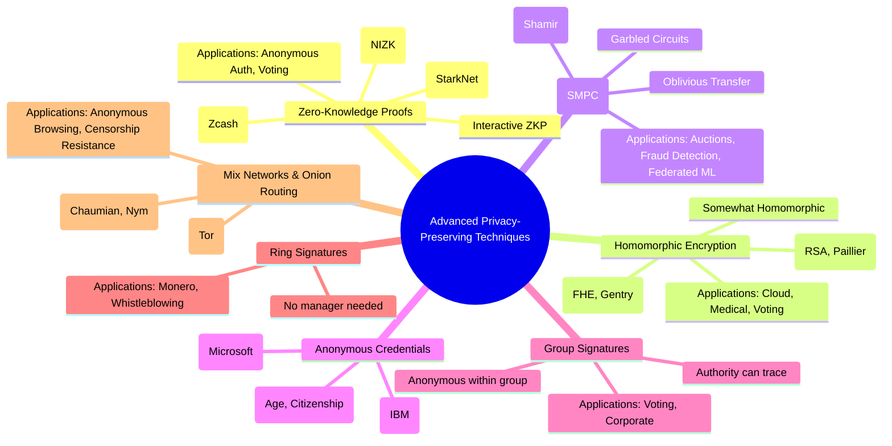

# 🔐 Advanced Privacy-Preserving Techniques
# 🌳 Mermaid Mindmap 

### 📌 Why This Category?

Traditional cryptographic techniques (symmetric, asymmetric, hashing, signatures) protect **data in transit and storage**.
But in many real-world cases, **just encrypting is not enough**:

* You may need to **prove a fact** without revealing sensitive details.
* You may want to **compute on encrypted data** without exposing it.
* You may need **collaboration among parties** without leaking their secrets.
* You may want to remain **anonymous or unlinkable** while authenticating or transacting.

That’s where **advanced privacy-preserving cryptography** comes in.

---

## 🌳 Major Divisions

---

### **1. Zero-Knowledge Proofs (ZKPs)**

📌 **Definition**: A cryptographic protocol where one party (the prover) convinces another (the verifier) that a statement is true, **without revealing any extra information** beyond the truth of the statement.

* **Properties**:

  * **Completeness** → If the statement is true, an honest prover can always convince the verifier.
  * **Soundness** → A dishonest prover cannot convince a verifier of a false statement.
  * **Zero-Knowledge** → The verifier learns nothing beyond the fact that the statement is true.

* **Variants**:

  * **Interactive ZKPs** → Require back-and-forth communication.
  * **Non-Interactive ZKPs (NIZKPs)** → No interaction; often used in blockchain systems.
  * **zk-SNARKs** (Succinct Non-Interactive Arguments of Knowledge) → Short proofs, widely used in Zcash for private transactions.
  * **zk-STARKs** (Scalable Transparent Arguments of Knowledge) → Do not require trusted setup, scalable for large data.

* **Applications**:

  * Anonymous authentication → Prove you are over 18 without revealing DOB.
  * Privacy blockchains (Zcash, StarkNet).
  * Secure voting → Prove vote validity without revealing content.

---

### **2. Homomorphic Encryption**

📌 **Definition**: An encryption scheme that allows mathematical computations to be performed **directly on ciphertexts**. The result, when decrypted, matches the result of operations as if they were done on plaintext.

* **Types**:

  * **Partial Homomorphic Encryption (PHE)** → Supports one operation (e.g., addition or multiplication).

    * Examples: RSA (multiplication), Paillier (addition).
  * **Somewhat Homomorphic Encryption (SHE)** → Supports limited operations before noise grows too large.
  * **Fully Homomorphic Encryption (FHE)** → Supports unlimited, arbitrary computations.

    * Breakthrough: Craig Gentry’s scheme (2009).

* **Applications**:

  * Secure cloud computing → A company can process user data without seeing it.
  * Medical privacy → Hospitals encrypt records, researchers analyze them without decryption.
  * Secure elections → Ballots remain encrypted during tallying.

* **Reason for Division**: Classified by **extent of supported computations** (partial, somewhat, full).

---

### **3. Secure Multi-Party Computation (SMPC)**

📌 **Definition**: A cryptographic method that allows multiple parties to jointly compute a function **without revealing their private inputs** to each other.

* **Techniques**:

  * **Secret Sharing (Shamir’s Secret Sharing):** Splits a secret into shares; only a threshold of shares can reconstruct.
  * **Garbled Circuits:** Encodes a function into a garbled form so that parties can evaluate without learning inputs.
  * **Oblivious Transfer:** Allows a sender to transfer one of many possible pieces of information, without knowing which one the receiver got.

* **Applications**:

  * Privacy-preserving auctions (bidders’ values remain private).
  * Collaborative fraud detection across banks.
  * Federated learning with privacy (training AI models across hospitals without exposing patient data).

* **Reason for Division**: Based on **computation model** (secret sharing, circuit-based, transfer-based).

---

### **4. Anonymous Credentials & Group Signatures**

📌 **Anonymous Credentials**: Allow users to prove attributes (like age, citizenship, membership) **without revealing identity**.

* **Examples**:

  * IBM **Idemix**.
  * Microsoft **U-Prove**.
* **Use Case**:

  * “I am a student” → without revealing name, ID, or institution.

📌 **Group Signatures**: Enable any member of a group to sign a message on behalf of the group, but the verifier cannot tell which member.

* **Properties**:

  * Anonymous within the group.
  * An authority (opener) can reveal the signer in case of disputes.

* **Use Case**:

  * Corporate whistleblowing.
  * Anonymous voting.

* **Reason for Division**: Both are about **unlinkable identity proofs**, but anonymous credentials focus on **attributes**, group signatures on **membership anonymity**.

---

### **5. Ring Signatures**

📌 **Definition**: A digital signature scheme where a signer is hidden within a group of possible signers, but without any group authority.

* **Difference from Group Signatures**:

  * Group signatures need a manager; ring signatures do not.
* **Applications**:

  * **Monero cryptocurrency** → Transactions are unlinkable to specific users.
  * Whistleblowers → Can publish documents anonymously while still verifiable.

---

### **6. Mix Networks & Onion Routing**

📌 **Definition**: Network-level cryptographic techniques to **hide communication metadata** (sender, receiver, path).

* **Mix Networks (Chaumian Mixes):** Collect messages, shuffle them, and re-encrypt to break sender-receiver link.

* **Onion Routing (e.g., Tor):** Wrap messages in multiple layers of encryption. Each relay peels one layer, forwarding the rest.

* **Applications**:

  * Anonymous web browsing (Tor).
  * Secure messaging systems (Mixnets like Nym).
  * Censorship resistance.

---

## 📌 Why These Techniques Matter for Digital Privacy

* **Beyond encryption**: They protect not only data but also **identity, metadata, and usage patterns**.
* **Real-world relevance**:

  * ZKPs → Anonymous digital IDs.
  * FHE → Secure cloud & healthcare.
  * SMPC → Collaborative AI & finance.
  * Ring/Group signatures → Cryptocurrency, whistleblowing.
  * Onion routing → Anonymous web browsing.

These techniques make **privacy-preserving systems** possible, where trust is not placed in people but in cryptography.

---
