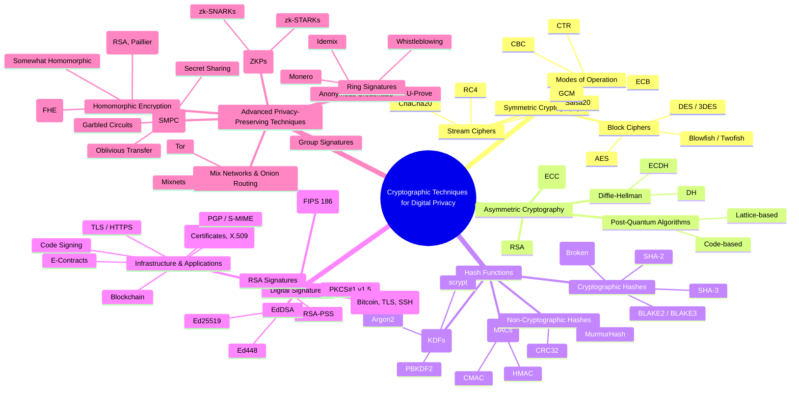

# 🌳 Unified Structure of Cryptographic Techniques for Digital Privacy
# 🌳 Mermaid Unified Mindmap

### **1. Symmetric Cryptography**

* Uses **single shared secret key**.
* Fast, efficient, but key distribution is a challenge.
* **Subdivisions:**

  * **Block Ciphers** (AES, DES, 3DES, Blowfish, Twofish).
  * **Stream Ciphers** (RC4, ChaCha20, Salsa20).
  * **Modes of Operation** (ECB, CBC, GCM, CTR).
* **Uses:** Data encryption, VPNs, Wi-Fi security.

---

### **2. Asymmetric Cryptography**

* Uses **public/private key pairs**.
* Solves key distribution problem.
* **Subdivisions:**

  * **RSA** (encryption, key exchange, signatures).
  * **Diffie-Hellman (DH, ECDH)** (key exchange).
  * **Elliptic Curve Cryptography (ECC)** (smaller, faster).
  * **Post-Quantum Algorithms** (lattice-based, code-based).
* **Uses:** Secure email, TLS, digital identity.

---

### **3. Hash Functions**

* One-way functions mapping any input to fixed output.
* Ensure **integrity, authentication, key protection**.
* **Subdivisions:**

  * **Cryptographic Hashes:** SHA-2, SHA-3, BLAKE2/3, MD5/SHA-1 (broken).
  * **Message Authentication Codes (MACs):** HMAC, CMAC.
  * **Key Derivation Functions (KDFs):** PBKDF2, scrypt, Argon2.
  * **Non-Cryptographic Hashes:** CRC32, MurmurHash (not for privacy).
* **Uses:** File integrity, password hashing, blockchain.

---

### **4. Digital Signatures**

* Ensure **authenticity, integrity, non-repudiation**.
* Built on asymmetric crypto, but treated as distinct branch.
* **Subdivisions:**

  * **RSA Signatures:** PKCS#1, RSA-PSS.
  * **DSA:** NIST FIPS 186 (legacy).
  * **ECDSA:** Used in Bitcoin, TLS, SSH.
  * **EdDSA:** Ed25519, Ed448 (modern, secure).
* **Infrastructure & Applications:** PKI, TLS/HTTPS, PGP/S-MIME, code signing, blockchain, e-contracts.

---

### **5. Advanced Privacy-Preserving Techniques**

* Go beyond encryption → protect **identity, metadata, computations**.
* **Subdivisions:**

  * **Zero-Knowledge Proofs (ZKPs):** zk-SNARKs, zk-STARKs.
  * **Homomorphic Encryption:** Partial, Somewhat, Fully Homomorphic (FHE).
  * **Secure Multi-Party Computation (SMPC):** Secret sharing, garbled circuits.
  * **Anonymous Credentials:** Idemix, U-Prove.
  * **Group Signatures:** Anonymous group signing.
  * **Ring Signatures:** Used in Monero, whistleblowing.
  * **Mix Networks & Onion Routing:** Mixnets, Tor.
* **Uses:** Blockchain, cloud security, privacy-preserving ML, anonymous browsing, voting, payments.

---
