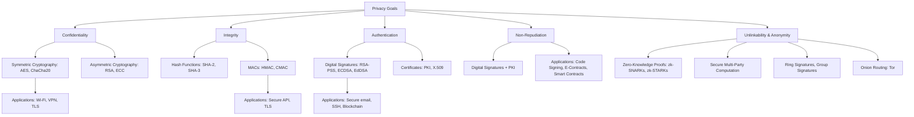

# 🔐 Layered Privacy Architecture

### **Privacy Goals:**

* **Confidentiality:** Prevent unauthorized access to data.
* **Integrity:** Ensure data isn’t tampered with.
* **Authentication:** Verify identity of entities.
* **Non-Repudiation:** Ensure a sender cannot deny actions.
* **Unlinkability / Anonymity:** Prevent linking actions to identities or patterns.

---

## 🌳 Mapping Privacy Goals to Cryptographic Techniques

| **Privacy Goal (Layer)**                      | **Cryptographic Techniques Used**           | **Examples / Standards**                   |
| --------------------------------------------- | ------------------------------------------- | ------------------------------------------ |
| **Layer 1: Confidentiality**                  | Symmetric Encryption, Asymmetric Encryption | AES (WPA3), ChaCha20, RSA, ECC (TLS, VPNs) |
| **Layer 2: Integrity**                        | Hash Functions, MACs                        | SHA-2, SHA-3, HMAC, GCM mode               |
| **Layer 3: Authentication**                   | Digital Signatures, Certificates            | RSA-PSS, ECDSA, EdDSA, PKI                 |
| **Layer 4: Non-Repudiation**                  | Digital Signatures + PKI                    | Code signing, blockchain smart contracts   |
| **Layer 5: Unlinkability / Advanced Privacy** | ZKPs, SMPC, Ring Signatures, Onion Routing  | zk-SNARKs (Zcash), Monero, Tor             |

---

## 🌐 Mermaid Architecture Diagram

---

## 📌 How to Read the Diagram
- **Bottom layers (Confidentiality, Integrity):** Provide basic protection for data.  
- **Middle layers (Authentication, Non-Repudiation):** Establish trust and legal accountability.  
- **Top layer (Unlinkability/Anonymity):** Protects privacy of identities and metadata, crucial for advanced privacy-preserving systems.  

---
