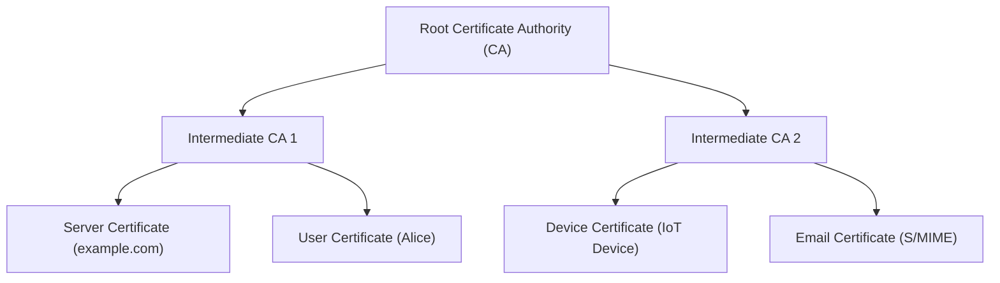
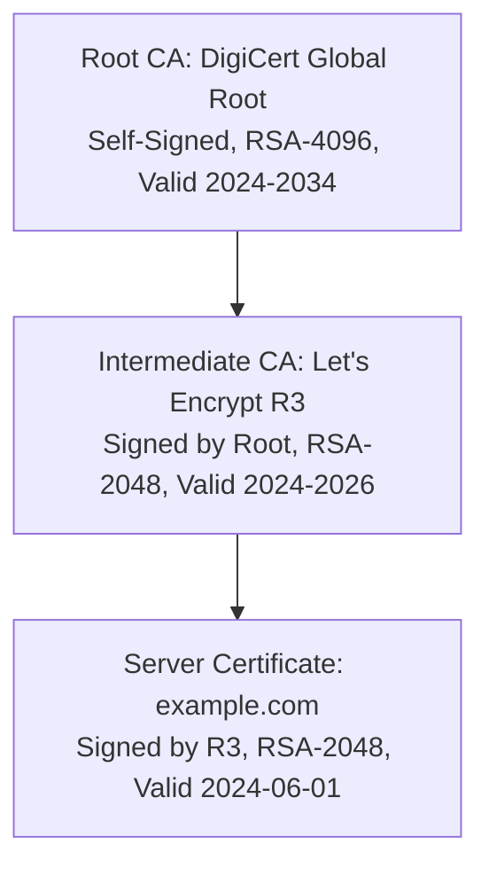
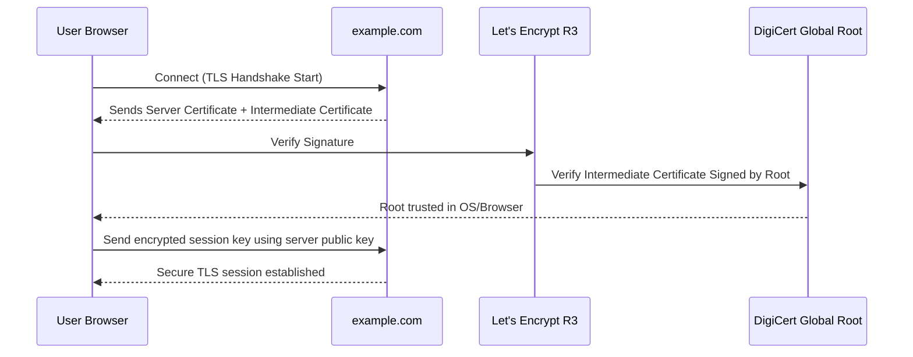

# 🔐 Public Key Infrastructure (PKI)

## **1. Definition**

**Public Key Infrastructure (PKI)** is a **framework of policies, technologies, and processes** that enables **secure communication** and **trust establishment** over untrusted networks.
It is primarily used for:

* **Digital Certificates** issuance and management
* **Authentication**
* **Encryption**
* **Digital Signatures**
* **Non-repudiation**

PKI **binds public keys** with **entities (people, devices, organizations)** through **trusted certificate authorities (CAs)**.

---

## **2. Goals of PKI**

| **Goal**             | **How PKI Achieves It**                         |
| -------------------- | ----------------------------------------------- |
| **Confidentiality**  | Encrypting data using public keys (TLS, HTTPS)  |
| **Integrity**        | Digital signatures prevent tampering            |
| **Authentication**   | Certificates verify identities of servers/users |
| **Non-Repudiation**  | Signed digital transactions cannot be denied    |
| **Trust Management** | Hierarchical CA model ensures legitimacy        |

---

## **3. PKI Core Components**

| **Component**                                 | **Description**                                          | **Examples / Standards**          |
| --------------------------------------------- | -------------------------------------------------------- | --------------------------------- |
| **Certificate Authority (CA)**                | Trusted third party that issues and manages certificates | DigiCert, Let’s Encrypt           |
| **Registration Authority (RA)**               | Verifies identities before certificates are issued       | Intermediate verification servers |
| **Digital Certificates**                      | Bind a public key with an identity                       | X.509 certificates                |
| **Public / Private Keys**                     | Core cryptographic elements                              | RSA, ECC                          |
| **Certificate Revocation List (CRL)**         | List of invalid/revoked certificates                     | Managed by CA                     |
| **Online Certificate Status Protocol (OCSP)** | Real-time certificate validity checking                  | RFC 6960                          |
| **Repositories**                              | Store and distribute certificates and CRLs               | LDAP directories, OCSP responders |

---

## **4. PKI Hierarchy**

PKI operates on a **chain of trust**:

| **Level**           | **Description**                                   | **Example**                    |
| ------------------- | ------------------------------------------------- | ------------------------------ |
| **Root CA**         | Top-most trusted entity, self-signed certificate  | DigiCert Root, GlobalSign Root |
| **Intermediate CA** | Subordinate to root, issues certs to end entities | Let's Encrypt R3               |
| **End Entity**      | Final user, device, or server certificate         | HTTPS website certificate      |

---

### **Mermaid Diagram – PKI Hierarchy**


---

## **5. PKI Workflow**
Here’s how PKI functions step-by-step:

1. **Key Pair Generation:**  
   - User or server generates a **public/private key pair**.

2. **Certificate Signing Request (CSR):**  
   - Entity submits a CSR containing their public key and details to the **Registration Authority (RA)**.

3. **Identity Verification:**  
   - RA verifies the applicant’s identity.

4. **Certificate Issuance:**  
   - CA signs and issues a **digital certificate** binding the verified identity to the public key.

5. **Secure Communication Setup:**  
   - The certificate is installed on the server or user device.
   - During TLS handshake, it’s presented to clients for trust validation.

6. **Revocation and Status Checking:**  
   - If compromised, certificates are **revoked** using **CRL** or **OCSP**.

---

## **6. Standards in PKI**
| **Standard** | **Purpose** |
|--------------|-------------|
| **X.509** | Defines certificate format and fields |
| **PKCS (Public Key Cryptography Standards)** | Cryptographic implementations and structures |
| **TLS/SSL** | Secure communication protocol using PKI |
| **S/MIME** | Secure email exchange |
| **OCSP (RFC 6960)** | Online status verification of certificates |

---

## **7. PKI Applications**
| **Application** | **Example** |
|------------------|-------------|
| **Web Security (HTTPS)** | TLS certificates for secure browsing |
| **Email Security** | S/MIME encrypted and signed emails |
| **Document Signing** | Adobe PDF digital signatures |
| **IoT Devices** | Device authentication and secure firmware |
| **VPNs** | Mutual authentication between clients and servers |
| **Blockchain** | Identity management and smart contract verification |

---

## **8. Example Workflow in TLS**
1. Browser connects to `https://example.com`.  
2. Server sends its **certificate** to browser.  
3. Browser verifies:
   - Signed by trusted CA.
   - Certificate not expired or revoked.
4. Browser uses public key to **encrypt session keys**.
5. Secure encrypted communication begins.

---

## **9. PKI Trust Chain Example**

```

Root CA → Intermediate CA → example.com (server certificate)

```

- If **any link** in the chain is broken (e.g., intermediate certificate revoked), trust fails.

---

## **10. PKI in Privacy Context**
PKI directly supports:
- **Confidentiality** → via encrypted communication (TLS).
- **Integrity** → ensures data is untampered.
- **Authentication** → verifies identities of servers and users.
- **Non-repudiation** → digital signatures provide legal evidence.

---
We can build a **real-world PKI certificate chain visualization** showing how a browser validates an HTTPS connection. This will include:

1. **Root CA** → Trusted, pre-installed in OS/browser.
2. **Intermediate CA** → Issued by root, used for operational certificate signing.
3. **Server Certificate** → Example domain like `example.com`.


---

## **1. Example Certificate Chain**

Below is a simulated but realistic chain based on common TLS practice.

| **Field**               | **Root CA Certificate**             | **Intermediate Certificate** | **Server Certificate**                                      |
| ----------------------- | ----------------------------------- | ---------------------------- | ----------------------------------------------------------- |
| **Issuer**              | Self-signed: `DigiCert Global Root` | `DigiCert Global Root`       | `Let's Encrypt R3`                                          |
| **Subject**             | `DigiCert Global Root`              | `Let's Encrypt R3`           | `example.com`                                               |
| **Public Key**          | RSA 4096-bit                        | RSA 2048-bit                 | RSA 2048-bit                                                |
| **Serial Number**       | 01                                  | 35\:AC:78                    | 8F:4D:12                                                    |
| **Valid From**          | 2024-01-01                          | 2024-02-15                   | 2024-03-01                                                  |
| **Valid To**            | 2034-01-01                          | 2026-02-15                   | 2024-06-01                                                  |
| **Signature Algorithm** | SHA256-RSA                          | SHA256-RSA                   | SHA256-RSA                                                  |
| **Extensions**          | BasicConstraints: CA=True           | CA=True, PathLen=0           | SAN: example.com, [www.example.com](http://www.example.com) |

---

## **2. Visualizing the Trust Chain**

Here’s the **Mermaid diagram** of the above certificate hierarchy:


---

## **3. How Browser Validates the Chain**

1. **Browser/OS Trusted Root Store**  
   - Contains the **DigiCert Global Root** public key.
   - Root CA certificate is **self-signed** and pre-installed.

2. **Server Sends Chain**  
   - `example.com` sends **its certificate** + **Intermediate CA certificate** to the browser.

3. **Verification Process**
   - Browser checks if **Intermediate CA certificate** was signed by a **trusted root CA**.
   - Then it checks if **Server certificate** was signed by the intermediate.
   - Browser validates:
     - Signature correctness
     - Certificate validity dates
     - Not revoked (OCSP/CRL check)
     - Domain matches (SAN field)

4. **Session Key Exchange**
   - After trust is established, browser uses server's **public key** to exchange **symmetric session key** for TLS encryption.

---

## **4. OpenSSL Example Commands**

You can inspect a real chain using:

```bash
# Fetch server certificate and intermediates
openssl s_client -connect example.com:443 -showcerts

# View details of a certificate
openssl x509 -in server.crt -text -noout
```

---

## **5. Full PKI Workflow Visualization**



---

## **6. Summary of PKI Certificate Chain**
- **Root CA** is the **anchor of trust**, pre-installed in operating systems and browsers.
- **Intermediate CAs** issue certificates to operational entities without exposing the root key.
- **Server Certificates** represent websites, users, or devices.
- The **chain of trust** ensures **confidentiality, integrity, authentication, and non-repudiation**.

---


