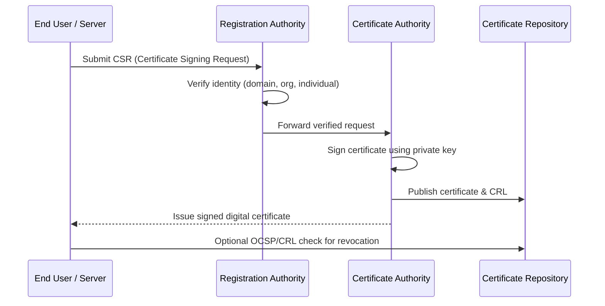
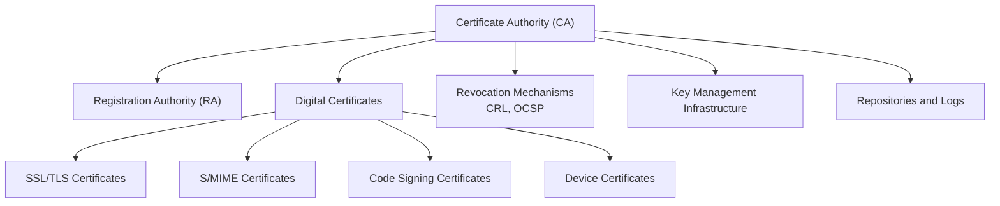

# 🔐 **PKI Core Components**

PKI is built on **five foundational components** that work together to establish trust and secure digital communications.

---

## **1. Certificate Authority (CA)**

The **Certificate Authority** is the **trust anchor** of PKI.
It **issues, manages, and revokes digital certificates**, binding public keys with verified identities.

### **Key Roles**

* Issues certificates after verifying identity.
* Signs certificates to establish trust.
* Publishes **Certificate Revocation Lists (CRLs)**.
* Works in a **hierarchical structure**:

  * **Root CA** (top-most trusted entity)
  * **Intermediate/Subordinate CAs** (for operational security)

| **Type of CA**      | **Function**                                   | **Example**             |
| ------------------- | ---------------------------------------------- | ----------------------- |
| **Root CA**         | Self-signed, ultimate trust anchor             | DigiCert Global Root    |
| **Intermediate CA** | Signs end-entity certificates                  | Let's Encrypt R3        |
| **Offline CA**      | Kept offline for security, signs intermediates | Military/government PKI |

### **Standards**

* Certificates issued using **X.509 standard** (RFC 5280).
* Must comply with **CA/Browser Forum Baseline Requirements** for HTTPS.

---

## **2. Registration Authority (RA)**

The **Registration Authority** acts as the **gatekeeper** between users and the CA.
It **verifies identities** before certificate issuance but **does not sign certificates** itself.

### **Functions**

* Validate user or organization identity.
* Approve or reject Certificate Signing Requests (CSRs).
* Offload workload from the CA for scalability.

| **Example Workflow**                                                                                                                             |
| ------------------------------------------------------------------------------------------------------------------------------------------------ |
| A company requests a TLS certificate → RA verifies domain ownership and organization details → forwards to CA → CA signs and issues certificate. |

---

## **3. Digital Certificates**

A **digital certificate** binds a **public key** to a **verified entity (person, server, or device)**.
It is like a **digital passport** that proves the holder's identity.

### **Key Elements (X.509 Fields)**

| **Field**               | **Description**                                       |
| ----------------------- | ----------------------------------------------------- |
| **Subject**             | Entity the certificate belongs to (e.g., example.com) |
| **Issuer**              | CA that issued the certificate                        |
| **Public Key**          | The public key bound to the entity                    |
| **Validity Period**     | Start and expiration dates                            |
| **Signature Algorithm** | E.g., SHA-256 with RSA                                |
| **Extensions**          | SAN (Subject Alternative Names), Key Usage            |

### **Types of Certificates**

| **Type**                          | **Use Case**              |
| --------------------------------- | ------------------------- |
| **SSL/TLS Certificates**          | Secure websites (HTTPS)   |
| **S/MIME Certificates**           | Email encryption/signing  |
| **Code Signing Certificates**     | Software authenticity     |
| **Device Certificates**           | IoT authentication        |
| **Document Signing Certificates** | Legal document validation |

---

## **4. Certificate Revocation Mechanisms**

Certificates must be revoked when **compromised** or **no longer trusted**.
Two main methods exist:

| **Mechanism**                                 | **Description**                                        | **Pros**                               | **Cons**                        |
| --------------------------------------------- | ------------------------------------------------------ | -------------------------------------- | ------------------------------- |
| **CRL (Certificate Revocation List)**         | Periodic list of revoked certificates published by CA. | Simple, widely supported.              | Not real-time, can be outdated. |
| **OCSP (Online Certificate Status Protocol)** | Real-time validation query to CA/OCSP responder.       | Up-to-date, immediate revocation info. | Requires online availability.   |

---

## **5. Key Management Infrastructure**

PKI relies on **asymmetric key pairs**:

* **Public Key:** Shared freely for encryption and verification.
* **Private Key:** Kept secret for decryption and signing.

### **Functions**

* Secure **key generation** (hardware-based recommended).
* **Key storage** using Hardware Security Modules (HSMs).
* **Key rotation** policies to maintain security.
* **Backup and recovery** of keys.

| **Example Tools**              | **Use**                                        |
| ------------------------------ | ---------------------------------------------- |
| HSM (Hardware Security Module) | Secure key storage and signing                 |
| TPM (Trusted Platform Module)  | Device-based key protection                    |
| OpenSSL                        | Software-based key generation and CSR creation |

---

## **6. Supporting Components**

Beyond the five essentials, several **supporting elements** ensure PKI operates smoothly:

| **Component**                     | **Purpose**                                         |
| --------------------------------- | --------------------------------------------------- |
| **Repositories**                  | Store and distribute certificates, CRLs, OCSP data. |
| **Policy Authorities**            | Define rules for PKI operation.                     |
| **Auditing & Logging**            | Ensure compliance and detect misuse.                |
| **Time Stamping Authority (TSA)** | Provide verifiable timestamps for signatures.       |

---

## **PKI Core Component Workflow**

Here’s how these components interact:

---

## **Summary Table of PKI Core Components**

| **Component**                     | **Primary Function**               | **Standards / Examples**                         |
| --------------------------------- | ---------------------------------- | ------------------------------------------------ |
| **CA (Certificate Authority)**    | Issue, manage, revoke certificates | X.509, DigiCert, Let's Encrypt                   |
| **RA (Registration Authority)**   | Identity verification              | Domain Validation (DV), Extended Validation (EV) |
| **Digital Certificates**          | Bind public key to identity        | SSL/TLS, S/MIME, Code Signing                    |
| **Revocation Mechanisms**         | Manage compromised certificates    | CRL (RFC 5280), OCSP (RFC 6960)                  |
| **Key Management Infrastructure** | Generate, store, and protect keys  | HSM, TPM, OpenSSL                                |

---

## **Visualization: PKI Component Hierarchy**

---

## **PKI in Practice**

* **Web Security:** TLS certificates for HTTPS (Let's Encrypt).
* **Email Security:** S/MIME encrypted and signed email.
* **Government / Military:** Smart cards, e-passports.
* **Enterprise Security:** VPN access, employee authentication.
* **IoT:** Secure device onboarding and firmware validation.

---
