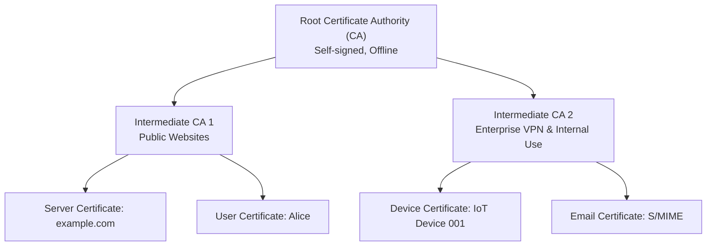
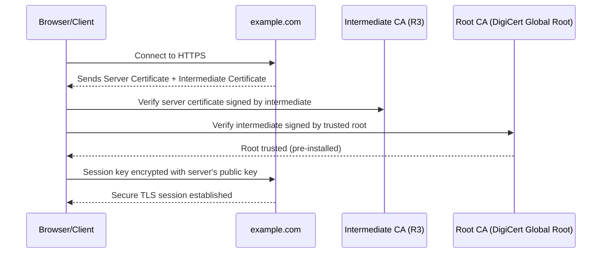
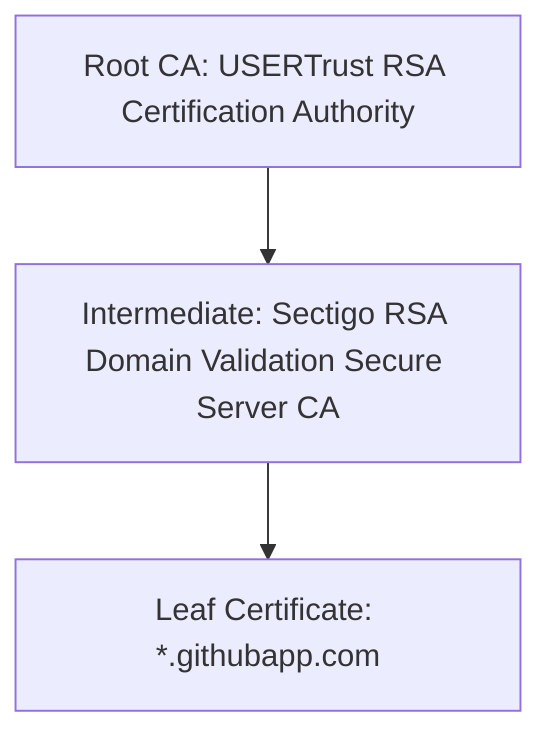

# 🔐 **PKI Hierarchy**

The **PKI hierarchy**, also called the **Chain of Trust**, is the **structured model of certificate authorities (CAs)** that ensures secure digital communication by organizing CAs into different levels.
Each level **delegates trust downward** by signing certificates for the next level.

---

## **1. Purpose of PKI Hierarchy**

| **Goal**               | **How PKI Hierarchy Achieves It**                     |
| ---------------------- | ----------------------------------------------------- |
| **Trust Management**   | Creates a clear, verifiable path of trust.            |
| **Scalability**        | Multiple intermediates distribute workloads securely. |
| **Security**           | Root CA stays offline to reduce risk of compromise.   |
| **Revocation Control** | Easy to revoke compromised intermediates.             |

---

## **2. Levels of the PKI Hierarchy**

The PKI hierarchy has **three primary layers**:

| **Layer**                              | **Role**                                                             | **Characteristics**                                                                                                           | **Examples**                             |
| -------------------------------------- | -------------------------------------------------------------------- | ----------------------------------------------------------------------------------------------------------------------------- | ---------------------------------------- |
| **Root CA (Top-Level)**                | Ultimate trust anchor. Issues certificates to intermediate CAs only. | - Self-signed certificate.<br>- Kept offline for maximum security.<br>- Very long validity period (10–20 years).              | DigiCert Global Root, GlobalSign Root    |
| **Intermediate CA (Mid-Level)**        | Delegates trust to end entities while protecting the root key.       | - Signed by the Root CA.<br>- Can issue end-entity certificates or other intermediates.<br>- Valid for 3–6 years.             | Let's Encrypt R3, Amazon Intermediate CA |
| **End-Entity Certificate (Leaf Node)** | Represents users, servers, or devices.                               | - Issued by intermediate CA.<br>- Short validity period (90 days – 1 year).<br>- Used directly in TLS/HTTPS, email, IoT, etc. | `example.com` SSL certificate            |

---

### **Hierarchy Structure**

```
Root CA
   ↓
Intermediate CA 1, Intermediate CA 2
   ↓
Server Certificates, User Certificates, Device Certificates
```

---

## **3. PKI Hierarchy Diagram (Mermaid)**



---

## **4. Example: Real-World TLS PKI Hierarchy**
**Scenario:** Connecting to `https://example.com`.

| **Step** | **What Happens** |
|----------|------------------|
| **1. Root CA** | `DigiCert Global Root` is pre-installed in the browser's trusted root store. |
| **2. Intermediate CA** | `Let's Encrypt R3` is signed by DigiCert Root. |
| **3. Server Certificate** | `example.com` certificate is signed by `Let's Encrypt R3`. |
| **4. Validation Process** | Browser checks chain from server certificate → intermediate → root. |

**Chain of Trust:**
```

DigiCert Global Root (trusted)
→ Let's Encrypt R3 (intermediate)
→ example.com (server certificate)

```

---

## **5. Workflow: How Hierarchy Works**

### **Step-by-step Process**
1. **Root CA creation:**
   - Root generates a **self-signed certificate**.
   - Installed in OS/browser trust stores.

2. **Intermediate CAs issued:**
   - Root signs intermediates to delegate certificate issuance.

3. **End-Entity Certificate request:**
   - A user/server submits a **CSR (Certificate Signing Request)**.
   - Intermediate CA issues a certificate after verification.

4. **Validation during TLS handshake:**
   - Server sends **its certificate + intermediates** to client.
   - Client validates the full chain up to a trusted root.

---

### **Mermaid Sequence Diagram: Validation**



---

## **6. Benefits of PKI Hierarchy**
| **Benefit** | **Explanation** |
|--------------|----------------|
| **Security Isolation** | Root CA stays offline → even if intermediates are hacked, root remains safe. |
| **Scalable Trust** | Multiple intermediates can handle different purposes (TLS, email, IoT). |
| **Simplified Revocation** | Only compromised intermediates need revocation, not the entire root. |
| **Operational Flexibility** | Enterprises can manage private intermediates for internal certificates. |

---

## **7. Real-World PKI Hierarchy Example**
**Let's Encrypt Example:**
```

ISRG Root X1
↓
Let's Encrypt R3
↓
Server Certificate: mywebsite.com

```

**Trusted Root Stores:**
- Root is distributed via browsers and OS vendors:
  - Microsoft
  - Apple
  - Mozilla
  - Android

---

## **8. Summary Table**

| **Hierarchy Level** | **Who Controls It** | **Validity** | **Purpose** |
|----------------------|----------------------|--------------|-------------|
| **Root CA** | Certificate Authority Organization | 10–20 years | Ultimate trust anchor |
| **Intermediate CA** | CA Operations Team | 3–6 years | Issue end-entity certificates |
| **End-Entity Certificate** | User/Server/Device | 90 days – 1 year | TLS, email, authentication |

---

## **9. Key Takeaway**
- The **PKI hierarchy** provides a **structured, scalable, and secure trust model**.
- Trust **flows from top (Root)** to **bottom (end-entity)**.
- Compromises can be isolated by revoking only affected intermediates without breaking the entire infrastructure.

---

## 🔍 Example Certificate Chain: `*.githubapp.com`

From SSL Checker, the chain for `*.githubapp.com` looks like this: ([decoder.link][1])

| **Certificate Level**         | **Common Name (Subject CN)**                     | **Issuer (who signed it)**                         | **Valid From → Valid To**                       | **Signature Algorithm**                        |
| ----------------------------- | ------------------------------------------------ | -------------------------------------------------- | ----------------------------------------------- | ---------------------------------------------- |
| **Leaf / Server Certificate** | `*.githubapp.com`                                | **Sectigo RSA Domain Validation Secure Server CA** | Sep 23, 2024 → Sep 23, 2025                     | SHA256 with RSA Encryption ([decoder.link][1]) |
| **Intermediate Certificate**  | `Sectigo RSA Domain Validation Secure Server CA` | **USERTrust RSA Certification Authority**          | (exact dates not listed in same source snippet) | — ([decoder.link][1])                          |

---

## 🏗 Visualizing the Trust Chain

Here’s a **Mermaid** diagram showing how these certificates connect in the chain:



---

## ⚙️ Key Observations from the Example

- The **leaf certificate** (`*.githubapp.com`) is what browsers see when connecting to subdomains of `githubapp.com`.  
- It's signed by an **intermediate CA** (`Sectigo RSA Domain Validation Secure Server CA`), not directly by a root.  
- That intermediate is itself trusted because it is signed by a **root CA** (`USERTrust RSA Certification Authority`), which is present in most browser/OS trust stores.  
- Signature algorithm is **SHA-256 with RSA**, which is a common modern choice — strong, widely supported.  
- Validity is one year (Sep 23, 2024 → Sep 23, 2025), which is typical for many TLS certificates.  

---


