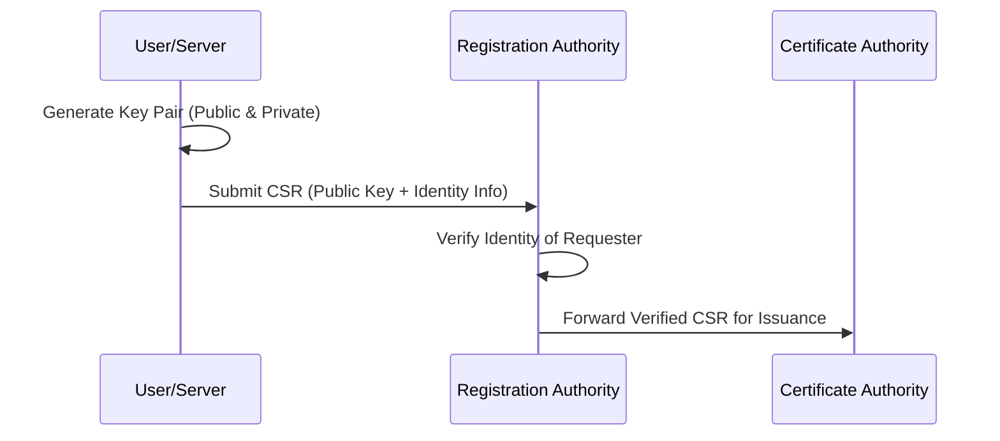
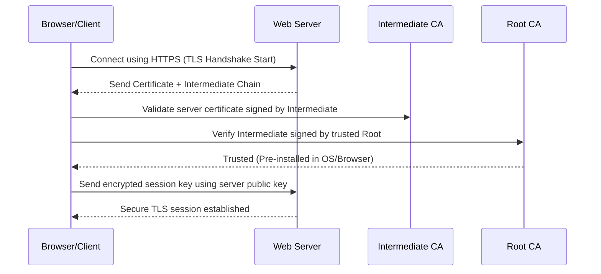
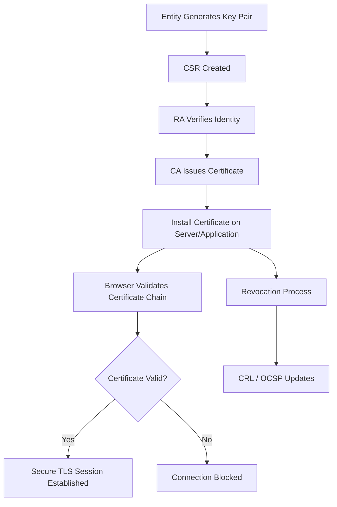

# 🔐 **PKI Workflow**

The **PKI workflow** is the complete lifecycle of how digital certificates are managed and used to establish **confidentiality, integrity, authentication, and non-repudiation** in communications.

It consists of **five main stages**:

| **Stage**                                 | **Description**                                                          | **Key Components Involved**              |
| ----------------------------------------- | ------------------------------------------------------------------------ | ---------------------------------------- |
| **1. Certificate Request & Registration** | Entity requests a certificate to identify itself securely.               | User/Server, RA (Registration Authority) |
| **2. Certificate Issuance**               | CA verifies identity and issues the certificate.                         | RA, CA, Private Key                      |
| **3. Certificate Installation & Usage**   | Certificate is installed on the device/service for secure communication. | End Entity, TLS/SSL, Email, IoT Device   |
| **4. Certificate Validation**             | Clients verify the certificate chain and trust before using it.          | Browser/Client, Root & Intermediate CAs  |
| **5. Certificate Revocation**             | If compromised or expired, certificate is revoked and added to CRL/OCSP. | CA, OCSP Responder, CRL List             |

---

## **1. Certificate Request & Registration**

This is the **first stage**, where a **user, server, or device** wants a digital identity.

### **Steps:**

1. The entity generates a **key pair**:

   * **Private Key** – stays secret on the device.
   * **Public Key** – shared with the CA.
2. It creates a **CSR (Certificate Signing Request)**, containing:

   * Public Key
   * Organization Name
   * Domain Name (CN - Common Name)
   * Country, Email, etc.
3. The CSR is sent to the **RA** (Registration Authority) for identity verification.

**Mermaid Diagram:**


---

## **2. Certificate Issuance**
Once the **RA verifies identity**, the **CA issues a signed digital certificate**.

### **Steps:**
1. CA signs the public key with its **private key**.
2. Certificate contains:
   - Public key of requester
   - Entity details (domain, org, etc.)
   - Issuer details (CA info)
   - Validity period
   - Extensions (e.g., SANs)
3. Certificate is delivered back to the requester.

| **Example Field**      | **Value (Example)** |
|------------------------|----------------------|
| Common Name (CN)       | `example.com` |
| Issuer                 | DigiCert Global Root |
| Serial Number          | 8F:4D:12 |
| Signature Algorithm    | SHA256-RSA |
| Valid From → To        | 2024-01-01 → 2025-01-01 |

---

## **3. Certificate Installation & Usage**
The entity installs the issued certificate on its server, application, or device.

- **Web Server:** Certificate used in HTTPS/TLS.
- **Email Server:** Used in S/MIME encryption/signing.
- **IoT Devices:** Authenticate device identity.

---

## **4. Certificate Validation (During Connection)**

When a client (e.g., browser) connects to a secure server:
1. Server sends its **certificate + intermediate certificates**.
2. Client verifies:
   - Certificate chain up to a trusted **root CA**.
   - Validity dates are correct.
   - Domain matches SAN field.
   - Certificate not revoked (OCSP/CRL check).
3. If valid → Secure session established.

**Mermaid Sequence Diagram:**


---

## **5. Certificate Revocation**
If a certificate is **compromised, expired, or misused**, it must be revoked immediately.

### **Methods:**
| **Method** | **Description** |
|------------|----------------|
| **CRL (Certificate Revocation List)** | CA publishes a list of revoked certificates periodically. |
| **OCSP (Online Certificate Status Protocol)** | Real-time check to see if a certificate is revoked. |

---

## **Full PKI Workflow Visualization**



---

## **Real-World Example: HTTPS Connection**

**Scenario:** You visit `https://github.com`.

1. GitHub server sends:
   - Its **leaf certificate** (`*.github.com`)
   - **Intermediate certificate** (`DigiCert SHA2 Secure Server CA`)
2. Browser validates chain:
```

DigiCert Global Root → DigiCert SHA2 Secure Server CA → \*.github.com

```
3. Browser establishes encrypted HTTPS session.

---

## **Summary Table of Workflow**

| **Step** | **Actor Involved** | **Goal** |
|----------|--------------------|----------|
| **Key Generation** | End Entity | Create secure cryptographic key pair |
| **CSR Submission** | End Entity → RA | Request certificate with public key |
| **Identity Verification** | RA | Verify entity details |
| **Certificate Issuance** | CA | Sign and issue certificate |
| **Installation** | End Entity | Deploy on server or app |
| **Validation** | Browser/Client | Verify chain of trust |
| **Revocation** | CA / OCSP | Remove compromised certificates |

---

## **Key Takeaways**
- PKI workflow enables **secure digital identity management**.
- Trust flows **top-down**: **Root CA → Intermediate CA → End Entity**.
- Validation during TLS handshake ensures **secure communication**.
- Revocation mechanisms (CRL, OCSP) protect against compromised certificates.

---

