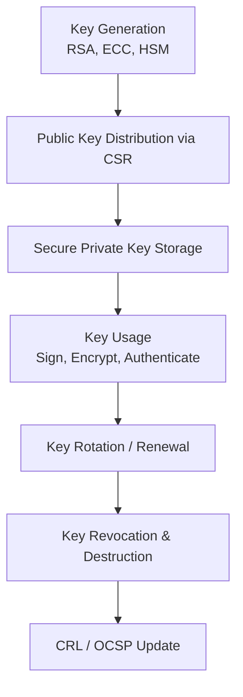
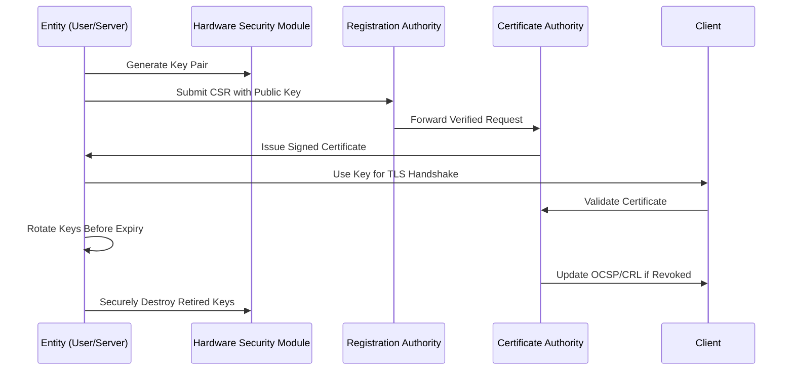

# 🔐 **Key Generation Lifecycle**

The **Key Generation Lifecycle** describes the **stages of creating, managing, and retiring cryptographic key pairs** used in PKI for digital certificates, encryption, and signing.
It ensures **confidentiality, integrity, authentication, and non-repudiation** throughout the key's lifetime.

---

## **1. Why Key Lifecycle Management is Important**

| **Risk**                   | **Impact of Poor Key Management**      |
| -------------------------- | -------------------------------------- |
| Weak or short keys         | Easily cracked → loss of security      |
| Compromised private key    | Total impersonation of identity        |
| No rotation or expiry      | Long-term attacks, outdated algorithms |
| Lack of secure destruction | Stolen keys used later for attacks     |

---

## **2. Key Generation Lifecycle Stages**

The lifecycle typically includes **six key stages**, managed using strict policies and hardware security modules (HSMs).

| **Stage**                           | **Purpose**                                                      | **Actors Involved**    |
| ----------------------------------- | ---------------------------------------------------------------- | ---------------------- |
| **1. Key Generation**               | Create cryptographic key pairs securely using strong algorithms. | Entity, HSM, CA        |
| **2. Key Distribution**             | Securely deliver public key to CA or other parties.              | RA, CA                 |
| **3. Key Storage & Protection**     | Store private key securely, often in HSMs or encrypted form.     | Entity, Admin          |
| **4. Key Usage**                    | Keys used for encryption, signing, authentication.               | Server, Browser, Email |
| **5. Key Rotation / Renewal**       | Replace old keys periodically for stronger security.             | CA, Entity             |
| **6. Key Revocation & Destruction** | Revoke compromised keys, securely destroy them.                  | CA, OCSP, Entity       |

---

## **3. Detailed Lifecycle Stages**

### **Stage 1: Key Generation**

The **first and most critical step** — generating a cryptographic key pair.

* **Algorithms Used:**

  * RSA (2048–4096 bits)
  * ECC (Elliptic Curve Cryptography – P-256, P-384)
  * Post-Quantum (future standards like CRYSTALS-Kyber)
* **Methods:**

  * Software generation using secure random number generators (CSPRNG).
  * Hardware generation inside **HSMs (Hardware Security Modules)** or **TPMs (Trusted Platform Modules)**.

**Example: RSA Key Pair**

```bash
# Generate 2048-bit RSA key pair
openssl genrsa -out private.key 2048
openssl rsa -in private.key -pubout -out public.key
```

> **Security Best Practice:** Keys must **never leave the secure boundary** of the device or HSM that generated them.

---

### **Stage 2: Key Distribution**

Once generated, the **public key** must be shared securely.

* **Public Key Distribution:**

  * Sent in a **CSR (Certificate Signing Request)** to the CA.
  * Distributed via signed digital certificates.
* **Private Key:**

  * **Never shared**. Remains strictly protected by the owner.

**Workflow Example:**

```
Entity → CSR → RA verifies identity → CA issues signed certificate → Public key distributed
```

---

### **Stage 3: Key Storage & Protection**

Private key must be **stored securely** to prevent theft.

| **Storage Method**                 | **Use Case**                                         |
| ---------------------------------- | ---------------------------------------------------- |
| **HSM (Hardware Security Module)** | Highest security for CAs and critical systems        |
| **TPM (Trusted Platform Module)**  | Built into devices like laptops and servers          |
| **Encrypted File Storage**         | Small-scale deployments, must use strong passphrases |
| **Smart Cards/USB Tokens**         | Personal certificates, identity cards                |

> **Root CA private keys** are **always stored offline** in highly secure, access-controlled environments.

---

### **Stage 4: Key Usage**

Keys are now actively used for cryptographic operations.

| **Key Type**    | **Used For**                                        |
| --------------- | --------------------------------------------------- |
| **Private Key** | Digital signing, decrypting data                    |
| **Public Key**  | Verification of signatures, encrypting session keys |

**Example:**

* During an HTTPS connection, the **server private key** signs the handshake message to prove authenticity.
* The **public key** is used by clients to verify the signature.

---

### **Stage 5: Key Rotation / Renewal**

Keys should **not be used indefinitely**. Periodic replacement prevents:

* Long-term exposure if compromised.
* Vulnerabilities due to outdated algorithms.

**Best Practice Rotation Intervals:**

| **Key Type**                 | **Recommended Lifetime** |
| ---------------------------- | ------------------------ |
| Root CA Key                  | 10–20 years              |
| Intermediate CA Key          | 3–6 years                |
| End-Entity Key (Server/User) | 90 days – 1 year         |

**Process:**

1. Generate new key pair.
2. Issue new certificate signed by CA.
3. Deploy new key and retire the old one securely.

---

### **Stage 6: Key Revocation & Destruction**

If a key is compromised or no longer needed, it must be revoked and destroyed.

* **Revocation:**

  * CA adds certificate to **CRL (Certificate Revocation List)**.
  * OCSP (Online Certificate Status Protocol) used for real-time revocation checks.

* **Destruction:**

  * Overwrite storage device holding the private key.
  * Hardware keys are physically destroyed or zeroized.

---

## **4. Key Lifecycle Workflow Diagram**



---

## **5. Example: TLS Server Key Lifecycle**
**Scenario:** A website (`example.com`) needs a secure HTTPS key pair.

| **Step** | **Action** | **Result** |
|----------|------------|------------|
| **Key Generation** | Server generates 2048-bit RSA key pair. | Secure public/private keys created. |
| **CSR Submission** | Public key sent to CA in CSR. | Identity verified. |
| **Issuance** | CA issues SSL/TLS certificate. | Server ready for HTTPS. |
| **Key Usage** | Used for TLS handshakes, data encryption. | Secure sessions established. |
| **Rotation** | Every 90 days (e.g., Let's Encrypt). | Fresh, secure keys deployed. |
| **Revocation** | If key compromised, CA revokes it via OCSP. | Clients block malicious usage. |

---

## **6. Security Best Practices**

| **Best Practice** | **Why It Matters** |
|-------------------|--------------------|
| Generate keys inside HSMs | Prevents theft by keeping keys secure. |
| Use modern algorithms | RSA-2048+, ECC P-256 for strong security. |
| Rotate keys regularly | Limits damage window if keys are stolen. |
| Secure backups of private keys | Prevents accidental permanent loss. |
| Audit and log key access | Detects misuse and insider threats. |
| Destroy keys properly after retirement | Avoids recovery by attackers. |

---

## **7. Lifecycle Summary Table**

| **Stage** | **Key Activities** | **Security Controls** |
|------------|-------------------|------------------------|
| Generation | Create strong keys using CSPRNG or HSM | Strong algorithms, randomness |
| Distribution | Public key sent to CA via CSR | TLS/secure channels |
| Storage | Private key stored securely | HSMs, encrypted files |
| Usage | Used for signing, encryption | Access controls, logging |
| Rotation | Replace periodically | Policies, automation |
| Revocation/Destruction | Revoke and securely destroy | CRL/OCSP, physical destruction |

---

## **8. Full Lifecycle Visualization**



---

## **Key Takeaway**
The **Key Generation Lifecycle** is the **foundation of PKI security**.  
- It ensures **keys are strong**, **protected**, **rotated**, and **retired securely**.  
- Proper management prevents **compromise of digital identities** and maintains **trust in secure systems**.  
- Tools like **HSMs**, **OCSP**, and **CRLs** are essential for maintaining integrity throughout the lifecycle.

```
