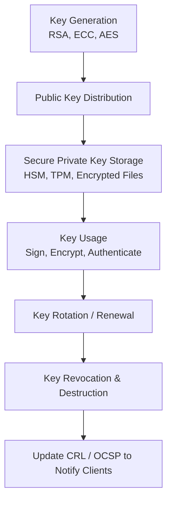
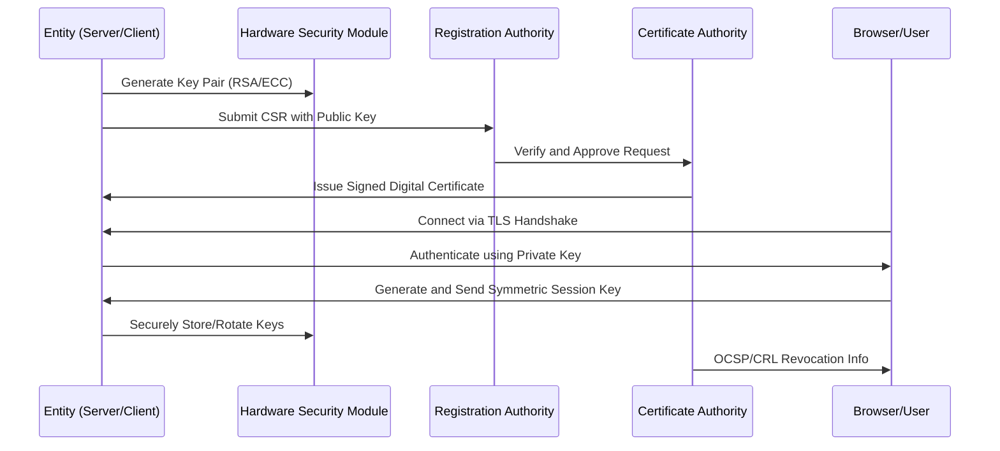

# 🔐 **Cryptographic Key Generation Lifecycle**

In **cryptography**, keys are the **core elements** that enable encryption, decryption, authentication, and digital signing.
The **key generation lifecycle** governs how cryptographic keys are **created, distributed, stored, rotated, and destroyed**, ensuring the security of encrypted systems.

---

## **1. Importance in Cryptography**

| **Why It Matters**        | **Cryptographic Impact**                                                                     |
| ------------------------- | -------------------------------------------------------------------------------------------- |
| **Secure key generation** | Weak or predictable keys can be cracked, breaking encryption (e.g., short RSA keys).         |
| **Proper distribution**   | Prevents man-in-the-middle attacks when sharing keys.                                        |
| **Safe storage**          | Compromised private keys allow full impersonation or decryption of all past/future messages. |
| **Regular rotation**      | Protects against attacks if a key is stolen or algorithms weaken over time.                  |
| **Revocation**            | Stops compromised keys from being trusted by others.                                         |

---

## **2. Types of Cryptographic Keys**

PKI and cryptography involve several **types of keys**, each with unique lifecycles.

| **Key Type**            | **Algorithm Type**  | **Example Usage**                                  | **Lifecycle Complexity**                |
| ----------------------- | ------------------- | -------------------------------------------------- | --------------------------------------- |
| **Symmetric Keys**      | AES, DES, ChaCha20  | Encrypting data, VPN tunnels, bulk TLS traffic     | Short-lived, rotated frequently         |
| **Asymmetric Keys**     | RSA, ECC, EdDSA     | Digital signatures, key exchange, TLS certificates | Long-lived, managed via PKI             |
| **Hashing Keys (HMAC)** | SHA256-HMAC         | Integrity checks, API authentication               | Medium-term, used per service           |
| **Session Keys**        | Derived dynamically | Encrypt one TLS session                            | Temporary, discarded after session ends |

---

## **3. Lifecycle Stages in Cryptography**

The cryptographic key lifecycle follows **six main stages**, closely tied to PKI processes.

| **Stage**                           | **Goal**                                      | **Algorithms Involved**     |
| ----------------------------------- | --------------------------------------------- | --------------------------- |
| **1. Key Generation**               | Create strong, random cryptographic keys.     | RSA, ECC, AES, ChaCha20     |
| **2. Key Distribution**             | Securely share public keys or symmetric keys. | Diffie-Hellman, RSA         |
| **3. Key Storage & Protection**     | Safeguard private keys against theft.         | HSMs, TPMs, encrypted files |
| **4. Key Usage**                    | Encryption, signing, authentication.          | TLS, S/MIME, blockchain     |
| **5. Key Rotation / Renewal**       | Replace old or weak keys periodically.        | RSA/ECC re-generation       |
| **6. Key Revocation & Destruction** | Stop trust in compromised or retired keys.    | OCSP, CRLs                  |

---

## **4. Detailed Lifecycle Stages**

### **Stage 1: Key Generation**

Keys must be **strong, random, and secure** to resist cryptographic attacks.

#### **Asymmetric Key Generation (RSA / ECC)**

* **RSA Example:**

  ```bash
  # Generate 2048-bit RSA key pair
  openssl genrsa -out private.key 2048
  openssl rsa -in private.key -pubout -out public.key
  ```
* **Elliptic Curve Example:**

  ```bash
  # Generate ECC key using P-256 curve
  openssl ecparam -genkey -name prime256v1 -noout -out private_ecc.key
  ```

> **Note:** For PKI root and intermediate CAs, keys are generated **inside Hardware Security Modules (HSMs)** to prevent exposure.

#### **Symmetric Key Generation (AES)**

* Symmetric keys must use **CSPRNG (Cryptographically Secure Random Number Generator)**.

  ```python
  import os
  key = os.urandom(32)  # 256-bit AES key
  print(key.hex())
  ```

---

### **Stage 2: Key Distribution**

Cryptographic systems must **share keys securely**, depending on whether they are symmetric or asymmetric.

| **Key Type**               | **Distribution Method**                                                                                    |
| -------------------------- | ---------------------------------------------------------------------------------------------------------- |
| **Asymmetric Public Key**  | Shared openly in a **certificate**, signed by a CA.                                                        |
| **Asymmetric Private Key** | **Never shared** — remains with the owner.                                                                 |
| **Symmetric Key**          | Shared securely via **asymmetric encryption** (e.g., RSA wrapping) or key exchange (e.g., Diffie-Hellman). |

**Example: TLS Key Exchange**

1. Browser sends **pre-master key** encrypted with server’s **public key**.
2. Server decrypts using its **private key**.
3. Both generate the same **symmetric session key** for encryption.

---

### **Stage 3: Key Storage & Protection**

Private keys must be **guarded against unauthorized access**.

| **Storage Method**                 | **Best Use Case**                                        |
| ---------------------------------- | -------------------------------------------------------- |
| **HSM (Hardware Security Module)** | CA root keys, financial systems, critical infrastructure |
| **TPM (Trusted Platform Module)**  | Device identity, OS security features                    |
| **Encrypted Software Storage**     | Small-scale deployments                                  |
| **Smart Cards / USB Tokens**       | Personal digital signatures, access badges               |

> **Cryptographic rule:** *The private key must **never** leave the secure boundary where it was generated.*

---

### **Stage 4: Key Usage**

Keys are now actively used for **cryptographic operations**.

| **Key Type**        | **Primary Usage in Cryptography**                             |
| ------------------- | ------------------------------------------------------------- |
| **Symmetric Key**   | Bulk data encryption (e.g., AES-256 for VPNs or TLS session). |
| **Asymmetric Key**  | Digital signatures, identity verification, key exchange.      |
| **Hash Key (HMAC)** | Data integrity verification, secure API tokens.               |

**Example:**
In TLS:

* Asymmetric key → used in handshake to **authenticate the server**.
* Symmetric key → used for **fast, bulk encryption** of web traffic.

---

### **Stage 5: Key Rotation / Renewal**

Keys must be **replaced periodically** to prevent long-term attacks.

| **Key Type**                 | **Rotation Frequency**                                  |
| ---------------------------- | ------------------------------------------------------- |
| Root CA Key                  | Every 10–20 years                                       |
| Intermediate CA Key          | Every 3–6 years                                         |
| End-Entity Key (Server/User) | 90 days – 1 year (Let's Encrypt uses 90 days)           |
| Symmetric Session Key        | Every session or few minutes (TLS session key rotation) |

**Reasons for Rotation:**

* Cryptographic algorithm deprecation (e.g., SHA-1 → SHA-256 migration).
* Compromise or suspected compromise.
* Compliance (PCI-DSS, HIPAA, NIST guidelines).

---

### **Stage 6: Key Revocation & Destruction**

If a private key is compromised, its **corresponding certificate must be revoked** immediately.

| **Revocation Method**                         | **How It Works**                                           |
| --------------------------------------------- | ---------------------------------------------------------- |
| **CRL (Certificate Revocation List)**         | Periodic list of revoked certificates published by the CA. |
| **OCSP (Online Certificate Status Protocol)** | Real-time check to see if a certificate is valid.          |

**Key Destruction:**

* **Zeroize** keys from HSM memory.
* Physically destroy hardware tokens or drives.

---

## **5. Key Lifecycle Diagram (Cryptography Focus)**


---

## **6. Example Workflow: HTTPS Session**

| **Step** | **Key Action** |
|----------|----------------|
| 1. **Generation** | Server generates asymmetric RSA/ECC key pair. |
| 2. **Issuance** | Public key sent in CSR → signed by CA → TLS certificate issued. |
| 3. **Handshake** | Browser verifies certificate using CA’s signature. |
| 4. **Session Key Creation** | Browser generates symmetric session key → encrypted with server’s public key. |
| 5. **Secure Communication** | All data encrypted using symmetric session key (AES). |
| 6. **Rotation** | Session key periodically rotated during connection. |

---

## **7. Best Practices for Cryptographic Key Management**

| **Practice** | **Why It’s Important** |
|--------------|------------------------|
| Use strong key sizes | RSA ≥ 2048 bits, ECC ≥ P-256, AES-256 |
| Generate keys inside HSMs | Prevent theft during generation |
| Rotate keys regularly | Reduces risk exposure |
| Backup private keys securely | Prevent permanent loss |
| Use post-quantum algorithms soon | Future-proof against quantum attacks |
| Enforce role-based access controls | Limit key access to authorized personnel |

---

## **8. Summary Table**

| **Lifecycle Stage** | **Symmetric Keys** | **Asymmetric Keys** |
|----------------------|---------------------|----------------------|
| **Generation** | Randomly generated using CSPRNG. | RSA/ECC key pairs created in HSM. |
| **Distribution** | Exchanged securely via key exchange. | Public key in CA-signed certificate. |
| **Storage** | Encrypted in memory or hardware. | Private key kept secure in HSM. |
| **Usage** | Bulk encryption/decryption. | Signing, authentication, exchange. |
| **Rotation** | Very frequent (minutes/hours). | Periodic (months/years). |
| **Revocation** | Not applicable (short-lived). | CRL/OCSP used to revoke certificates. |

---

## **9. Full Lifecycle Sequence Diagram**



---

## **Key Takeaways**
- **Asymmetric keys** establish **identity and trust**, while **symmetric keys** secure the actual data.
- The cryptographic key lifecycle ensures **end-to-end security**, from generation to destruction.
- Secure tools like **HSMs**, **OCSP**, and **post-quantum algorithms** are critical for future-proof PKI.
- **Proper lifecycle management** protects against data breaches, impersonation, and long-term cryptographic attacks.
---
