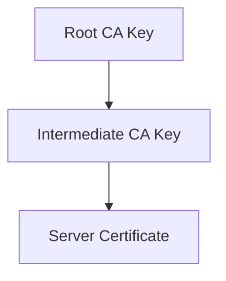
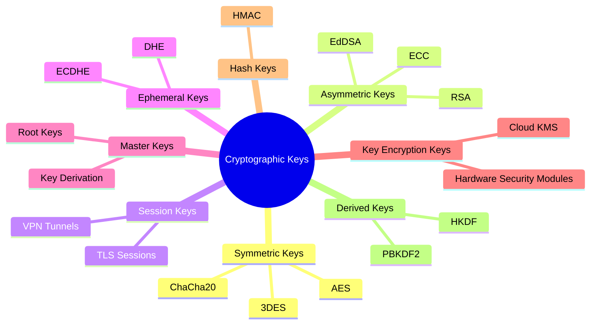

# 🔐 **Types of Cryptographic Keys**

Cryptographic keys can be categorized based on:

1. **Algorithm type** → Symmetric or Asymmetric
2. **Purpose** → Encryption, Signing, Authentication, etc.
3. **Lifespan** → Long-term (CA keys) or short-term (session keys).

---

## **1. Symmetric Keys**

### **Definition:**

* A **single secret key** is used for **both encryption and decryption**.
* Requires **secure sharing** between sender and receiver.
* Algorithms: **AES, DES, 3DES, ChaCha20**

### **Characteristics:**

| Property                 | Description                                         |
| ------------------------ | --------------------------------------------------- |
| **Key Length**           | Usually 128, 192, or 256 bits (AES).                |
| **Performance**          | Very **fast**, ideal for bulk data encryption.      |
| **Security Dependency**  | Must remain secret; compromise = total data breach. |
| **Distribution Problem** | Securely sharing the key is challenging.            |

### **Common Uses:**

* Data-at-rest encryption (e.g., full disk encryption, database encryption).
* VPNs and secure tunnels.
* TLS session encryption.

### **Example in AES:**

```python
import os
from Crypto.Cipher import AES

key = os.urandom(32)  # AES-256 key
cipher = AES.new(key, AES.MODE_GCM)
ciphertext, tag = cipher.encrypt_and_digest(b"Sensitive Data")
```

---

## **2. Asymmetric Keys (Public & Private Key Pair)**

### **Definition:**

* Uses **two mathematically related keys**:

  1. **Public Key** → shared openly, used to encrypt or verify signatures.
  2. **Private Key** → kept secret, used to decrypt or sign data.
* Algorithms: **RSA, ECC, EdDSA**

---

### **Key Roles:**

| **Key Type**    | **Function**                                               |
| --------------- | ---------------------------------------------------------- |
| **Public Key**  | Encrypt data, verify digital signatures, distribute trust. |
| **Private Key** | Decrypt data, create digital signatures.                   |

---

### **Characteristics:**

| Property                | Description                                                                       |
| ----------------------- | --------------------------------------------------------------------------------- |
| **Key Length**          | RSA ≥ 2048 bits, ECC ≥ 256 bits                                                   |
| **Performance**         | Slower than symmetric; used for authentication and key exchange.                  |
| **Security Dependency** | Private key secrecy is **critical**; if compromised, attacker gains full control. |

---

### **Common Uses:**

* **TLS/SSL Certificates** (HTTPS websites).
* **Email encryption** (PGP, S/MIME).
* **Digital signatures** (e.g., software signing).
* **Blockchain wallets** (cryptocurrency).

---

### **Example with RSA:**

```bash
# Generate RSA key pair
openssl genrsa -out private.pem 2048
openssl rsa -in private.pem -pubout -out public.pem
```

---

## **3. Session Keys**

### **Definition:**

* A **temporary symmetric key** created for a **single communication session**.
* Generated during a **handshake** (e.g., TLS).
* Provides **forward secrecy**: even if one session key is compromised, past sessions stay secure.

---

### **How It Works in TLS:**

1. Browser and server use **asymmetric encryption** to securely exchange a session key.
2. All subsequent communication uses **fast symmetric encryption** with the session key.
3. Session key is **discarded** at the end of the session.

---

### **Example Algorithm:**

* AES-256 or ChaCha20 for session encryption.
* Diffie-Hellman for secure key exchange.

---

## **4. Ephemeral Keys**

### **Definition:**

* **Short-lived asymmetric key pairs** generated for **each handshake** or transaction.
* Used in **Ephemeral Diffie-Hellman (DHE/ECDHE)** to achieve **Perfect Forward Secrecy (PFS)**.

---

### **Benefits:**

| Feature     | Benefit                                                              |
| ----------- | -------------------------------------------------------------------- |
| **PFS**     | Even if long-term keys are compromised, past sessions remain secure. |
| **Dynamic** | Keys are constantly rotated.                                         |

---

### **Example:**

* TLS 1.3 uses **ECDHE** (Elliptic Curve Diffie-Hellman Ephemeral) during the handshake.

---

## **5. Master Keys**

### **Definition:**

* A **root key** used to derive multiple sub-keys or session keys.
* Acts as the **foundation** of a cryptographic system.

---

### **Example Uses:**

* **TLS**: The "pre-master key" is negotiated, then used to derive session keys.
* **Kerberos authentication**: A master key generates ticket-granting keys.

---

## **6. Key Encryption Keys (KEK)**

### **Definition:**

* A key **used to encrypt other cryptographic keys**.
* Adds an extra layer of protection, especially when keys are stored or transmitted.

---

### **Example Use Cases:**

* Cloud Key Management Systems (AWS KMS, Azure Key Vault).
* Protecting database encryption keys.
* Hardware Security Modules (HSMs).

---

## **7. Hash-Based Keys (HMAC Keys)**

### **Definition:**

* A symmetric key used with a **hash function** to provide **message integrity** and **authentication**.
* Algorithm examples: **HMAC-SHA256, HMAC-SHA3**

---

### **Common Uses:**

* API authentication tokens.
* Digital signature systems.
* Blockchain consensus algorithms.

---

## **8. Root Keys (PKI)**

### **Definition:**

* The **most trusted and secure keys** in a Public Key Infrastructure (PKI).
* Used to **sign intermediate keys** and issue certificates.

---

### **Characteristics:**

* Stored in **Hardware Security Modules (HSMs)**.
* Never exposed to external systems.
* Rotated very rarely (every 10-20 years).

---

### **Example in PKI:**



---

## **9. Derived Keys**

### **Definition:**

* Generated from a **master key** using **Key Derivation Functions (KDFs)**.
* Allows multiple unique keys without transmitting them directly.

---

### **Example Algorithms:**

* PBKDF2
* HKDF
* scrypt
* bcrypt

---

## **10. Comparison Table**

| **Key Type**             | **Symmetric / Asymmetric** | **Lifespan**    | **Example Use**         |
| ------------------------ | -------------------------- | --------------- | ----------------------- |
| Symmetric Key            | Symmetric                  | Medium-term     | VPN, data encryption    |
| Asymmetric Key           | Asymmetric                 | Long-term       | TLS, digital signatures |
| Session Key              | Symmetric                  | Short-term      | TLS session encryption  |
| Ephemeral Key            | Asymmetric                 | Very short-term | TLS handshake (PFS)     |
| Master Key               | Symmetric                  | Long-term       | Key derivation          |
| Key Encryption Key (KEK) | Symmetric                  | Long-term       | Protect other keys      |
| HMAC Key                 | Symmetric                  | Medium-term     | Integrity verification  |
| Root Key                 | Asymmetric                 | 10-20 years     | PKI trust anchor        |
| Derived Key              | Symmetric                  | Varies          | Password-based systems  |

---

## **11. Visualization of Key Hierarchy**



---

## **Summary**

- **Symmetric keys** are fast and ideal for bulk encryption but face distribution challenges.  
- **Asymmetric keys** solve distribution problems and provide authentication but are slower.  
- **Session and ephemeral keys** secure communications dynamically, enabling **Perfect Forward Secrecy (PFS)**.  
- **Root keys** and **KEKs** form the backbone of **PKI trust chains**.  
- **Derived keys** and **HMAC keys** add flexibility and security for specialized use cases.

---

