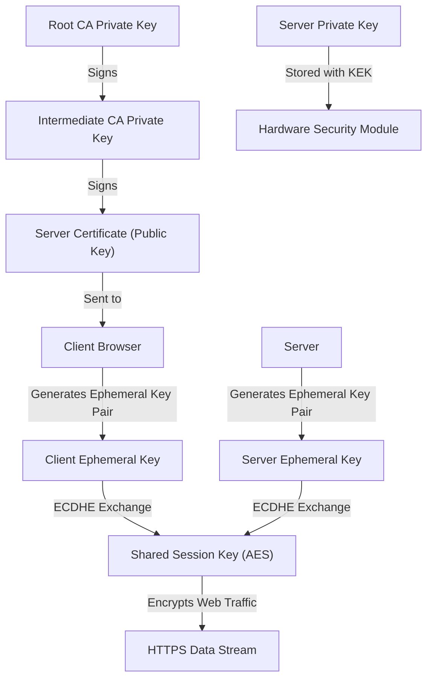
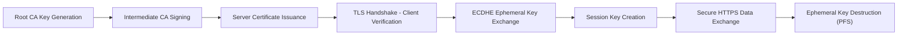

# 🌐 **PKI Key Interaction in HTTPS**

Public Key Infrastructure (PKI) powers secure web communications like **HTTPS**, **VPNs**, and **secure APIs**.
Each cryptographic key has a specific **role** during the TLS handshake and data exchange.

---

## **1. Key Roles in HTTPS**

| **Key Type**                 | **Role in HTTPS Workflow**                                                                             |
| ---------------------------- | ------------------------------------------------------------------------------------------------------ |
| **Root Key (CA)**            | Establishes ultimate trust by signing intermediate CA keys.                                            |
| **Intermediate Key (CA)**    | Signs server certificates; issued by the Root CA.                                                      |
| **Server Private Key**       | Decrypts session secrets and proves server identity.                                                   |
| **Server Public Key**        | Distributed in the SSL/TLS certificate for encryption.                                                 |
| **Session Key**              | Encrypts the actual user-server communication.                                                         |
| **Ephemeral Key (ECDHE)**    | Provides **Perfect Forward Secrecy (PFS)** by dynamically generating a temporary key for each session. |
| **Key Encryption Key (KEK)** | Protects server private keys when stored in HSM or database.                                           |

---

## **2. HTTPS Workflow Step-by-Step**

### **Step 1: PKI Trust Chain Creation**

1. **Root CA** generates its **root key pair** inside an HSM.
2. Root CA signs the **intermediate CA's public key**, creating a **certificate hierarchy**.
3. The **intermediate CA** signs the **server certificate**, which contains the server's public key.

> Browsers have **Root CA public keys pre-installed** for verification.

---

### **Step 2: TLS Handshake & Key Exchange**

1. **Client connects** to the server (e.g., [https://example.com](https://example.com)).
2. Server sends its **certificate chain** (server + intermediate certs).
3. Client verifies the certificates using the **Root CA public key**.
4. **Ephemeral ECDHE key pair** is generated:

   * Client and server perform **Elliptic Curve Diffie-Hellman Ephemeral (ECDHE)** exchange.
   * This creates a **shared session key**, unique to this connection.
5. The session key is **encrypted** with the server’s **public key** and sent to the server.
6. Server **decrypts** it using its **private key**.

---

### **Step 3: Secure Communication**

* The **session key (symmetric)** now encrypts all traffic (e.g., AES-256).
* Ephemeral keys are **discarded** after session ends → **Perfect Forward Secrecy (PFS)**.

---

### **Step 4: Key Storage & Protection**

* The **server private key** is protected using:

  * **Key Encryption Keys (KEK)** stored in HSM.
  * Hardware-level security modules ensure private keys never leave the device.

---

## **3. Visualization of Key Flow**



---

## **4. Detailed Key Relationship**

| **Stage** | **Key Used** | **Purpose** |
|------------|--------------|-------------|
| **Trust Establishment** | Root CA Key | Signs intermediate CA to establish global trust. |
| **Certificate Issuance** | Intermediate CA Key | Issues and signs server certificates. |
| **Handshake Authentication** | Server Public & Private Key | Proves server identity to the client. |
| **Session Creation** | Ephemeral Keys (ECDHE) | Generates temporary shared session key. |
| **Data Encryption** | Session Key (AES/ChaCha20) | Encrypts all actual user-server data. |
| **Key Storage Security** | KEK | Protects private keys at rest. |

---

## **5. Key Lifecycle in HTTPS**



---

## **6. Example Flow Summary**

| **Step** | **Key Involved** | **Example Algorithm** |
|----------|------------------|-----------------------|
| Root CA creation | Root Key | RSA-4096 / ECC P-384 |
| Intermediate CA signing | Intermediate Key | RSA-2048 / ECC P-256 |
| Server certificate signing | Server Key Pair | RSA-2048 / ECC P-256 |
| Handshake ephemeral keys | Ephemeral Keys | ECDHE |
| Session encryption | Session Key | AES-256 / ChaCha20 |

---

## **7. Real-World Example: HTTPS with Let's Encrypt**
- **Root CA Key** → "ISRG Root X1" (trusted by browsers).  
- **Intermediate CA Key** → "R3".  
- **Server Key Pair** → Example.com generates its own RSA/ECC key pair.  
- Let's Encrypt **signs the public key**, creating a certificate.  
- During TLS handshake:
  - ECDHE creates a session key.
  - AES encrypts all subsequent communications.

---

## **Summary**
- **Asymmetric keys** establish **identity and trust** (Root → Intermediate → Server).
- **Ephemeral keys** guarantee **Perfect Forward Secrecy**, preventing long-term exposure.
- **Session keys** handle **fast bulk encryption** of HTTPS traffic.
- **Key Encryption Keys (KEKs)** and **HSMs** safeguard private keys at rest.
- PKI orchestrates this entire trust chain to make the web secure.

```
