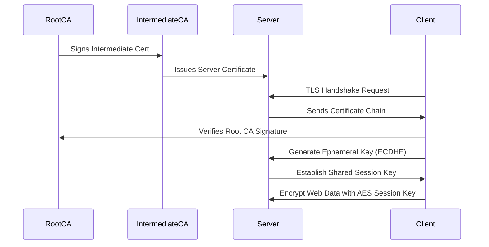

# 🧪 **Mini PKI and TLS Handshake Simulation with OpenSSL**

This guide works on **Linux**, **macOS**, or **Windows with OpenSSL installed**.

---

## **Step 1. Create a Root Certificate Authority (Root CA)**

The **Root CA** is the **trust anchor**.
It signs the **Intermediate CA** and ultimately the server certificates.

### **Commands:**

```bash
# Create private key for Root CA (RSA 4096)
openssl genrsa -out rootCA.key 4096

# Create a self-signed Root CA certificate
openssl req -x509 -new -nodes -key rootCA.key -sha256 -days 3650 -out rootCA.crt \
  -subj "/C=US/ST=California/L=SanFrancisco/O=MiniPKI/OU=RootCA/CN=MiniPKI Root CA"
```

### **Files Generated:**

| File         | Purpose                                                   |
| ------------ | --------------------------------------------------------- |
| `rootCA.key` | Root CA private key (must stay secret!)                   |
| `rootCA.crt` | Root CA public certificate (shared with browsers/clients) |

---

## **Step 2. Create an Intermediate CA**

The **Intermediate CA** issues certificates for servers, preventing direct exposure of the Root CA.

### **Commands:**

```bash
# Generate Intermediate CA private key
openssl genrsa -out intermediateCA.key 4096

# Create Certificate Signing Request (CSR) for Intermediate CA
openssl req -new -key intermediateCA.key -out intermediateCA.csr \
  -subj "/C=US/ST=California/L=SanFrancisco/O=MiniPKI/OU=IntermediateCA/CN=MiniPKI Intermediate CA"

# Sign the Intermediate CA CSR with the Root CA
openssl x509 -req -in intermediateCA.csr -CA rootCA.crt -CAkey rootCA.key \
  -CAcreateserial -out intermediateCA.crt -days 1825 -sha256
```

### **Files Generated:**

| File                 | Purpose                            |
| -------------------- | ---------------------------------- |
| `intermediateCA.key` | Intermediate CA private key        |
| `intermediateCA.csr` | CSR for Intermediate CA            |
| `intermediateCA.crt` | Signed Intermediate CA certificate |

---

## **Step 3. Create a Server Certificate**

This represents a real-world web server like `example.com`.

### **Commands:**

```bash
# Generate server private key
openssl genrsa -out server.key 2048

# Create server CSR
openssl req -new -key server.key -out server.csr \
  -subj "/C=US/ST=California/L=SanFrancisco/O=MiniPKI/OU=Server/CN=example.com"

# Sign the server CSR with the Intermediate CA
openssl x509 -req -in server.csr -CA intermediateCA.crt -CAkey intermediateCA.key \
  -CAcreateserial -out server.crt -days 365 -sha256
```

### **Files Generated:**

| File         | Purpose                   |
| ------------ | ------------------------- |
| `server.key` | Server private key        |
| `server.csr` | Server CSR                |
| `server.crt` | Signed server certificate |

---

## **Step 4. Verify the Certificate Chain**

Combine all certs into a chain to simulate what a real server sends during HTTPS handshake.

```bash
cat server.crt intermediateCA.crt > server_chain.crt

# Verify the entire chain
openssl verify -CAfile rootCA.crt server_chain.crt
```

**Expected Output:**

```
server_chain.crt: OK
```

---

## **Step 5. Simulate a TLS Handshake**

We’ll simulate a client connecting to a TLS server using our generated certs.

### **Start a TLS server:**

```bash
openssl s_server -cert server_chain.crt -key server.key -www -tls1_2
```

* This opens a test TLS server on port **4433**.

### **Connect as a client:**

Open a new terminal and run:

```bash
openssl s_client -connect localhost:4433 -CAfile rootCA.crt
```

**Look for:**

* The certificate chain being verified.
* Cipher suite used (e.g., `ECDHE-RSA-AES256-GCM-SHA384`).
* Successful handshake message.

---

## **Step 6. Generate a Session Key (Ephemeral)**

TLS uses a **session key** for bulk encryption.
We’ll generate one manually for demonstration.

```bash
# Generate 256-bit AES session key
openssl rand -hex 32
```

Example Output:

```
3a9b2f1c5d4f3e7d9c1a2b3f5e7d6c9a3f5b6d2c4e1f9a0b1c2d3e4f5a6b7c8d
```

This key would be used internally by the TLS engine to encrypt communication using **AES-256-GCM**.

---

## **Step 7. Encrypt & Decrypt Data with Session Key**

### **Encrypt:**

```bash
echo "Sensitive HTTPS Data" > data.txt
openssl enc -aes-256-gcm -salt -in data.txt -out data.enc -k 3a9b2f1c5d4f3e7d9c1a2b3f5e7d6c9a3f5b6d2c4e1f9a0b1c2d3e4f5a6b7c8d
```

### **Decrypt:**

```bash
openssl enc -aes-256-gcm -d -in data.enc -out decrypted.txt -k 3a9b2f1c5d4f3e7d9c1a2b3f5e7d6c9a3f5b6d2c4e1f9a0b1c2d3e4f5a6b7c8d
```

Check the result:

```bash
cat decrypted.txt
```

Output should match:

```
Sensitive HTTPS Data
```

---

## **Step 8. Visualize the Process**



---

## **Summary of Workflow**

| **Step**               | **Purpose**               | **Key Type Used**         |
| ---------------------- | ------------------------- | ------------------------- |
| Root CA creation       | Establish ultimate trust  | Root Key                  |
| Intermediate CA        | Signs server certificates | Intermediate Key          |
| Server certificate     | Identifies the server     | Server Public/Private Key |
| TLS handshake          | Proves server identity    | RSA/ECDHE                 |
| Session key generation | Secure bulk data          | Symmetric AES key         |
| Data encryption        | Protects user traffic     | AES-256-GCM               |

---

## **Key Takeaways**

* You built a **mini PKI** with Root CA → Intermediate CA → Server.
* You simulated a **TLS handshake** and certificate verification.
* You generated and used a **session key** for symmetric encryption.
* This mirrors **real-world HTTPS security**, where PKI enables trust and privacy at global scale.

---
