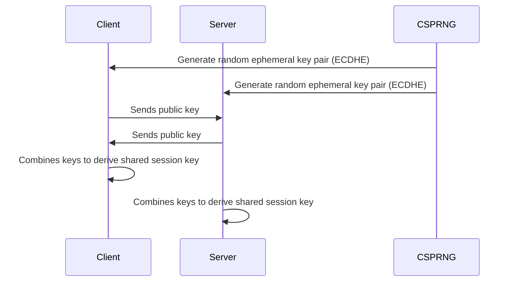

# 🔐 **Key Generation (Keygen) Process**

The **key generation process** involves turning **random entropy** into **usable cryptographic keys**.
This randomness is critical because **predictable keys = broken security**.

> *"The strength of a cryptographic key depends entirely on the unpredictability of its generation process."*

---

## **1. Key Generation Pipeline**

Here’s the high-level workflow for any secure key generation system:


---

## **2. Step-by-Step Keygen Process**

### **Step 1: Collect Entropy**

Entropy is the **raw randomness** collected from unpredictable real-world sources.
It forms the **foundation of key generation**.

| **Source Type**      | **Example Sources**                                                                        | **Strength** |
| -------------------- | ------------------------------------------------------------------------------------------ | ------------ |
| **Hardware Entropy** | Thermal noise, radioactive decay, quantum randomness, hardware RNG chips like Intel RDRAND | ★★★★★        |
| **System Entropy**   | Mouse movements, keystroke timings, disk I/O timings, network packet arrival times         | ★★★★         |
| **External Entropy** | Weather data, hardware security tokens, external TRNG devices                              | ★★★          |

> **Why Entropy Matters:**
> Weak entropy allows attackers to **predict keys**, as seen in historical failures like the **Debian OpenSSL RNG bug (2008)**.

---

### **Step 2: Create a Seed**

A **seed** is a **fixed-length, high-entropy number** used to initialize a **Cryptographically Secure Pseudo-Random Number Generator (CSPRNG)**.

#### **Properties of a Good Seed**

* **Large enough** to resist brute-force guessing (≥ 256 bits recommended).
* **Truly random**, collected from diverse entropy sources.
* **Unique** for each key generation event.

---

#### **Example: Generating a Seed**

Linux-based systems:

```bash
# Generate a 256-bit seed
head -c 32 /dev/random | xxd -p
```

Python example:

```python
import os
seed = os.urandom(32)  # 32 bytes = 256 bits
print("Seed:", seed.hex())
```

Output example:

```
b17c1d33b4c9fcd84378a1f034f566cb8d934dcfcf134bc2fbe0a5b63c9275f9
```

---

### **Step 3: Expand Seed Using a CSPRNG**

The **seed** initializes a **CSPRNG (Cryptographically Secure Pseudo-Random Number Generator)**, which expands it into a **stream of unpredictable bits** used to generate cryptographic keys.

| **CSPRNG Algorithm**    | **Example Usage**                         |
| ----------------------- | ----------------------------------------- |
| **HMAC\_DRBG**          | NIST SP 800-90 standard RNG               |
| **CTR\_DRBG (AES-CTR)** | Hardware security modules                 |
| **ChaCha20 RNG**        | Linux `/dev/random`, OpenSSL              |
| **Fortuna**             | FreeBSD and OpenBSD random number systems |

#### **Why CSPRNG?**

* Regular PRNGs (like `rand()`) are **predictable**, making them **unsafe** for cryptography.
* CSPRNG ensures each bit is **unpredictable**, even if some internal state is exposed.

---

### **Step 4: Key Material Derivation**

The CSPRNG output is **shaped into cryptographic key material** depending on the algorithm.

#### **A. Symmetric Keys**

* Directly take the first **n bits** for the desired key length.
* Example:

  * AES-128 → 128 bits
  * AES-256 → 256 bits

```bash
# Generate a 256-bit AES key
openssl rand -hex 32
```

---

#### **B. Asymmetric Keys**

Asymmetric algorithms need **mathematical structures**:

* **RSA:** Generate two large random prime numbers, then compute modulus `n = p × q`.
* **ECC:** Randomly select a secret integer within the curve's field.

Example with OpenSSL:

```bash
# Generate 2048-bit RSA key
openssl genrsa -out private.key 2048

# Generate ECC key on curve P-256
openssl ecparam -genkey -name prime256v1 -noout -out ecc_private.key
```

---

### **Step 5: Key Validation**

Once generated, keys **must be validated** to ensure they are **secure and correctly formed**.

| **Key Type**  | **Validation Steps**                                              |
| ------------- | ----------------------------------------------------------------- |
| **RSA**       | Verify primes are random and safe, modulus has correct properties |
| **ECC**       | Confirm point lies on curve and within correct range              |
| **Symmetric** | Verify length and entropy quality                                 |

Example:

```bash
openssl rsa -in private.key -check
```

---

### **Step 6: Secure Storage**

After generation, **private keys must be protected**:

* **Never store in plain text**.
* Use **Hardware Security Modules (HSMs)** or **Trusted Platform Modules (TPMs)**.
* Encrypt keys with a **Key Encryption Key (KEK)**.

> **Rule of Thumb:**
> *A private key is only secure if its storage is more secure than its generation.*

---

## **3. Key Generation for Common Algorithms**

| **Algorithm**           | **Key Generation Process**                                                            |
| ----------------------- | ------------------------------------------------------------------------------------- |
| **AES (Symmetric)**     | Take CSPRNG output directly as the key.                                               |
| **RSA**                 | Generate two random large primes → compute modulus → derive public/private exponents. |
| **ECC**                 | Generate random integer → multiply by base point on curve to get public key.          |
| **Diffie-Hellman (DH)** | Generate random private number → compute public value using generator/modulus.        |

---

## **4. Example Workflow: Generating a TLS Session Key**

Here's how **TLS 1.3** generates ephemeral session keys:



* Both sides generate random **ephemeral key pairs** using strong CSPRNG seeds.
* Final shared session key is **never transmitted**, only derived.

---

## **5. Example Implementation (Python)**

Below is a simple example generating **symmetric and asymmetric keys** securely:

```python
from cryptography.hazmat.primitives.asymmetric import rsa, ec
from cryptography.hazmat.primitives import serialization
import os

# --- Generate a Symmetric Key (AES-256) ---
symmetric_key = os.urandom(32)
print("AES-256 Symmetric Key:", symmetric_key.hex())

# --- Generate RSA Key Pair ---
rsa_key = rsa.generate_private_key(
    public_exponent=65537,
    key_size=2048
)
private_pem = rsa_key.private_bytes(
    encoding=serialization.Encoding.PEM,
    format=serialization.PrivateFormat.PKCS8,
    encryption_algorithm=serialization.NoEncryption()
)
print("\nRSA Private Key:\n", private_pem.decode())

# --- Generate ECC Key Pair ---
ecc_key = ec.generate_private_key(ec.SECP256R1())
ecc_private_pem = ecc_key.private_bytes(
    encoding=serialization.Encoding.PEM,
    format=serialization.PrivateFormat.PKCS8,
    encryption_algorithm=serialization.NoEncryption()
)
print("\nECC Private Key:\n", ecc_private_pem.decode())
```

---

## **6. Best Practices**

| **Best Practice**                                 | **Why Important**                    |
| ------------------------------------------------- | ------------------------------------ |
| Use **CSPRNG only** for keygen                    | Prevent predictable keys             |
| Collect **strong entropy** for seed creation      | Avoid low-entropy vulnerabilities    |
| Rotate keys regularly                             | Limit damage from compromise         |
| Use **HSMs or TPMs** for sensitive key generation | Protect root and signing keys        |
| Validate keys after generation                    | Catch faulty RNG or algorithm errors |

---

## **7. Summary Table**

| **Stage**              | **Goal**                                         |
| ---------------------- | ------------------------------------------------ |
| **Entropy Collection** | Gather randomness from hardware & system sources |
| **Seed Creation**      | Initialize secure random generator               |
| **CSPRNG Expansion**   | Produce high-quality random stream               |
| **Key Derivation**     | Shape bits into cryptographic keys               |
| **Validation**         | Ensure mathematical and security correctness     |
| **Storage**            | Protect keys from theft or misuse                |

---

## **Final Thoughts**

* The **seed is the most critical component** in key generation — if it’s weak, the entire system is compromised.
* **CSPRNGs expand the seed** into many cryptographic keys without weakening entropy.
* Proper **key validation, storage, and rotation** complete the lifecycle, ensuring long-term security for systems like **TLS, PKI, VPNs, and blockchain**.

---
