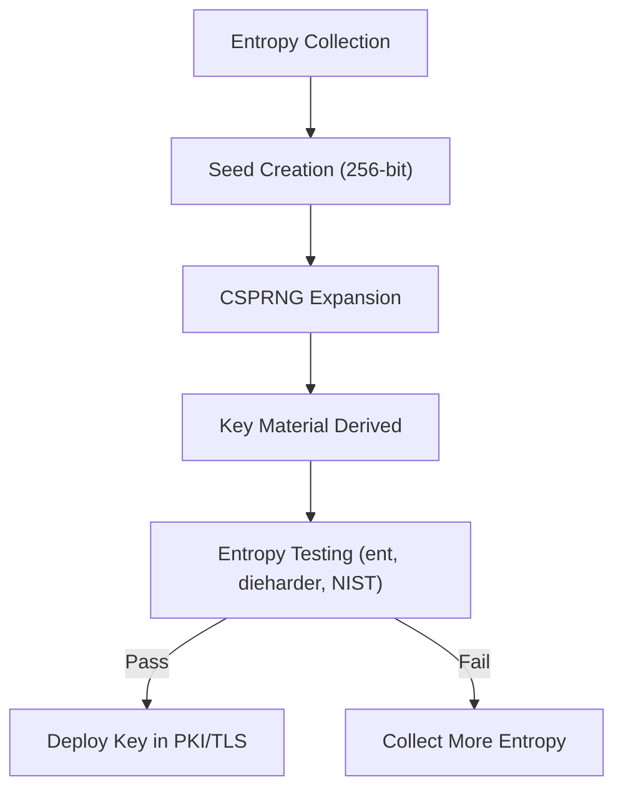

# 🧪 **Entropy Quality Testing**

## **1. Why Entropy Testing Matters**

A cryptographic system is only as secure as its random seed.
If an attacker can **predict or partially guess the seed**, they can:

* Reproduce symmetric keys (e.g., AES).
* Break asymmetric key pairs (RSA, ECC).
* Forge digital signatures.

> **Example Failure:**
> The **Debian OpenSSL bug (2008)** reduced entropy drastically, resulting in predictable SSH keys for millions of servers.

---

## **2. Generate a Random Seed**

We’ll start by generating a **256-bit seed**.

### **Linux Command**

```bash
head -c 32 /dev/random > seed.bin
```

> `32 bytes = 256 bits`
> `/dev/random` uses environmental noise from device drivers, providing cryptographically secure entropy.

---

## **3. Tool 1: `ent` (Entropy Testing Tool)**

`ent` is a simple statistical tool for analyzing randomness.

### **Install:**

* **Debian/Ubuntu:**

  ```bash
  sudo apt-get install ent
  ```
* **MacOS:**

  ```bash
  brew install ent
  ```

### **Run Analysis:**

```bash
ent seed.bin
```

### **Sample Output:**

```
Entropy = 7.999837 bits per byte.

Optimum compression would reduce the size
of this 32 byte file by 0 percent.

Chi square distribution for 32 samples is 248.37, and randomly
would exceed this value 23.45 percent of the time.

Arithmetic mean value of data bytes is 127.39 (127.5 = random).
Monte Carlo value for Pi is 3.14328 (error 0.05 percent).

Serial correlation coefficient is 0.002394 (totally uncorrelated = 0.0).
```

---

### **Interpreting Results:**

| **Metric**              | **Ideal Value** | **Meaning**               |
| ----------------------- | --------------- | ------------------------- |
| **Entropy (bits/byte)** | \~8.0           | Maximum unpredictability  |
| **Chi-Square p-value**  | 10–90%          | Good randomness range     |
| **Arithmetic Mean**     | \~127.5         | Balanced bit distribution |
| **Serial Correlation**  | Close to 0.0    | No pattern or correlation |

> **If entropy < 7.99 bits/byte**, the seed **may not be secure**.

---

## **4. Tool 2: `dieharder` (Advanced RNG Testing)**

For deeper analysis, use **Dieharder**, a suite of randomness tests.

### **Install:**

```bash
sudo apt-get install dieharder
```

### **Run a Full Test:**

```bash
dieharder -a -g 202 -f seed.bin
```

* `-a` → Run **all tests** (Diehard, NIST, etc.).
* `-g 202` → Treat input as a **file source**.
* `-f` → Specify the file to test.

---

### **Sample Output:**

```
#=============================================================================#
#           dieharder version 3.31.1
#=============================================================================#
    test_name   |ntup| tsamples | psamples | p-value | Assessment
#-----------------------------------------------------------------------------
    diehard_birthdays|   0|     100|       100|  0.45902333|  PASSED
    diehard_operm5   |   0|   1000000|     100|  0.62312910|  PASSED
    diehard_rank_32x32|   0|    40000|     100|  0.98278127|  PASSED
    diehard_rank_6x8 |   0|   100000|     100|  0.74109244|  PASSED
```

### **Interpretation:**

* **PASSED:** Randomness quality acceptable.
* **WEAK:** Borderline — investigate further.
* **FAILED:** Bad entropy, insecure for cryptographic use.

---

## **5. Tool 3: NIST Statistical Test Suite (SP 800-22)**

The **NIST suite** is the **industry standard** for randomness testing.

### **Steps:**

1. [Download NIST STS](https://csrc.nist.gov/projects/random-bit-generation/documentation-and-software).
2. Compile and run against `seed.bin`:

   ```bash
   ./assess 256 seed.bin
   ```
3. Check the p-values generated for each statistical test.

> All p-values should fall between **0.01 and 0.99** for a strong random source.

---

## **6. Example Python Test**

Here’s a **Python example** using built-in libraries to test entropy:

```python
import math
from collections import Counter

def calculate_entropy(data):
    length = len(data)
    counts = Counter(data)
    entropy = -sum((count/length) * math.log2(count/length) for count in counts.values())
    return entropy

# Load seed file
with open("seed.bin", "rb") as f:
    seed_data = f.read()

entropy_value = calculate_entropy(seed_data)
print(f"Entropy: {entropy_value:.6f} bits per byte")

if entropy_value > 7.99:
    print("High quality entropy: Secure for key generation ✅")
else:
    print("Low entropy: NOT secure for cryptographic use ❌")
```

---

## **7. Visualizing the Keygen Process**



---

## **8. When Entropy Fails**

If testing shows **low entropy**, common causes include:

| **Problem**                                     | **Solution**                                |
| ----------------------------------------------- | ------------------------------------------- |
| Weak entropy source (e.g., old /dev/random bug) | Use hardware RNG or TPM                     |
| Virtual machines lack randomness                | Use entropy daemon like `haveged` or `rngd` |
| Predictable seeds in code                       | Use `os.urandom()` or crypto libraries only |

---

## **9. Best Practices**

| **Practice**                         | **Benefit**                                        |
| ------------------------------------ | -------------------------------------------------- |
| Use **multiple entropy sources**     | Avoid single point of failure                      |
| Always test new hardware RNGs        | Prevent defective chips from compromising security |
| Run **periodic entropy tests**       | Ensure system remains secure over time             |
| Integrate tests into CI/CD pipelines | Detect RNG regressions early                       |

---

## **Summary Table**

| **Tool**     | **Depth of Analysis**        | **Use Case**           |
| ------------ | ---------------------------- | ---------------------- |
| `ent`        | Quick statistical test       | Initial checks         |
| `dieharder`  | Advanced randomness testing  | Production validation  |
| **NIST STS** | Industry-grade certification | Compliance & standards |

---

## **Final Thoughts**

* A seed must be **unpredictable and statistically random** before it's used to generate cryptographic keys.
* Tools like **ent**, **dieharder**, and **NIST STS** help verify randomness quality.
* **High-entropy seeds** ensure strong cryptographic keys, protecting systems like **PKI**, **TLS**, **VPNs**, and **blockchains**.
---
