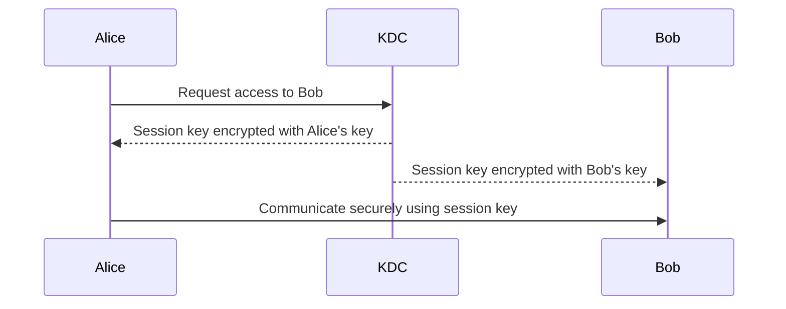
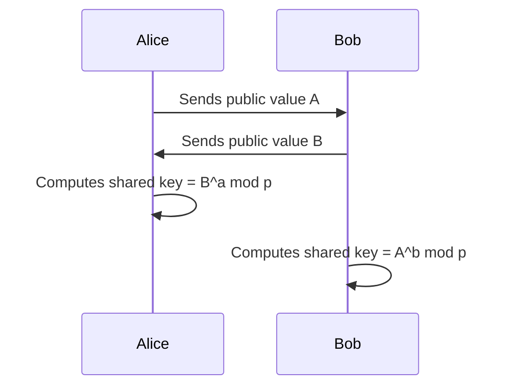
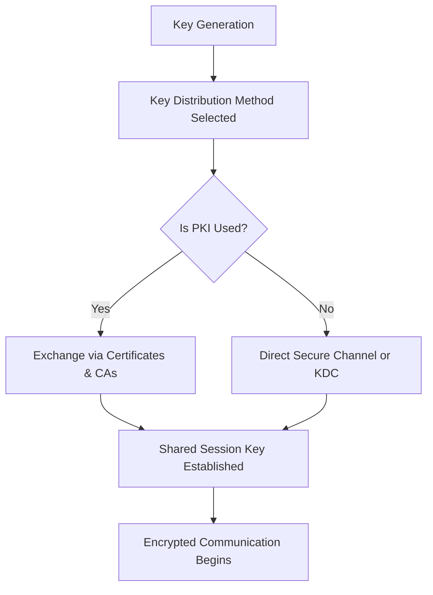
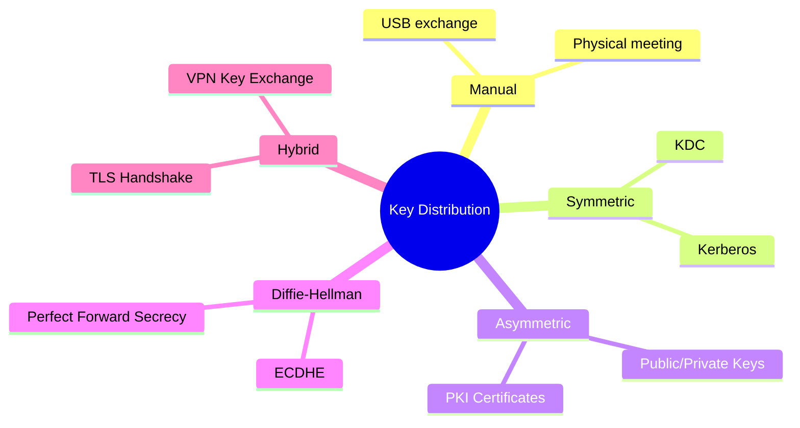

# 🔐 **Key Distribution in Cryptography**

Key distribution is the process of **securely delivering cryptographic keys** to parties who need to communicate.
It’s a critical problem because **even perfect encryption is useless if the key is stolen during exchange**.

> **Core Goal:**
> *Ensure that only authorized parties receive the correct cryptographic keys, while preventing attackers from intercepting or tampering with them.*

---

## **1. Why Key Distribution Matters**

| **Without Secure Key Distribution**                        | **With Secure Key Distribution**                                  |
| ---------------------------------------------------------- | ----------------------------------------------------------------- |
| Keys could be intercepted → total system compromise.       | Secure communication channel established.                         |
| Attackers can launch **man-in-the-middle (MITM)** attacks. | Identity is verified using certificates or trusted third parties. |
| No proof of origin → possible key forgery.                 | Strong authentication and trust chain.                            |

**Example:**

* Imagine two parties, Alice and Bob, using AES encryption.
* If Eve intercepts the AES key during exchange, **all messages are compromised** — regardless of AES strength.

---

## **2. Types of Keys to Distribute**

| **Key Type**        | **Purpose**                             | **Example**                |
| ------------------- | --------------------------------------- | -------------------------- |
| **Symmetric Keys**  | Bulk data encryption                    | AES-256 key for VPN tunnel |
| **Asymmetric Keys** | Authentication and digital signatures   | RSA private/public pair    |
| **Session Keys**    | Temporary symmetric key for one session | TLS session key            |
| **Master Keys**     | Used to derive other keys               | Kerberos                   |

---

## **3. Key Distribution Challenges**

| **Challenge**       | **Explanation**                                              |
| ------------------- | ------------------------------------------------------------ |
| **Confidentiality** | Prevent attackers from intercepting keys.                    |
| **Authentication**  | Verify that the key truly comes from the claimed sender.     |
| **Integrity**       | Ensure the key isn’t altered during transmission.            |
| **Scalability**     | Efficiently distribute keys to millions of users or devices. |
| **Key Management**  | Handle key rotation, revocation, and renewal.                |

---

## **4. Key Distribution Methods**

There are **four primary models** for distributing cryptographic keys:

---

### **A. Manual Key Exchange**

Keys are physically exchanged between parties, like handing over a USB drive.

| **Pros**                             | **Cons**                         |
| ------------------------------------ | -------------------------------- |
| Very secure if done privately.       | Not scalable for large networks. |
| Immune to MITM if handled correctly. | Physical risk of theft or loss.  |

**Example:**
Military and banking sectors often exchange master keys this way.

---

### **B. Symmetric Key Distribution via Trusted Third Party**

A **Key Distribution Center (KDC)** acts as a **trusted authority** to share symmetric session keys.

**Example:** **Kerberos**

**Process:**

1. Alice authenticates to KDC.
2. KDC generates a session key.
3. KDC securely sends session key to both Alice and Bob.
4. Alice and Bob now use this session key for communication.

| **Pros**             | **Cons**                                    |
| -------------------- | ------------------------------------------- |
| Centralized control. | Single point of failure (if KDC is hacked). |
| Easy key rotation.   | Requires always-online KDC.                 |

---

### **C. Public Key Cryptography (Asymmetric Distribution)**

Uses a **public/private key pair**:

* **Public key**: Shared openly to encrypt data or verify signatures.
* **Private key**: Kept secret by the owner.

**Process Example:**

1. Bob publishes his public key.
2. Alice encrypts a symmetric session key using Bob's public key.
3. Bob decrypts it with his private key.
4. Both now share the symmetric key securely.

| **Pros**                                           | **Cons**                                     |
| -------------------------------------------------- | -------------------------------------------- |
| Scales well, no pre-shared secrets needed.         | Relies on authentic public keys → needs PKI. |
| Protects against MITM if certificates are trusted. | Slower than symmetric encryption.            |

**Example Protocols:** TLS, HTTPS, SSH.

---

### **D. Diffie-Hellman Key Exchange**

Two parties agree on a shared key **without transmitting it directly**.

**Process:**

1. Alice and Bob agree on a base and modulus.
2. Each generates a **private random number**.
3. They exchange **computed public values**.
4. Both compute the **same shared secret** independently.

| **Pros**                        | **Cons**                                                                                  |
| ------------------------------- | ----------------------------------------------------------------------------------------- |
| Key never transmitted directly. | Vulnerable to MITM unless combined with authentication (e.g., TLS uses authenticated DH). |

**Example Protocols:** TLS 1.3, VPNs (IPsec).

---

## **5. Key Distribution in PKI (Public Key Infrastructure)**

PKI solves the **public key authenticity problem**:

* Anyone can generate a key pair, but **how do you know it belongs to the right person?**

**PKI Process:**

1. Certificate Authority (CA) issues a **digital certificate** containing a public key and identity info.
2. The certificate is **digitally signed** by the CA.
3. Others can **verify authenticity** using the CA’s trusted root certificate.

**Example in HTTPS:**

* Browser trusts root CAs → verifies that a website's TLS key is legitimate.

---

## **6. Combining Methods: Hybrid Key Distribution**

Most modern protocols **combine asymmetric and symmetric methods** for speed and security.

| **Phase**            | **Algorithm Used** | **Purpose**                     |
| -------------------- | ------------------ | ------------------------------- |
| Initial Key Exchange | RSA or ECDHE       | Securely agree on a session key |
| Data Encryption      | AES, ChaCha20      | Fast bulk encryption            |

**Example: TLS Handshake**

1. Client verifies server’s certificate (PKI).
2. Securely negotiates a symmetric session key using ECDHE.
3. All further communication uses symmetric encryption.

---

## **7. Key Distribution Workflow**

---

## **8. Example: Key Distribution in TLS**

| **Step**               | **Description**                                     |
| ---------------------- | --------------------------------------------------- |
| 1. Client Hello        | Browser sends supported algorithms to server.       |
| 2. Server Hello        | Server responds with certificate (public key).      |
| 3. Key Exchange        | RSA or ECDHE used to securely generate session key. |
| 4. Session Established | AES or ChaCha20 used for bulk data encryption.      |

---

## **9. Best Practices for Secure Key Distribution**

| **Practice**                                | **Why It’s Important**               |
| ------------------------------------------- | ------------------------------------ |
| Always use **PKI and trusted certificates** | Prevent MITM attacks                 |
| Rotate keys regularly                       | Limit damage if a key is compromised |
| Use **ephemeral keys** (e.g., ECDHE)        | Ensure Perfect Forward Secrecy       |
| Encrypt keys **at rest and in transit**     | Prevent key leakage                  |
| Validate public keys before trust           | Avoid rogue certificates             |

---

## **10. Summary Table**

| **Method**       | **When Used**                            | **Security Level**            |
| ---------------- | ---------------------------------------- | ----------------------------- |
| Manual Exchange  | Small, high-security networks            | Very high but not scalable    |
| KDC / Symmetric  | Enterprise networks (Kerberos)           | High, centralized             |
| Public Key (PKI) | Internet-scale (TLS, HTTPS)              | Very high if CA trusted       |
| Diffie-Hellman   | Secure negotiation without key transport | Very high with authentication |

---

## **11. Visual Overview**

---

## **Final Thoughts**

* Key distribution is **the heart of secure communications**.
* **Symmetric systems** are fast but need secure channels for key sharing.
* **Asymmetric systems (PKI)** solve the secure key exchange problem at scale.
* Modern protocols like **TLS** use **hybrid models**, combining asymmetric exchange with symmetric encryption for performance and security.
* Following **best practices** like **Perfect Forward Secrecy** and **key rotation** ensures long-term data protection.

