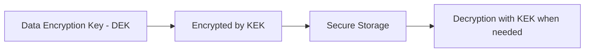
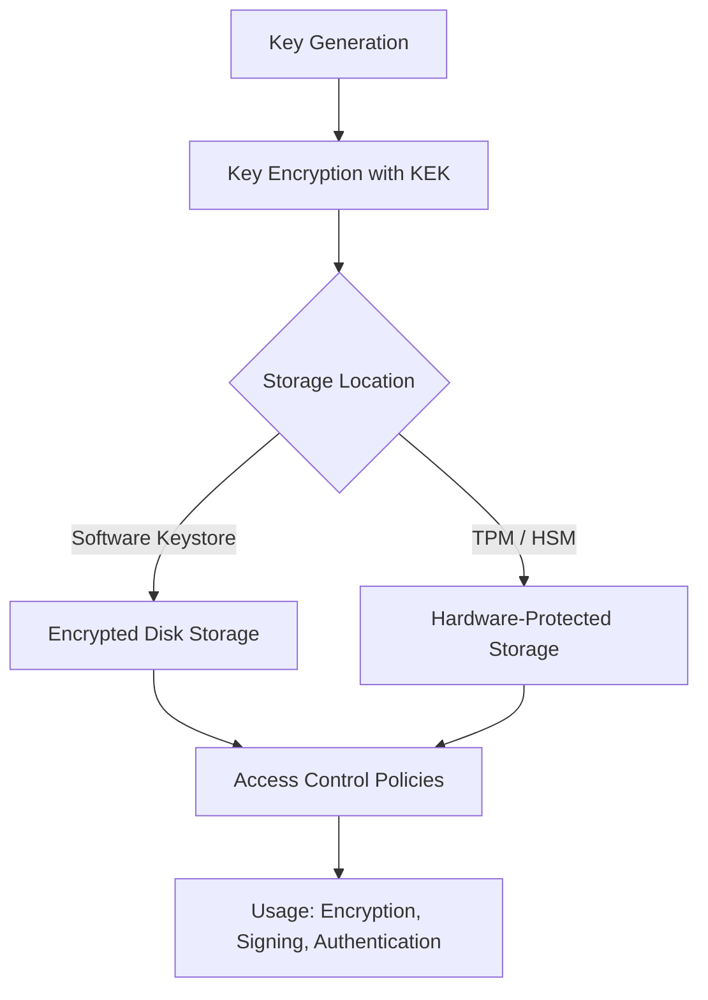
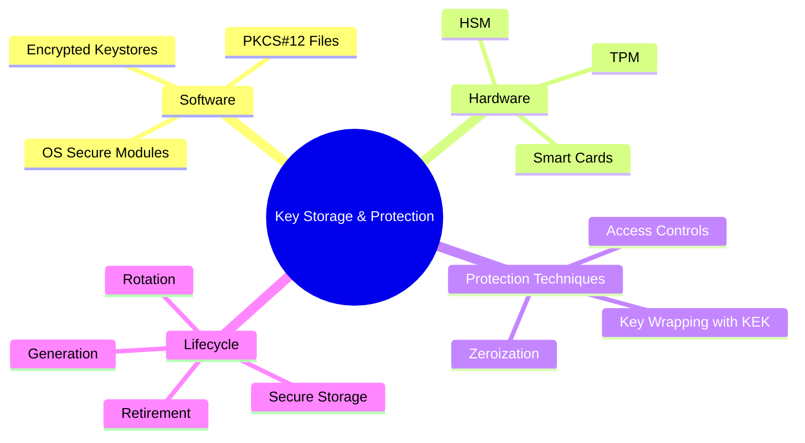
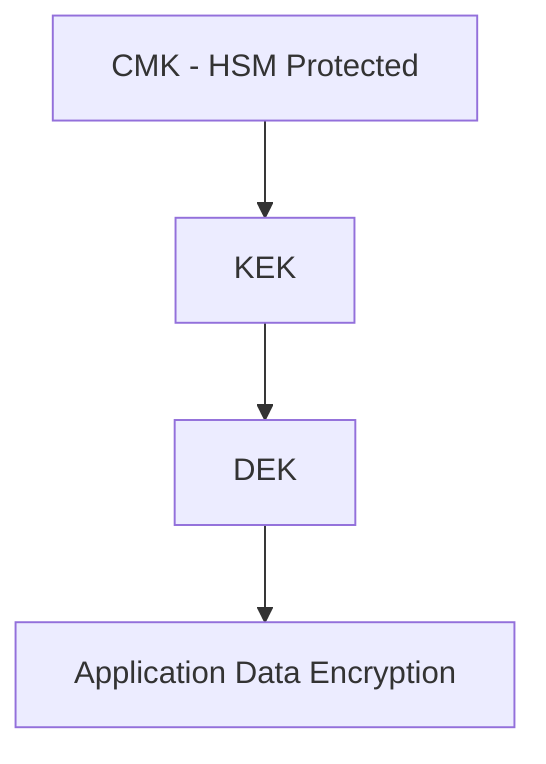

# 🔐 **Key Storage & Protection**

## **1. Introduction**

Keys are the **crown jewels** of any cryptographic system.
Even if you use **strong algorithms** like AES-256 or RSA-4096, **compromised keys render the entire system useless**.

> **Objective:**
> Ensure that cryptographic keys remain **confidential**, **integral**, and **available** throughout their lifecycle — from **generation** to **retirement**.

---

## **2. Importance of Secure Key Storage**

| **If Keys Are Exposed** | **Impact**                                              |
| ----------------------- | ------------------------------------------------------- |
| Private keys stolen     | Attacker can impersonate legitimate users or servers    |
| Symmetric key leaked    | All past and future encrypted data is compromised       |
| Signing key compromised | Fake signatures become indistinguishable from real ones |
| Root CA key compromised | Entire PKI collapses                                    |

> **Example Breach:**
> *2011 DigiNotar breach* – Hackers stole the CA’s signing keys, enabling forged SSL certificates for high-profile websites like Google, leading to massive trust collapse.

---

## **3. Key Storage Locations**

Keys can be stored **in software** or **hardware**, depending on the security requirements.

| **Storage Method**                 | **Security Level** | **Examples**                            |
| ---------------------------------- | ------------------ | --------------------------------------- |
| **Plain Software Storage**         | ❌ Weak             | Simple file storage (`.pem` files)      |
| **Encrypted Software Storage**     | 🟡 Medium          | Encrypted keystores like JKS or PKCS#12 |
| **Trusted Platform Module (TPM)**  | 🟢 Strong          | TPM 2.0 chips on modern PCs             |
| **Hardware Security Module (HSM)** | 🟢🔒 Very Strong   | Banking systems, PKI root CAs           |
| **Smart Cards / Tokens**           | 🟢 Strong          | YubiKeys, smartcards                    |

---

## **4. Threats to Key Storage**

| **Threat**               | **Example Attack**                          | **Impact**                        |
| ------------------------ | ------------------------------------------- | --------------------------------- |
| **Physical theft**       | Stealing a USB drive with private key       | Unauthorized access               |
| **Malware / keylogger**  | Malware steals software-stored keys         | Silent compromise                 |
| **Side-channel attacks** | Timing or power analysis on hardware device | Key leakage without direct access |
| **Insider threat**       | Rogue employee copying key material         | Persistent breach                 |
| **Improper backup**      | Keys stored in plaintext backups            | Accidental exposure               |

---

## **5. Best Practices for Secure Key Storage**

| **Best Practice**                           | **Explanation**                                             |
| ------------------------------------------- | ----------------------------------------------------------- |
| **Use Hardware-Based Security**             | TPM or HSM prevents key extraction.                         |
| **Encrypt Keys at Rest**                    | Keys stored on disk must be encrypted with strong AES keys. |
| **Access Control & Role Separation**        | Only authorized personnel can use or manage keys.           |
| **Key Wrapping**                            | Protect keys by encrypting them with a master key (KEK).    |
| **Rotate Keys Regularly**                   | Reduce exposure time if a key is compromised.               |
| **Zeroization**                             | Securely delete keys from memory when no longer needed.     |
| **Multi-Factor Authentication for Key Use** | Prevent single point of failure.                            |

---

## **6. Key Protection Techniques**

### **6.1. Key Encryption Key (KEK) / Key Wrapping**

* A **Key Encryption Key** is a master key used to encrypt other cryptographic keys.
* Prevents direct exposure of keys in storage.

**Example Flow:**

| **Benefit**             | **Explanation**                                      |
| ----------------------- | ---------------------------------------------------- |
| Layered security        | Even if database is hacked, attacker still needs KEK |
| Supports secure backups | Encrypted key files are portable but safe            |

---

### **6.2. Secure Keystores**

Cryptographic libraries and OSs provide **secure storage containers**:

| **Keystore Type**        | **Platform**     | **Encryption Standard** |
| ------------------------ | ---------------- | ----------------------- |
| **Java Keystore (JKS)**  | Java apps        | AES                     |
| **Windows DPAPI**        | Windows          | User credentials        |
| **Apple Secure Enclave** | iOS/macOS        | Hardware-backed         |
| **PKCS#12 (.p12)**       | PKI Certificates | AES, 3DES               |

---

### **6.3. Hardware Security Module (HSM)**

> **HSM = Dedicated physical device for key management.**

**Functions:**

* Key generation inside the module.
* Keys **never leave the hardware** unencrypted.
* Supports cryptographic operations like signing and encryption.

**Used In:**

* Banking & payment systems (PCI DSS compliance).
* Root CAs for PKI.
* Cloud KMS services (AWS KMS, Azure Key Vault).

---

### **6.4. Trusted Platform Module (TPM)**

> **TPM = Secure crypto processor embedded in modern PCs and servers.**

* Generates and stores device-specific keys.
* Used for:

  * Secure boot.
  * Disk encryption (e.g., BitLocker).
  * Device identity.

---

## **7. Key Storage Workflow**

Here’s how keys flow securely from generation to storage:

---

## **8. Key Lifecycle Protection**

| **Phase**        | **Security Actions**                      |
| ---------------- | ----------------------------------------- |
| **Generation**   | Use strong entropy (CSPRNG, hardware RNG) |
| **Distribution** | Secure channels (TLS, PKI)                |
| **Storage**      | Encrypted storage or HSM                  |
| **Rotation**     | Regular renewal to limit exposure         |
| **Revocation**   | Immediate disablement of compromised keys |
| **Destruction**  | Zeroization and secure wipe               |

---

## **9. Example: PKI Private Key Protection**

| **Key Type**               | **Protection Method**                           |
| -------------------------- | ----------------------------------------------- |
| **Root CA Key**            | Stored only in HSM, offline most of the time    |
| **Intermediate CA Key**    | HSM or encrypted storage, strict access control |
| **End-User Key (Browser)** | Stored in encrypted OS keystore or smart card   |

---

## **10. Secure Backup of Keys**

| **Backup Method**                          | **Security Consideration**                                         |
| ------------------------------------------ | ------------------------------------------------------------------ |
| Encrypted Backup                           | Always encrypt backups with KEK.                                   |
| Split-Key Backup (Shamir’s Secret Sharing) | Key is split into multiple parts; threshold needed to reconstruct. |
| Offline Storage                            | Store backups in physically secure location.                       |

---

## **11. Key Storage Architecture Diagram**

---

## **12. Best Practices Summary**

| **Best Practice**                     | **Why It’s Critical**                            |
| ------------------------------------- | ------------------------------------------------ |
| Use **HSM for sensitive keys**        | Prevents key extraction                          |
| Encrypt **all stored keys**           | Defense in depth                                 |
| Regularly audit access logs           | Detect insider threats                           |
| Rotate and expire keys                | Limit compromise window                          |
| Use **Perfect Forward Secrecy**       | Past sessions remain secure                      |
| Implement **Shamir’s Secret Sharing** | Protect master keys from single point of failure |

---

## **13. Example: AWS KMS Key Hierarchy**

Modern cloud services use **layered key protection**:

| **Level** | **Key Type**              | **Purpose**                 |
| --------- | ------------------------- | --------------------------- |
| Level 1   | Customer Master Key (CMK) | Stored in HSM, controls KEK |
| Level 2   | Key Encryption Key (KEK)  | Encrypts DEKs               |
| Level 3   | Data Encryption Key (DEK) | Encrypts application data   |

---

## **14. Real-World Case Study**

### **WhatsApp End-to-End Encryption**

* **Session keys** are generated on the fly.
* **Private keys** stored only on the user's device in **hardware secure storage**.
* If device is compromised, attacker cannot read past messages due to **Perfect Forward Secrecy (PFS)**.

---

## **15. Final Thoughts**

* Secure key storage is **non-negotiable** for any cryptographic system.
* **Hardware-based protection** (HSM, TPM) is the gold standard.
* Combine **encryption, access control, and lifecycle management** to mitigate threats.
* Even the strongest algorithms fail if the keys are **stolen or mismanaged**.
---
Would you like me to provide a **step-by-step OpenSSL demo** of securely generating and encrypting a private key?
