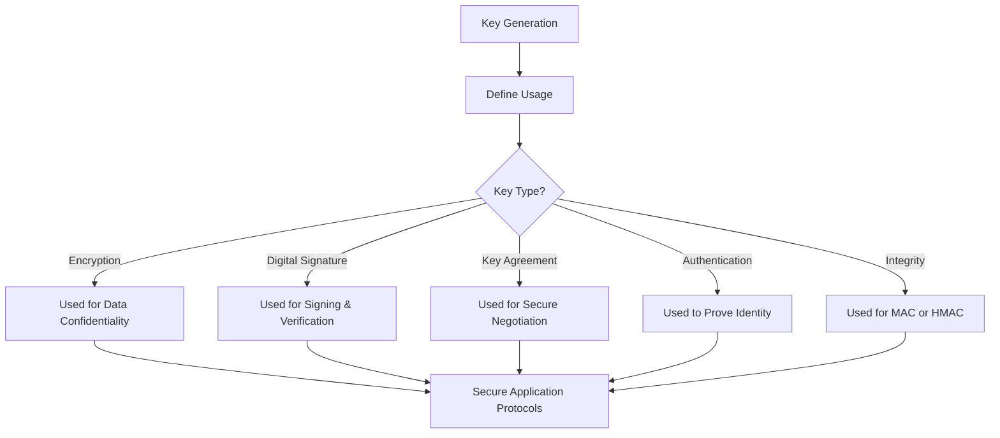
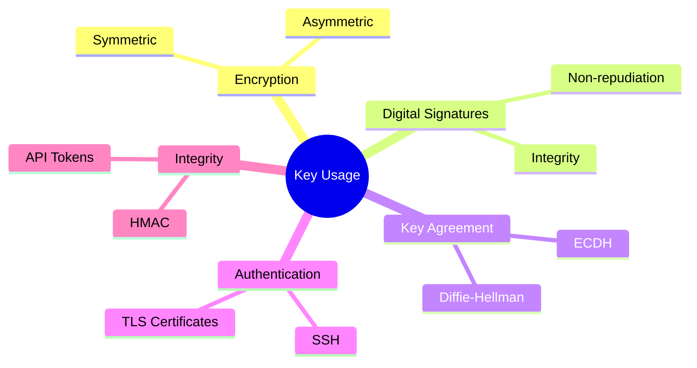

# 🔐 **Key Usage in Cryptography**

## **1. Introduction**

Cryptographic keys serve **different purposes** depending on the type of cryptography and the protocol in use.
Each key is **bound to a specific role**, and improper usage can **break the security model**.

> **Definition:**
> *Key Usage is the set of actions a cryptographic key is authorized to perform, such as encryption, decryption, signing, verification, or key exchange.*

---

## **2. Why Key Usage Matters**

| **If Key Usage Is Not Defined**                                      | **Risk**                                   |
| -------------------------------------------------------------------- | ------------------------------------------ |
| Private key used for multiple purposes (e.g., encryption + signing). | Increases attack surface and key exposure. |
| Wrong key used for digital signatures.                               | Signatures may be forged or invalid.       |
| Compromised encryption key reused for authentication.                | Total system breach.                       |
| CA key used for non-CA tasks.                                        | PKI trust collapse.                        |

> **Example:**
> If a server’s TLS certificate private key is reused for code signing, a breach of the TLS key could also allow **malware signing**.

---

## **3. Key Usage Categories**

Cryptographic keys are generally divided by **purpose**, which aligns with **core cryptographic operations**.

| **Category**                 | **Key Role**                                 | **Example Algorithm** | **Use Case**                   |
| ---------------------------- | -------------------------------------------- | --------------------- | ------------------------------ |
| **Encryption / Decryption**  | Protect data confidentiality                 | AES, RSA, ChaCha20    | Data at rest, VPN tunnels      |
| **Digital Signature**        | Verify integrity and authenticity            | RSA, ECDSA, EdDSA     | Code signing, document signing |
| **Key Agreement / Exchange** | Securely generate shared session keys        | Diffie-Hellman, ECDH  | TLS handshake, IPsec           |
| **Authentication**           | Prove identity of entity                     | RSA, EdDSA            | SSH login, server certificates |
| **Integrity Check**          | Generate message authentication codes (MACs) | HMAC-SHA256           | API authentication             |

---

## **4. Symmetric vs Asymmetric Key Usage**

| **Aspect**              | **Symmetric Key Usage**           | **Asymmetric Key Usage**                    |
| ----------------------- | --------------------------------- | ------------------------------------------- |
| **Key Ownership**       | Shared secret between two parties | Public/Private pair owned by one entity     |
| **Main Operations**     | Encryption, decryption, HMAC      | Signing, verification, key exchange         |
| **Example Protocols**   | AES for VPN, HMAC for APIs        | RSA for TLS handshake, ECDSA for signatures |
| **Security Dependency** | Key secrecy                       | Mathematical hardness (RSA, ECC)            |

---

## **5. Key Usage in PKI (X.509 Certificates)**

In **PKI**, key usage is explicitly defined in **X.509 certificates** through the `KeyUsage` extension.

### **Common Key Usage Flags**

| **Key Usage Flag**      | **Purpose**                           | **Example**              |
| ----------------------- | ------------------------------------- | ------------------------ |
| **Digital Signature**   | Verify integrity and authenticity     | TLS handshake signatures |
| **Non-Repudiation**     | Prevent entity from denying signature | Legal document signing   |
| **Key Encipherment**    | Encrypt symmetric session keys        | RSA encrypting AES keys  |
| **Data Encipherment**   | Directly encrypt user data            | Legacy systems           |
| **Key Agreement**       | Negotiate session keys                | Diffie-Hellman exchange  |
| **Certificate Signing** | Sign other certificates               | Root CA key              |
| **CRL Signing**         | Sign Certificate Revocation Lists     | Certificate Authorities  |

---

### **Example TLS Server Certificate Usage**

A standard TLS server certificate should include:

* **Digital Signature** → for authenticating the server.
* **Key Encipherment** → to encrypt the session key during handshake.

```plaintext
X.509 Key Usage: Digital Signature, Key Encipherment
```

---

## **6. Key Usage by Function**

### **A. Encryption Keys**

> Used to protect **data confidentiality**.

* **Symmetric Encryption:**

  * Example: AES key for encrypting files or VPN traffic.
  * One key is shared between sender and receiver.

* **Asymmetric Encryption:**

  * Example: RSA key used to encrypt a symmetric session key.
  * Public key encrypts, private key decrypts.

**Example in TLS:**

* Server’s public key encrypts the session key.
* Client uses that key to start encrypted communication.

---

### **B. Digital Signature Keys**

> Ensure **data integrity, authenticity, and non-repudiation**.

* Private key **signs** the data.
* Public key **verifies** the signature.

**Examples:**

* Code signing (e.g., Windows drivers).
* Signing blockchain transactions (Bitcoin, Ethereum).
* Signing legal e-documents.

> **Important:**
> A signing key **should never** be reused for encryption to reduce attack vectors.

---

### **C. Key Agreement / Exchange Keys**

> Securely negotiate a **shared symmetric key** over an insecure channel.

* Based on **Diffie-Hellman (DH)** or **Elliptic Curve Diffie-Hellman (ECDH)**.
* Neither party directly transmits the symmetric key.

**Example: TLS 1.3**

* Uses **Ephemeral Diffie-Hellman** (ECDHE) to ensure **Perfect Forward Secrecy (PFS)**.

---

### **D. Authentication Keys**

> Used to **prove identity** of a user, device, or server.

**Examples:**

* SSH private key authenticating a user to a server.
* TLS server certificate proving website authenticity.
* Hardware tokens like YubiKeys storing private authentication keys.

---

### **E. Integrity Keys (MAC Keys)**

> Verify that **data has not been tampered with**.

* Typically symmetric keys used with **HMAC** (Hash-based Message Authentication Code).
* Example: HMAC-SHA256 for API authentication tokens.

---

## **7. Key Usage Across Common Protocols**

| **Protocol**    | **Key Types Used**        | **Roles**                              |
| --------------- | ------------------------- | -------------------------------------- |
| **TLS (HTTPS)** | RSA/ECDSA, AES, ECDHE     | Signing, key exchange, data encryption |
| **IPsec VPN**   | Diffie-Hellman, AES, HMAC | Key agreement, encryption, integrity   |
| **SSH**         | RSA/Ed25519, AES          | Authentication, encryption             |
| **Blockchain**  | ECDSA/EdDSA               | Transaction signing                    |
| **Kerberos**    | AES, HMAC                 | Session keys, authentication           |

---

## **8. Key Usage Workflow**



---

## **9. Example: TLS Key Usage Breakdown**

| **Phase**                  | **Key Used**                 | **Purpose**                 |
| -------------------------- | ---------------------------- | --------------------------- |
| Handshake - Authentication | Server's private signing key | Prove server identity       |
| Handshake - Key Exchange   | ECDHE keys                   | Generate shared session key |
| Data Transfer              | AES session key              | Encrypt actual data         |
| Integrity Check            | HMAC key                     | Verify message integrity    |

---

## **10. Key Usage & Separation Principle**

**Principle of Key Separation:**

> A single cryptographic key should be used **only for one specific purpose**.

| **Why Important**                    | **Example**                                            |
| ------------------------------------ | ------------------------------------------------------ |
| Limits blast radius of compromise    | If encryption key is leaked, signing key remains safe. |
| Easier auditing and compliance       | PCI DSS, HIPAA requirements.                           |
| Reduces risk of cryptographic misuse | Avoids cross-protocol attacks.                         |

**Implementation:**

* Separate keys for:

  * **TLS data encryption** vs **TLS certificate signing**.
  * **Blockchain wallet signing** vs **data storage encryption**.

---

## **11. Key Usage Mindmap**



---

## **12. Security Controls for Key Usage**

| **Control**                     | **Purpose**                                       |
| ------------------------------- | ------------------------------------------------- |
| **Access Control Lists (ACLs)** | Restrict who can use which keys                   |
| **Policy Enforcement**          | Enforce allowed key usages through PKI extensions |
| **Audit Logging**               | Track key operations for forensics                |
| **Hardware Enforcement**        | Use HSM or TPM to physically prevent key misuse   |

---

## **13. Example: X.509 Certificate Key Usage Extension**

```plaintext
X509v3 Key Usage: 
    Digital Signature, Key Encipherment
X509v3 Extended Key Usage:
    TLS Web Server Authentication
    TLS Web Client Authentication
```

* **Digital Signature:** Certificate used to sign TLS handshake messages.
* **Key Encipherment:** Used to encrypt the session key during the handshake.
* **Extended Key Usage:** Specifies exact application roles (e.g., web server, email).

---

## **14. Best Practices for Key Usage**

| **Best Practice**                              | **Why**                                       |
| ---------------------------------------------- | --------------------------------------------- |
| **Use different keys for different functions** | Reduce attack impact                          |
| **Follow PKI key usage flags strictly**        | Prevent misuse in certificates                |
| **Implement Perfect Forward Secrecy (PFS)**    | Protect past sessions even if keys are leaked |
| **Rotate keys regularly**                      | Limit exposure window                         |
| **Use hardware-backed keys**                   | Prevent software-level theft                  |

---

## **15. Summary Table**

| **Key Usage**  | **Algorithm Example** | **Real-World Example**    |
| -------------- | --------------------- | ------------------------- |
| Encryption     | AES, RSA              | VPN traffic encryption    |
| Signing        | RSA, ECDSA            | Code signing certificates |
| Key Exchange   | Diffie-Hellman        | TLS handshake             |
| Authentication | EdDSA, RSA            | SSH login keys            |
| Integrity      | HMAC-SHA256           | API request signing       |

---

## **Final Thoughts**

* **Key Usage** defines the **purpose and boundaries** for cryptographic keys.
* In PKI, these are explicitly encoded in **certificate extensions**, ensuring strong compliance.
* By **separating keys by role** and **enforcing policies**, organizations reduce the chance of catastrophic compromise.
* Proper key usage is a foundation for secure systems like **TLS, VPNs, and blockchain**.
---
