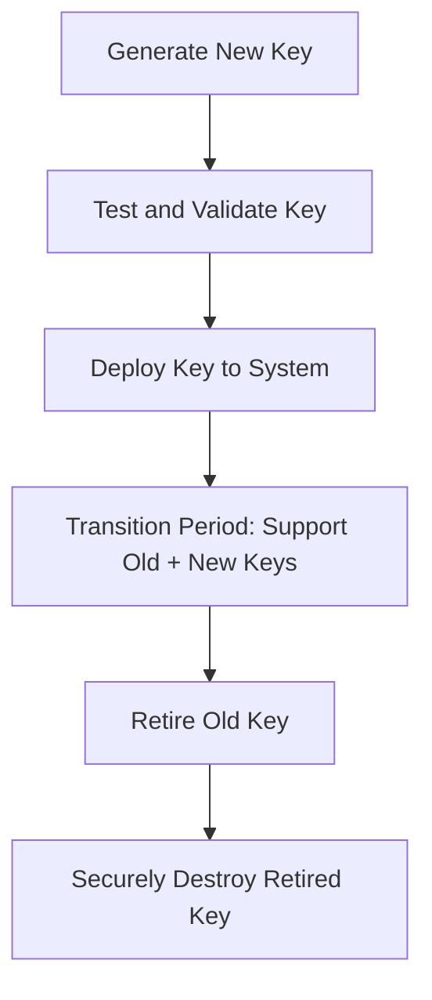
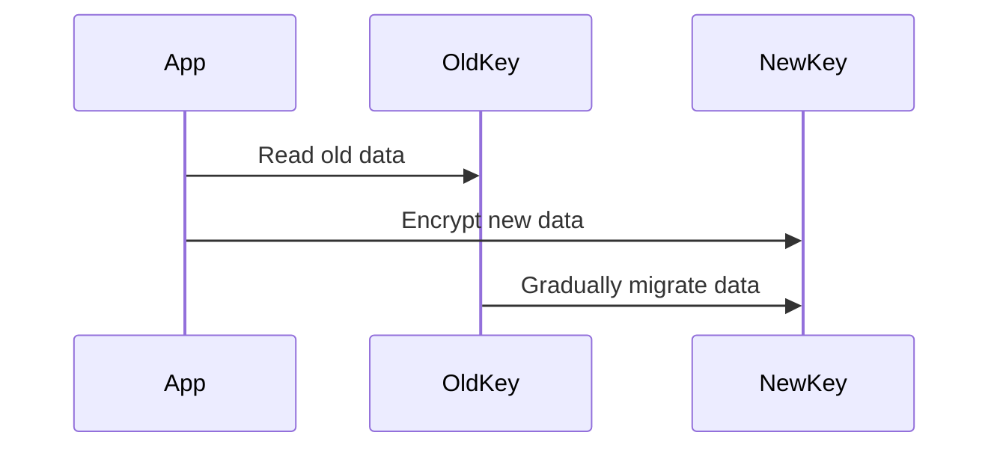
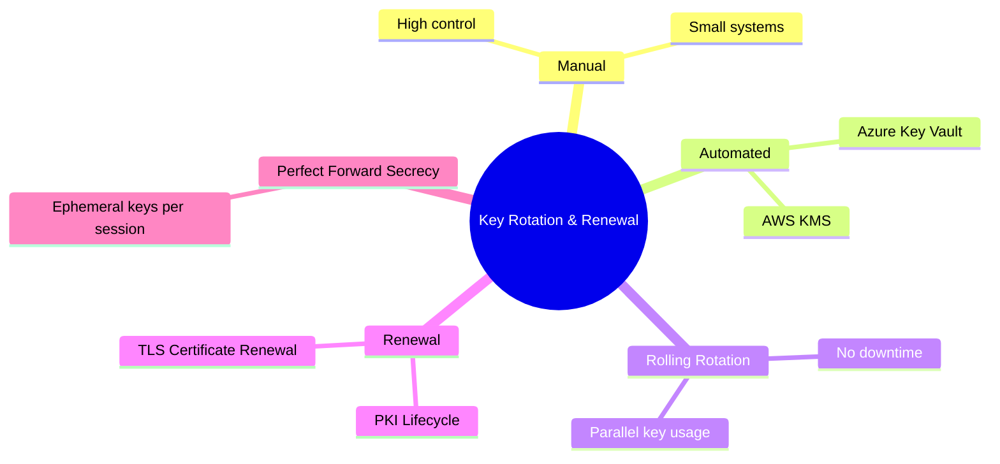

# 🔐 **Key Rotation / Renewal**

## **1. Introduction**

Keys are the **backbone of cryptographic systems**.
Even if you use strong algorithms like **AES-256** or **RSA-4096**, a cryptographic key cannot be trusted **forever**.

> **Key Rotation / Renewal** ensures that keys are **periodically replaced or updated** to:
>
> * Limit the exposure window if a key is compromised.
> * Maintain compliance with industry standards (e.g., PCI DSS, HIPAA).
> * Preserve long-term security against evolving threats.

---

## **2. Definitions**

| **Term**           | **Definition**                                                                               | **Purpose**                              |
| ------------------ | -------------------------------------------------------------------------------------------- | ---------------------------------------- |
| **Key Rotation**   | Replacing an **old cryptographic key** with a **new one**, while retiring the old key.       | Reduce damage if old key compromised     |
| **Key Renewal**    | Updating a **certificate or key pair** while maintaining the same identity (usually in PKI). | Extend validity without identity changes |
| **Key Revocation** | Declaring a key **invalid before its expiration**.                                           | Stop further use if key is compromised   |

---

## **3. Why Key Rotation is Critical**

| **Risk Without Rotation**  | **Impact**                                                       |
| -------------------------- | ---------------------------------------------------------------- |
| **Key Compromise**         | Attacker can decrypt all past and future data.                   |
| **Cryptographic Weakness** | Algorithms that were once secure may become breakable over time. |
| **Regulatory Violations**  | PCI DSS requires keys to be rotated every 12 months or less.     |
| **No Forward Secrecy**     | Past sessions remain vulnerable if a long-term key is exposed.   |

> **Example Incident:**
> In 2011, **Sony PlayStation Network** used **non-rotated SSL keys**.
> When the private key was stolen, attackers intercepted **all user traffic** until a complete re-issuance occurred.

---

## **4. Key Rotation Lifecycle**



---

## **5. Key Rotation vs Renewal**

| **Aspect**       | **Key Rotation**                                | **Key Renewal**                                                       |
| ---------------- | ----------------------------------------------- | --------------------------------------------------------------------- |
| **What Changes** | Entire key is replaced with a new one.          | Same key or pair may be reused, but certificate validity is extended. |
| **Use Case**     | Compromise prevention, routine rotation.        | PKI certificates nearing expiration.                                  |
| **Example**      | Generate a new AES key for database encryption. | Renew SSL certificate with same public/private key pair.              |

> **Best Practice:**
> *Whenever possible, **rotate keys** rather than simply renewing them*, especially for long-term cryptographic strength.

---

## **6. Types of Keys That Require Rotation**

| **Key Type**          | **Example Usage**                  | **Rotation Frequency**                                 |
| --------------------- | ---------------------------------- | ------------------------------------------------------ |
| **Symmetric Keys**    | AES for VPN or database encryption | Frequently (daily to yearly, depending on sensitivity) |
| **Asymmetric Keys**   | RSA/ECC for TLS, code signing      | Typically every 1-2 years                              |
| **Session Keys**      | TLS ephemeral keys                 | Per session (Perfect Forward Secrecy)                  |
| **Root CA Keys**      | PKI trust anchors                  | Rarely, every 10-20 years, requires ceremony           |
| **Master Keys (KEK)** | AWS KMS or HSM root keys           | Every 1-5 years                                        |

---

## **7. Rotation Strategies**

### **A. Manual Rotation**

* Administrator manually generates, deploys, and revokes keys.
* **Pros:** High control, works for small systems.
* **Cons:** Human error risk, time-consuming, not scalable.

---

### **B. Automatic / Scheduled Rotation**

* Keys rotate automatically based on a defined policy.
* Common in **cloud services** like AWS KMS, Azure Key Vault.

**Example (AWS KMS):**

* Enable automatic rotation for Customer Managed Keys every **365 days**.

```bash
aws kms enable-key-rotation --key-id <KEY_ID>
```

| **Pros**            | **Cons**                                  |
| ------------------- | ----------------------------------------- |
| Reduces human error | Requires robust automation and monitoring |
| Scales easily       | Misconfigurations can disrupt services    |

---

### **C. Rolling Rotation (Live Migration)**

* Both **old and new keys** are active during a **transition window**.
* Ensures **zero downtime** during rotation.

**Example: Database Encryption**

1. New key is deployed.
2. New data is encrypted with the new key.
3. Old data is gradually re-encrypted.
4. Old key is retired after transition.



---

## **8. Perfect Forward Secrecy & Rotation**

**Perfect Forward Secrecy (PFS):**

* Ensures **past communications remain secure** even if a long-term key is compromised.
* Achieved by **rotating ephemeral session keys per session** (e.g., ECDHE in TLS 1.3).

| **With PFS**                                  | **Without PFS**                           |
| --------------------------------------------- | ----------------------------------------- |
| Compromised key cannot decrypt past sessions. | Compromised key exposes all past traffic. |

---

## **9. Key Renewal in PKI**

Key renewal is most common in **digital certificates** like SSL/TLS.

**Steps:**

1. Generate a **new Certificate Signing Request (CSR)**.
2. CA issues a renewed certificate with **updated expiration date**.
3. Deploy new certificate to servers.

> **Note:**
>
> * Renewal **does not always rotate the key pair**.
> * For higher security, generate a **new key pair** at renewal time.

---

## **10. Key Rotation Workflow Example: TLS Certificate**

| **Step**                    | **Description**                                   |
| --------------------------- | ------------------------------------------------- |
| 1. Generate new private key | Use strong algorithm (e.g., RSA 4096, ECC P-384). |
| 2. Create CSR               | Link new key to server identity.                  |
| 3. Submit to CA             | Certificate Authority validates identity.         |
| 4. Deploy certificate       | Add to web server configuration.                  |
| 5. Phase out old key        | Update load balancers, revoke old certificate.    |
| 6. Destroy old key          | Securely wipe from storage.                       |

---

## **11. Challenges in Key Rotation**

| **Challenge**                             | **Mitigation**                               |
| ----------------------------------------- | -------------------------------------------- |
| Service downtime during rotation          | Use rolling or phased rotation.              |
| Applications not designed for key changes | Build key versioning into application logic. |
| Backward compatibility                    | Allow old and new keys temporarily.          |
| Human error                               | Automate and log all steps.                  |
| Regulatory compliance                     | Use policies and audit trails.               |

---

## **12. Key Rotation in Cloud & DevOps**

### **AWS Example:**

* **AWS KMS** automatically rotates CMKs every **365 days**.
* Supports manual key rotation via API/CLI.

### **Kubernetes Secrets:**

* Secrets should be **rotated automatically** via CI/CD pipelines.
* Integration with HashiCorp Vault or Azure Key Vault recommended.

---

## **13. Key Rotation Architecture**



---

## **14. Best Practices**

| **Practice**                                     | **Benefit**                     |
| ------------------------------------------------ | ------------------------------- |
| Automate key rotation where possible             | Minimize human error            |
| Use **ephemeral session keys**                   | Achieve Perfect Forward Secrecy |
| Rotate keys **frequently** for sensitive systems | Limit compromise window         |
| Always **audit and log** rotation events         | For compliance and forensics    |
| Securely **destroy old keys**                    | Prevent re-use or theft         |
| Include key versioning in application logic      | Smooth migration and rollback   |

---

## **15. Example Rotation Policy**

| **System**               | **Rotation Interval**            |
| ------------------------ | -------------------------------- |
| TLS Certificates         | 90 days (Let’s Encrypt standard) |
| Database Encryption Keys | Every 6-12 months                |
| API Authentication Keys  | Every 3 months                   |
| Root CA Key              | Every 10-20 years                |
| Session Keys (TLS, VPN)  | Per connection/session           |

---

## **16. Summary Table**

| **Concept**           | **Key Rotation**                | **Key Renewal**                 |
| --------------------- | ------------------------------- | ------------------------------- |
| **Scope**             | Replace key completely          | Extend key validity             |
| **Typical Use Case**  | Database encryption, API tokens | SSL certificate renewal         |
| **Security Strength** | Higher (new key generated)      | Lower (same key reused)         |
| **PKI Example**       | New key pair + new certificate  | Same key pair + new certificate |

---

## **17. Final Thoughts**

* **Key rotation** is a cornerstone of cryptographic hygiene.
* It limits damage from key compromise and ensures compliance.
* Combine with **Perfect Forward Secrecy** for maximum protection.
* Automate rotation using cloud KMS or DevOps tooling to reduce human error.
* Always include **logging, versioning, and rollback plans** for a seamless transition.

---
