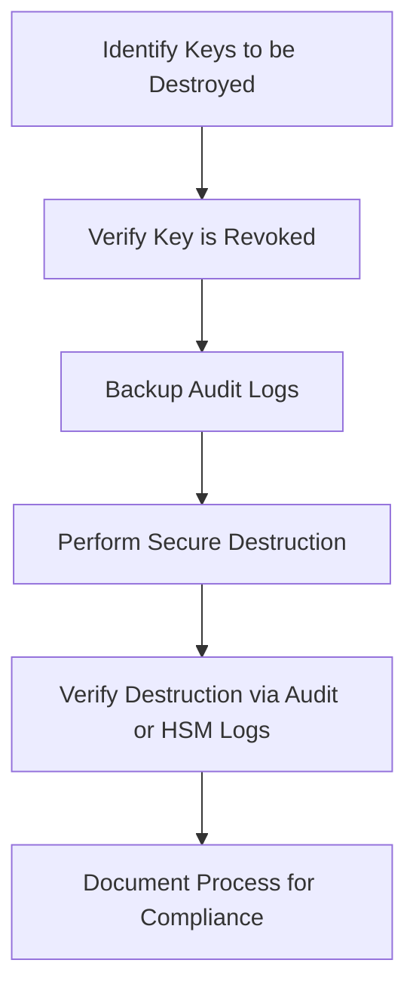
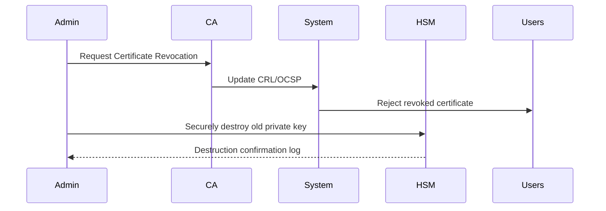
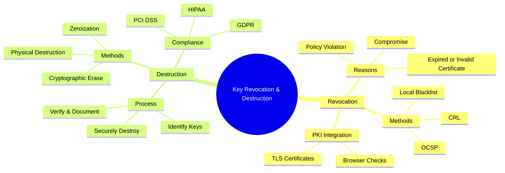

# 🔐 **Key Revocation & Destruction**

## **1. Introduction**

Keys are the **foundation of cryptographic security**, but if they are compromised or no longer needed, they must be **revoked and securely destroyed**.
Leaving old keys active creates a **serious security risk**, as attackers could use them to:

* Decrypt sensitive data,
* Forge digital signatures,
* Impersonate trusted services.

> **Goal:**
>
> * **Revocation** prevents further trust or use of a key.
> * **Destruction** ensures the key **cannot be recovered**.

---

## **2. Key Lifecycle Context**

**Revocation** and **destruction** are the final stages, ensuring **end-of-life security** for cryptographic keys.

---

## **3. Key Revocation**

### **Definition:**

> *Key revocation is the process of marking a cryptographic key as **no longer trusted** before its scheduled expiration.*

Once revoked:

* The key **should not be used** for encryption, signing, or authentication.
* Systems and users must be informed about its revoked status.

---

### **3.1 Reasons for Key Revocation**

| **Reason**                         | **Example Scenario**                                          |
| ---------------------------------- | ------------------------------------------------------------- |
| **Key Compromise**                 | Private key leaked due to server breach or malware infection. |
| **Personnel Change**               | Employee with access to a signing key leaves the company.     |
| **Certificate Expired or Invalid** | Domain name no longer owned by the organization.              |
| **Policy Violation**               | Certificate issued incorrectly (e.g., CA mis-issuance).       |
| **Algorithm Obsolescence**         | Weak cryptographic algorithms (e.g., SHA-1) must be retired.  |

---

### **3.2 PKI Key Revocation Process**

In **Public Key Infrastructure (PKI)**, revocation is critical for certificates used in TLS, code signing, and digital documents.

#### Steps:

1. **Detect Compromise or Issue**

   * Incident detected via intrusion detection, audit logs, or reports.
2. **Notify Certificate Authority (CA)**

   * Request revocation of the compromised certificate.
3. **Add to Certificate Revocation List (CRL)**

   * CA publishes revoked certificate identifiers in a signed list.
4. **Distribute via OCSP**

   * Online Certificate Status Protocol provides real-time revocation checks.
5. **Update Systems**

   * Servers, browsers, and clients stop trusting the revoked certificate.

---

### **3.3 Methods of Key Revocation**

| **Method**                                    | **Description**                                        | **Use Case**                          |
| --------------------------------------------- | ------------------------------------------------------ | ------------------------------------- |
| **CRL (Certificate Revocation List)**         | List of revoked certificates signed by CA.             | Offline validation, periodic updates. |
| **OCSP (Online Certificate Status Protocol)** | Real-time revocation checking.                         | Modern browsers, TLS.                 |
| **Direct Key Blacklist**                      | Applications maintain local list of revoked keys.      | IoT devices, embedded systems.        |
| **Automated Revocation via APIs**             | Cloud providers automatically revoke compromised keys. | AWS KMS, Azure Key Vault.             |

---

### **3.4 Revocation Example: TLS Certificate**

* A website’s private key is **stolen**.
* Admin requests CA to revoke the TLS certificate.
* Browser checks OCSP or CRL:

  * If revoked, browser displays a **"Certificate Revoked"** warning.

---

### **3.5 Challenges in Revocation**

| **Challenge**         | **Explanation**                                               |
| --------------------- | ------------------------------------------------------------- |
| **Revocation Delays** | Time gap between compromise and revocation list update.       |
| **Client Caching**    | Old CRL cached by clients may trust revoked keys temporarily. |
| **Offline Devices**   | IoT devices may not be able to fetch updated CRLs.            |
| **Scale**             | Millions of revoked certificates can grow CRLs to huge sizes. |

> **Solution:**
> Use **OCSP Stapling** and **short-lived certificates** to reduce reliance on revocation.

---

## **4. Key Destruction**

### **Definition:**

> *Key destruction is the **permanent, irreversible elimination** of cryptographic keys so they **cannot be recovered or used again**.*

Even after revocation, a key may still exist in storage.
To prevent **data leaks or future misuse**, keys must be securely destroyed.

---

### **4.1 Why Destruction is Necessary**

| **Reason**                    | **Risk if Not Destroyed**                    |
| ----------------------------- | -------------------------------------------- |
| **Prevent Future Compromise** | Stolen backup drives may contain old keys.   |
| **Comply with Regulations**   | PCI DSS, HIPAA require secure key disposal.  |
| **Avoid Insider Threats**     | Former employees may access legacy keys.     |
| **Reduce Attack Surface**     | Less sensitive data for attackers to target. |

---

### **4.2 Key Destruction Methods**

| **Method**               | **Description**                                              | **Use Case**                        |
| ------------------------ | ------------------------------------------------------------ | ----------------------------------- |
| **Zeroization**          | Overwrite key memory with zeros or random data.              | Hardware security modules (HSMs).   |
| **Cryptographic Erase**  | Destroy a key-encryption key (KEK) that protects other keys. | Cloud KMS, disk encryption systems. |
| **Physical Destruction** | Shred, melt, or pulverize physical key storage devices.      | USB tokens, smart cards, HSMs.      |
| **Secure Wipe Software** | Overwrite storage sectors using secure erase algorithms.     | File-based keys on SSD/HDD.         |

---

### **4.3 Key Destruction Process**

---

### **4.4 Cryptographic Erase Example**

> *If a large encrypted database must be deleted quickly:*

* Instead of wiping the entire database, **destroy the encryption key** protecting it.
* Without the key, the data becomes **mathematically inaccessible**.

**Advantages:**

* Instant data sanitization.
* Efficient for cloud or large-scale storage.

---

## **5. Key Revocation & Destruction in PKI**

| **Step**                | **Revocation Role**                        | **Destruction Role**                             |
| ----------------------- | ------------------------------------------ | ------------------------------------------------ |
| Certificate Compromised | Revoke via CRL or OCSP.                    | Securely delete compromised private key.         |
| Certificate Expired     | Optional revoke for clarity.               | Destroy expired key to prevent misuse.           |
| Root CA Retirement      | Publish final CRL, revoke subordinate CAs. | Physically destroy HSM devices storing root key. |

---

## **6. Integration with Key Management Systems (KMS)**

Modern cloud platforms like **AWS KMS**, **Azure Key Vault**, and **HashiCorp Vault** provide built-in revocation and destruction.

| **Action**                      | **AWS KMS Example**                                                           |
| ------------------------------- | ----------------------------------------------------------------------------- |
| Schedule Key Deletion           | `aws kms schedule-key-deletion --key-id <KEY_ID> --pending-window-in-days 30` |
| Cancel Key Deletion             | `aws kms cancel-key-deletion --key-id <KEY_ID>`                               |
| Automatic Rotation + Revocation | Enable auto-rotation policies.                                                |

---

## **7. Security & Compliance Standards**

| **Standard**       | **Requirement for Revocation/Destruction**                            |
| ------------------ | --------------------------------------------------------------------- |
| **PCI DSS**        | Keys must be retired and destroyed annually or upon compromise.       |
| **HIPAA**          | Healthcare encryption keys must be securely destroyed at end-of-life. |
| **NIST SP 800-57** | Defines approved key destruction methods like zeroization.            |
| **GDPR**           | Right to be forgotten requires cryptographic erase for personal data. |

---

## **8. Combined Revocation & Destruction Workflow**

---

## **9. Best Practices**

| **Best Practice**                         | **Why**                                    |
| ----------------------------------------- | ------------------------------------------ |
| Always revoke keys **before destruction** | Prevent accidental trust in deleted keys   |
| Use HSMs or secure key vaults             | Ensure hardware-backed zeroization         |
| Automate CRL/OCSP updates                 | Reduce revocation delays                   |
| Document destruction with audits          | Meet compliance requirements               |
| Combine with **short-lived certificates** | Reduce reliance on revocation mechanisms   |
| Use versioned key management              | Smooth migrations during revocation events |

---

## **10. Example: Browser Behavior After Revocation**

* If a revoked TLS certificate is detected:

  * Browser displays:
    *"SEC\_ERROR\_REVOKED\_CERTIFICATE"*
  * Connection is blocked immediately.
  * OCSP or CRL check is logged.

---

## **11. Key Revocation & Destruction Mindmap**

---

## **12. Summary**

| **Stage**       | **Goal**                                             | **Example**                                    |
| --------------- | ---------------------------------------------------- | ---------------------------------------------- |
| **Revocation**  | Make a key untrusted, prevent future use.            | TLS certificate added to CRL after compromise. |
| **Destruction** | Permanently erase the key so it cannot be recovered. | HSM zeroizes root key during decommissioning.  |

---

## **13. Final Thoughts**

* **Key revocation** protects systems by **stopping trust** in compromised or invalid keys.
* **Key destruction** ensures **absolute elimination** of old keys, reducing the risk of insider attacks or forensic recovery.
* Together, they form a **critical defense layer** in cryptographic key management.
* Automated cloud services and strict compliance processes make these tasks **scalable and reliable**.

