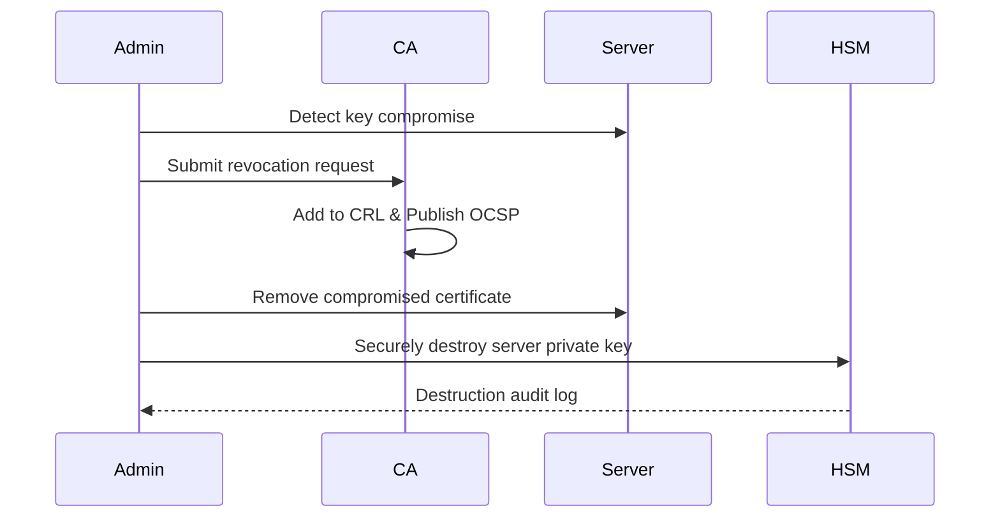

# 🛠 **OpenSSL Demo: Certificate Revocation & Key Destruction**

## **1. Prerequisites**

Make sure you have:

* **OpenSSL** installed (`openssl version`)
* Linux, macOS, or WSL terminal
* A working directory for PKI files:

  ```bash
  mkdir ~/pki-demo && cd ~/pki-demo
  ```

Directory structure:

```
pki-demo/
│
├── ca/            # Certificate Authority files
├── certs/         # Issued certificates
└── private/       # Private keys
```

---

## **2. Step 1 – Create Root CA**

The CA issues and revokes certificates.

```bash
# Generate Root CA private key
openssl genrsa -out ca/rootCA.key 4096

# Self-sign Root CA certificate (valid for 10 years)
openssl req -x509 -new -nodes -key ca/rootCA.key -sha256 -days 3650 \
    -out ca/rootCA.pem -subj "/C=US/ST=Demo/L=Test/O=DemoCA/CN=Demo Root CA"
```

**Files created:**

* `ca/rootCA.key` → Root CA private key
* `ca/rootCA.pem` → Root CA certificate

---

## **3. Step 2 – Create a Server Certificate**

This simulates a TLS server key pair and certificate.

```bash
# Generate server private key
openssl genrsa -out private/server.key 2048

# Generate CSR (Certificate Signing Request)
openssl req -new -key private/server.key -out certs/server.csr \
    -subj "/C=US/ST=Demo/L=Test/O=DemoOrg/CN=www.demo.com"

# CA signs the CSR to issue the certificate
openssl x509 -req -in certs/server.csr -CA ca/rootCA.pem -CAkey ca/rootCA.key \
    -CAcreateserial -out certs/server.crt -days 365 -sha256
```

**Files created:**

* `private/server.key` → Server private key
* `certs/server.csr` → Certificate Signing Request
* `certs/server.crt` → Signed certificate

---

## **4. Step 3 – Verify the Certificate**

```bash
openssl verify -CAfile ca/rootCA.pem certs/server.crt
```

Expected output:

```
certs/server.crt: OK
```

At this point, the certificate is **trusted and active**.

---

## **5. Step 4 – Create Certificate Revocation Infrastructure**

We now prepare for revocation.

```bash
# Initialize CA database for revocations
touch ca/index.txt
echo 1000 > ca/serial
```

---

## **6. Step 5 – Revoke the Certificate**

Suppose the **server private key was compromised**.
We revoke the certificate to stop its trust.

```bash
openssl ca -config /etc/ssl/openssl.cnf -revoke certs/server.crt -keyfile ca/rootCA.key -cert ca/rootCA.pem
```

**Expected output:**

```
Revoking Certificate 1000.
Data Base Updated
```

---

## **7. Step 6 – Generate a CRL (Certificate Revocation List)**

The CA publishes a CRL to inform systems about revoked certificates.

```bash
openssl ca -gencrl -keyfile ca/rootCA.key -cert ca/rootCA.pem -out ca/rootCA.crl.pem
```

View the CRL:

```bash
openssl crl -in ca/rootCA.crl.pem -noout -text
```

You’ll see:

```
Revoked Certificates:
    Serial Number: 1000
    Revocation Date: Sep 16 12:00:00 2025 GMT
```

---

## **8. Step 7 – Verify Revocation**

Test that the certificate is now invalid:

```bash
openssl verify -CAfile ca/rootCA.pem -crl_check certs/server.crt
```

Expected output:

```
certs/server.crt: revoked
```

---

## **9. Step 8 – Securely Destroy the Compromised Private Key**

The revoked server key **must be securely destroyed** to prevent future misuse.

### **A. Overwrite (Zeroization)**

```bash
shred -u -z private/server.key
```

* `-u` → Delete file after overwriting
* `-z` → Final overwrite with zeros

### **B. Verify Deletion**

```bash
ls -l private/
```

Output should **not** show `server.key`.

---

## **10. Step 9 – Optional Physical Destruction**

If the key was stored on a **hardware device**:

* **Smart cards / USB tokens** → Physically destroy or melt.
* **HSMs** → Use built-in zeroization commands.

Example for AWS KMS:

```bash
aws kms schedule-key-deletion --key-id <KEY_ID> --pending-window-in-days 7
```

---

## **11. Summary Workflow**



---

## **12. Cleanup**

To reset the demo environment:

```bash
rm -rf ~/pki-demo
```

---

## **13. Best Practices Recap**

| **Step**                       | **Why It Matters**                          |
| ------------------------------ | ------------------------------------------- |
| Revoke certificate immediately | Prevents trust in compromised key           |
| Publish CRL or OCSP response   | Distribute revocation status                |
| Securely destroy old keys      | Prevent forensic recovery or insider misuse |
| Audit the process              | Compliance with PCI DSS, HIPAA, NIST        |

---

## **14. Final Thoughts**

* Revocation **stops trust**, destruction **eliminates risk**.
* In production, automate revocation and destruction using:

  * **AWS KMS**, **HashiCorp Vault**, or **Azure Key Vault**.
  * Enable **short-lived certificates** (e.g., 90-day TLS certs).
* Always maintain **audit logs** for compliance and incident response.

