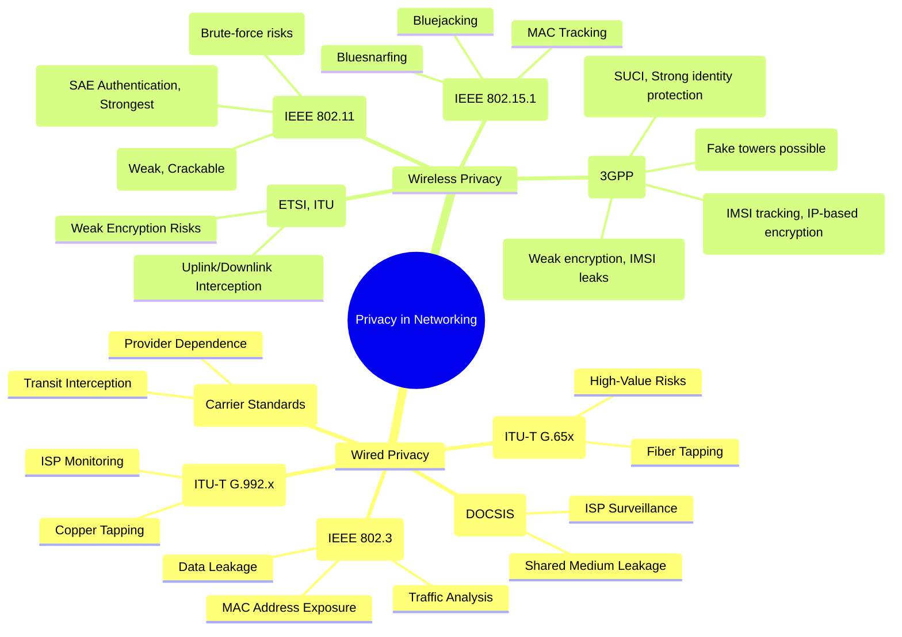

# **Privacy in Networking (Technology → Standards)**

---

## **1. Wired Privacy**

### a) Ethernet (LAN) → *Standard: IEEE 802.3*

* **Data Leakage**: LAN sniffing via compromised nodes.
* **MAC Address Exposure**: Device identification & tracking.
* **Traffic Analysis**: Metadata (who communicates with whom).

### b) Fiber Optics → *Standard: ITU-T G.65x*

* **Fiber Tapping**: Light leakage interception.
* **High-Value Risks**: Targeting backbone networks (govt, finance).

### c) DSL Broadband → *Standard: ITU-T G.992.x*

* **Copper Tapping**: Interception at junction boxes.
* **ISP Monitoring**: Providers logging/inspecting traffic.

### d) Cable Internet → *Standard: DOCSIS*

* **Shared Medium Leakage**: Neighbors intercepting traffic (older DOCSIS).
* **ISP Surveillance**: Provider-level monitoring/profiling.

### e) Leased Lines/MPLS → *Carrier Standards*

* **Provider Dependence**: Trust in telecom carriers.
* **Transit Interception**: Weak/missing encryption risks.

---

## **2. Wireless Privacy**

### a) Wi-Fi → *Standard: IEEE 802.11 (a/b/g/n/ac/ax/be)*

* **WEP**: Weak encryption, easily cracked.
* **WPA/WPA2**: Stronger, but brute-force possible.
* **WPA3**: Latest, robust privacy with SAE authentication.

### b) Mobile Networks → *Standard: 3GPP (GSM, UMTS, LTE, 5G NR)*

* **2G (GSM)**: Weak A5/1 encryption, IMSI leaks.
* **3G (UMTS)**: Better, but fake towers still work.
* **4G (LTE)**: IP encryption, but IMSI tracking risk.
* **5G (NR)**: Stronger privacy with SUCI (concealed identity).

### c) Bluetooth → *Standard: IEEE 802.15.1*

* **Bluejacking**: Spam messages.
* **Bluesnarfing**: Data theft.
* **MAC Tracking**: Device profiling.

### d) Satellite Communication → *Standards: ETSI, ITU*

* **Uplink/Downlink Interception**: Signals exposed over wide areas.
* **Weak Encryption Risks**: If protocols are outdated or missing.

---

# **Tree Diagram in Markdown (Mermaid)**

````markdown
```mermaid
mindmap
  root((Privacy in Networking))
    Wired Privacy
      Ethernet (IEEE 802.3)
        Data Leakage
        MAC Address Exposure
        Traffic Analysis
      Fiber Optics (ITU-T G.65x)
        Fiber Tapping
        High-Value Risks
      DSL Broadband (ITU-T G.992.x)
        Copper Tapping
        ISP Monitoring
      Cable Internet (DOCSIS)
        Shared Medium Leakage
        ISP Surveillance
      Leased Lines/MPLS (Carrier Standards)
        Provider Dependence
        Transit Interception
    Wireless Privacy
      Wi-Fi (IEEE 802.11)
        WEP (Weak)
        WPA/WPA2 (Stronger, Brute-force risks)
        WPA3 (Strongest, SAE auth)
      Mobile Networks (3GPP)
        2G (Weak encryption, IMSI leaks)
        3G (Fake towers risk)
        4G (IMSI tracking, IP-based)
        5G (SUCI protection)
      Bluetooth (IEEE 802.15.1)
        Bluejacking
        Bluesnarfing
        MAC Tracking
      Satellite Communication (ETSI, ITU)
        Uplink/Downlink Interception
        Weak Encryption Risks
````

---

✅ **Why this division works best**:  
- **Technology-first** makes it easy to understand (Ethernet, Wi-Fi, Mobile, etc.).  
- **Standards inside each** give technical credibility (IEEE, ITU-T, 3GPP, DOCSIS).  
- **Nodes** show exact **privacy vulnerabilities**.  

---

